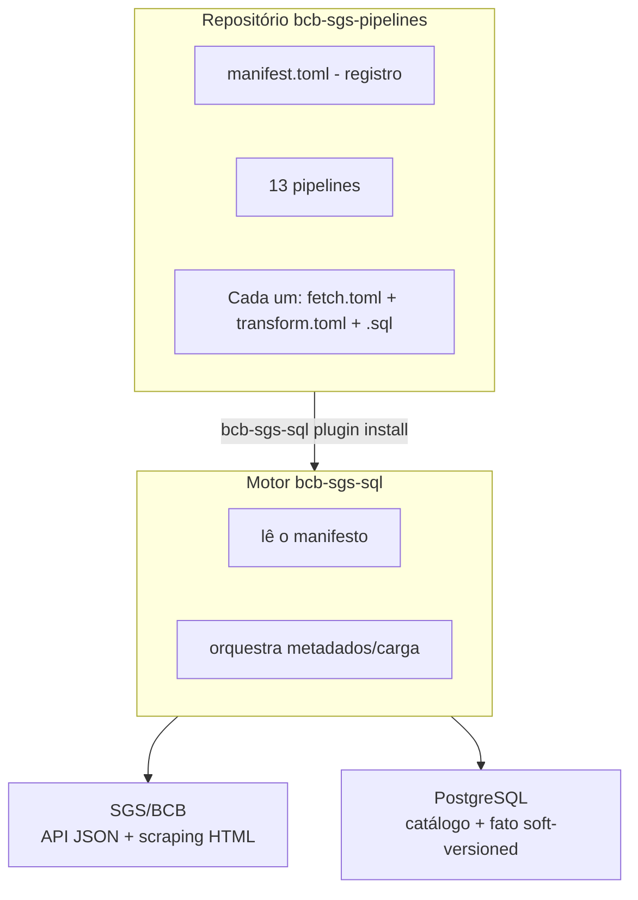

# bcb-sgs-pipelines

**Catálogo de referência de pipelines declarativos para o motor bcb-sgs-sql.**

!!! warning "Pegadinhas da fonte e do carregamento"

    - **Seletores `themes` exigem catálogo carregado.** Um `[[series]]` com `themes` filtra `series_metadata` — rode primeiro um pipeline por `ids` (ou `load --kind metadata`) para popular o catálogo.
    - **Séries diárias demoram na primeira carga.** O fetcher varre ano a ano via API `/dados`; `juros` e `cambio` são os pipelines mais lentos no primeiro `run`.
    - **O BCB revisa valores sem aviso.** Recargas idênticas são no-op (detecção-de-mudança); valores alterados geram nova revisão (`ativo`/`loaded_at`), nunca overwrite.
    - **Requer PostgreSQL ≥ 15** (índice único parcial com `NULLS NOT DISTINCT`) — mesma exigência do [bcb-sgs-sql](bcb-sgs-sql.md).

## O Que É

`bcb-sgs-pipelines` é o catálogo padrão de pipelines production-ready para o motor `bcb-sgs-sql` — atualmente com 13 pipelines cobrindo preços, juros, câmbio, atividade, crédito, monetário e temas setoriais. É um único repositório Git com definições declarativas (`fetch.toml` + `transform.toml` + `.sql`) para as séries SGS mais usadas.

Em vez de escrever suas próprias definições, instale o catálogo e execute com um único comando:

```bash
bcb-sgs-sql run std precos     # IPCA, IPCA-15, INPC, IGP-M
bcb-sgs-sql run std juros      # SELIC meta/over, CDI, TR
bcb-sgs-sql run std cambio     # USD/BRL, EUR/BRL
```

Sem código para escrever. Sem configuração de séries para gerenciar. Apenas dados.

## Arquitetura



## Pipelines Incluídos

A lista canônica está em [`manifest.toml`](https://github.com/Quantilica/bcb-sgs-pipelines/blob/main/manifest.toml); a tabela abaixo resume os 13 pipelines:

| ID do Pipeline | Conteúdo | Tabela de Output |
|---|---|---|
| `precos` | IPCA, IPCA-15, INPC, IGP-M | `analytics.precos` |
| `juros` | SELIC meta/over, CDI, TR | `analytics.juros` |
| `cambio` | USD/BRL, EUR/BRL | `analytics.cambio` |
| `atividade` | IBC-Br e atividade | `analytics.atividade` |
| `credito` | Saldo total, inadimplência, spread | `analytics.credito` |
| `monetario` | M1, M2, M3, M4 | `analytics.monetario` |
| `commodities` | IC-Br e índices de commodities | `analytics.commodities` |
| `movimento_cambio_contratado` | Fluxo cambial contratado | `analytics.movimento_cambio_contratado` |
| `pib_mensal` | PIB mensal acumulado em 12 meses (BRL e USD) | `analytics.pib_mensal` |
| `alcool_carburante` | Consumo de álcool hidratado, anidro e total | `analytics.alcool_carburante` |
| `derivados_petroleo` | Produção e consumo de derivados | `analytics.derivados_petroleo` |
| `desembolsos_bndes` | Desembolsos do BNDES por setor | `analytics.desembolsos_bndes` |
| `energia_eletrica` | Consumo de energia elétrica por setor | `analytics.energia_eletrica` |

As tabelas de output seguem o padrão wide-pivot (uma coluna por série, em português legível), indexadas por data.

## Instalação

### 1. Instalar bcb-sgs-sql

```bash
pip install bcb-sgs-sql
```

### 2. Configurar Banco de Dados

Crie `config.ini` no diretório de trabalho (PostgreSQL ≥ 15):

```ini
[storage]
data_dir = data

[database]
user     = postgres
password = <senha>
host     = localhost
port     = 5432
dbname   = dados
schema   = bcb_sgs
```

O caminho global canônico é `~/.config/quantilica/bcb-sgs-sql/config.ini` — ver [Configuração Global](../normas/configuracao.md).

### 3. Instalar Este Catálogo

```bash
bcb-sgs-sql plugin install https://github.com/Quantilica/bcb-sgs-pipelines.git --alias std
```

Verifique a instalação:

```bash
bcb-sgs-sql plugin list
```

## Início Rápido

### Executar um Pipeline

```bash
# Índices de preços (IPCA, IPCA-15, INPC, IGP-M)
bcb-sgs-sql run std precos
# Saída esperada:
# ✓ Buscando metadados das séries
# ✓ Baixando observações (com cache TTL)
# ✓ Carregando em bcb_sgs.series_data (soft-versioned)
# ✓ Executando SQL de transformação
# ✓ Criado analytics.precos
```

### Consultar o Resultado

```sql
SELECT * FROM analytics.precos ORDER BY date DESC LIMIT 12;
```

### Executar Todos os Pipelines

```bash
bcb-sgs-sql run std
```

## Estrutura do Pipeline

Cada pipeline é um diretório com três arquivos:

### fetch.toml

Quais séries buscar — por `ids` (sempre válido) ou por `themes`/`frequency` (exige catálogo carregado):

```toml
# precos/fetch.toml
[[series]]
ids = [433, 13522, 188, 189, 7478]

[[series]]
themes = ["Preços"]
frequency = "M"
```

### transform.toml

Qual tabela analítica criar e com qual estratégia:

```toml
[[table]]
name = "precos"
schema = "analytics"
strategy = "replace"
sql = "precos.sql"
```

### transform.sql

A SELECT wide-pivot — uma coluna por série, apenas revisões ativas:

```sql
SELECT
    sd.date,
    MAX(CASE WHEN sd.series_id = 433   THEN sd.value END) AS ipca_mensal,
    MAX(CASE WHEN sd.series_id = 13522 THEN sd.value END) AS ipca_acum_12m,
    MAX(CASE WHEN sd.series_id = 189   THEN sd.value END) AS igpm_mensal
FROM series_data sd
WHERE sd.series_id IN (433, 13522, 189)
  AND sd.ativo = TRUE
GROUP BY sd.date
ORDER BY sd.date;
```

## Extensão: Adicionar Seu Próprio Pipeline

### 1. Criar um diretório

```bash
bcb-sgs-sql plugin add-pipeline meu_indicador --plugin-dir ./meu-plugin
```

### 2. Escrever fetch.toml

Liste os IDs SGS (descubra-os com `bcb-sgs series search` no fetcher ou no [catálogo](https://www3.bcb.gov.br/sgspub/)).

### 3. Escrever transform.toml + .sql

Siga o padrão wide-pivot acima, filtrando sempre `sd.ativo = TRUE`.

## Saiba Mais

- [Visão Geral BCB](index.md) — os dois stacks (exploração vs. produção)
- [bcb-sgs-fetcher](bcb-sgs-fetcher.md) — extração de séries do SGS
- [bcb-sgs-sql](bcb-sgs-sql.md) — motor ETL, Via A/B, soft-versioning
- [sidra-pipelines](../ibge/sidra-pipelines.md) — o catálogo análogo para o IBGE
