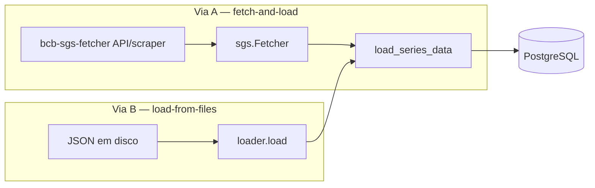
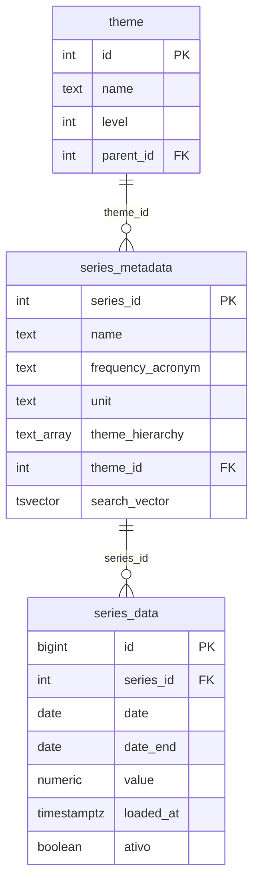

# bcb-sgs-sql

**Camada de ETL e Data Warehousing para as séries temporais do BCB SGS em PostgreSQL.**

!!! warning "Pegadinhas da fonte e do carregamento"

    - **O BCB revisa valores sem aviso.** Uma observação publicada hoje pode mudar numa próxima divulgação. O `bcb-sgs-sql` usa *soft-versioning* (`ativo`, `loaded_at`) — nunca sobrescreve; insere uma nova revisão e marca a anterior `ativo = FALSE`. A "verdade atual" é `WHERE ativo = TRUE`; a trilha de revisões é `ORDER BY loaded_at`.
    - **Requer PostgreSQL ≥ 15.** O índice único parcial usa `NULLS NOT DISTINCT` para tratar `date_end IS NULL` (séries diárias) como mesma chave. Em versões anteriores seria preciso uma coluna gerada de chave.
    - **Séries diárias têm download retroativo.** A API `/dados` não devolve o histórico completo de alta frequência; o `bcb-sgs-fetcher` faz a varredura ano a ano. Não é o `bcb-sgs-sql` que reimplementa isso — ele apenas passa o acrônimo de frequência.
    - **Metadados exigem scraping com sessão stateful.** O catálogo vem do `ScraperClient` (HTML), que mantém cookies — **não** é seguro paralelizar a coleta de metadados.
    - **`config.ini` lê do CWD.** Rodar de outro diretório falha sem mensagem clara. Use caminho absoluto ou `os.chdir()`.

## O Que É

**`bcb-sgs-sql`** é a infraestrutura de Data Warehousing e ETL para os dados do **SGS**
(Sistema Gerenciador de Séries Temporais) do Banco Central do Brasil. É a camada SQL
análoga ao `sidra-sql` do IBGE.

Enquanto **bcb-sgs-fetcher** resolve o problema de comunicação (obter séries da API JSON e
metadados via scraping), **bcb-sgs-sql** resolve o problema de **persistência, governança
e reprodutibilidade**: converte observações e metadados do SGS em um banco PostgreSQL
relacional, com histórico de revisões preservado.

## Problema que Resolve

Levar séries do SGS para análise rigorosa ou modelagem envolve desafios além do download:

### 1. Catálogo, observações e temas em um modelo coerente

O SGS tem mais de 17.000 séries, cada uma com metadados ricos (nome, frequência, unidade,
fonte, hierarquia de temas) e um histórico de observações `(data, valor)`. O `bcb-sgs-sql`
separa isso em três tabelas — `series_metadata` (catálogo), `series_data` (observações) e
`theme` (hierarquia auto-referente) — em vez de achatar tudo num CSV que perde integridade.

### 2. Gargalos de I/O de ingestão

Séries longas (diárias com décadas de histórico) acumulam milhões de observações. Inserção
linha a linha via ORM é lenta e gasta RAM. O motor usa `COPY FROM STDIN` + tabela de
staging.

### 3. Revisões & reprodutibilidade — sem tabela de auditoria

O BCB revisa valores. Sobrescrever destrói a reprodutibilidade. Uma abordagem comum é
manter overwrite mais uma tabela `audit_log` separada para rastrear mudanças. O
`bcb-sgs-sql` adota uma abordagem mais enxuta: **soft-versioning na própria
tabela-fato**, preservando a trilha completa de revisões sem nenhuma tabela de
auditoria separada.

## Arquitetura & Recursos Principais

### 1. Dois caminhos de acoplamento (Via A e Via B)

O pacote serve tanto quem quer buscar-e-carregar num passo só quanto quem já tem os
artefatos em disco:



- **Via A** (`run`, `run-path`): `sgs.Fetcher` envolve o `SgsDataClient` (valores) e o
  `ScraperClient` (metadados), com cache em disco e retry/backoff.
- **Via B** (`load`): lê arquivos JSON de observações e de metadados já em disco — **sem
  rede** — e carrega no banco. Permite usar o pacote 100% sobre artefatos.

Ambas convergem em `database.load_series_data`, então a lógica de soft-versioning vive em
um único lugar.

### 2. Ingestão Streaming (COPY)

- **PostgreSQL `COPY FROM STDIN`**: transmite as observações para uma tabela temporária
  `_staging_series_data`.
- **Single-pass**: como a série temporal é plana (sem dimensões com FK a resolver), não há
  o "Pass 1" de coleta do SIDRA.
- **Stubs de catálogo**: `_ENSURE_SERIES` cria linhas mínimas em `series_metadata` para
  satisfazer a FK numa carga values-only.

### 3. Soft-versioning por detecção-de-mudança (SCD na própria fato)

Auditabilidade sem tabela de auditoria:

- **Nunca sobrescreve**: quando o valor de uma observação muda, insere uma nova linha
  (`ativo = TRUE`, `loaded_at` da execução) e marca a anterior `ativo = FALSE`.
- **Detecção-de-mudança**: só insere/desativa quando o valor **difere** do ativo corrente.
  Recargas idênticas são um no-op (zero churn).
- **Invariante no banco**: um índice único parcial garante no máximo uma linha ativa por
  `(series_id, date, date_end)`.



### 4. Pipelines declarativos via TOML

Lógica de negócio isolada de código, igual ao `sidra-sql`:

```toml
# fetch.toml — quais séries carregar
[[series]]
ids = [433, 13522, 189]          # IPCA mensal, IPCA acum. 12m, IGP-M

[[series]]
themes = ["Índices de preços"]   # filtra o catálogo (exige catálogo já carregado)
frequency = "M"                   # opcional: D, S, M, T, Qd, A
```

### 5. Hierarquia de temas

A `theme_hierarchy` de cada série (ex.: `["Preços", "Índices", "IPCA"]`) é normalizada numa
árvore auto-referente (`theme`) **e** mantida denormalizada como ARRAY (com índice GIN)
para consultas de containment rápidas.

### 6. Arquitetura de plugin

O motor é genérico; os pipelines vivem em repositórios Git separados (ex.:
`bcb-sgs-pipelines`):

```
Plugin (seu repo Git)
├── manifest.toml       ← registro de pipelines
├── precos/ipca/
│   ├── fetch.toml      ← quais séries baixar do SGS
│   ├── transform.toml  ← config da tabela analytics
│   └── ipca.sql        ← consulta wide-pivot
```

```bash
bcb-sgs-sql plugin install https://github.com/Quantilica/bcb-sgs-pipelines.git --alias std
bcb-sgs-sql run std precos
```

### Recursos Adicionais

- ✅ Busca full-text no catálogo (`search_vector` tsvector português + inglês)
- ✅ Cache de metadados (`{id:06d}_basic.json` / `_full.json`, interoperável com o fetcher)
- ✅ Integração PostgreSQL (transações ACID)
- ✅ Operações idempotentes (recarga segura, zero churn)
- ✅ Retry com backoff exponencial (até 5 tentativas)
- ✅ Histórico de revisões via colunas `ativo` + `loaded_at` (sem `audit_log`)

## Instalação

```bash
pip install git+https://github.com/Quantilica/bcb-sgs-sql.git
```

Com [uv](https://github.com/astral-sh/uv):

```bash
uv add "git+https://github.com/Quantilica/bcb-sgs-sql.git"
```

## Configuração

`bcb-sgs-sql` lê um `config.ini` no diretório de trabalho:

```ini
[storage]
data_dir = data

[database]
user = postgres
password = suasenha
host = localhost
port = 5432
dbname = dados
schema = bcb_sgs
```

Carregue a config em Python:

```python
from bcb_sgs_sql.config import Config

config = Config()  # lê config.ini do diretório atual
```

Ou via CLI:

```bash
bcb-sgs-sql config set database.host     localhost
bcb-sgs-sql config set database.port     5432
bcb-sgs-sql config set database.user     postgres
bcb-sgs-sql config set database.password suasenha
bcb-sgs-sql config set database.dbname   dados
bcb-sgs-sql config set database.schema   bcb_sgs
bcb-sgs-sql config set storage.data_dir  data
```

## Exemplo Rápido: Pipeline ETL

### Opção 1: CLI com plugin (Via A)

Use pipelines pré-construídos de `bcb-sgs-pipelines`:

```bash
# Instalar catálogo padrão
bcb-sgs-sql plugin install https://github.com/Quantilica/bcb-sgs-pipelines.git --alias std

# Executar pipeline (buscar metadados + observações + carregar + transformar)
bcb-sgs-sql run std precos

# Consultar resultados em PostgreSQL
psql -c "SELECT * FROM analytics.precos ORDER BY date DESC LIMIT 12"
```

### Opção 2: Load-from-files (Via B, sem rede)

Carrega artefatos já baixados pelo `bcb-sgs-fetcher`:

```bash
# Detecta automaticamente JSON de observações / metadados
bcb-sgs-sql load ./data/bcb-sgs --kind auto

# Ou explicitamente
bcb-sgs-sql load ./data/bcb-sgs/data --kind json
bcb-sgs-sql load ./data/bcb-sgs/metadata --kind metadata
```

### Opção 3: TOML declarativo

Define o fetch:

```toml
# pipelines/precos/fetch.toml
[[series]]
ids = [433, 13522, 189]
```

Define a transform (wide-pivot — uma coluna por série):

```toml
# pipelines/precos/transform.toml
[[table]]
name = "precos"
schema = "analytics"
strategy = "replace"
sql = "precos.sql"
```

```sql
-- pipelines/precos/precos.sql
SELECT
    sd.date,
    MAX(CASE WHEN sd.series_id = 433   THEN sd.value END) AS ipca_mensal,
    MAX(CASE WHEN sd.series_id = 13522 THEN sd.value END) AS ipca_acum_12m,
    MAX(CASE WHEN sd.series_id = 189   THEN sd.value END) AS igpm_mensal
FROM series_data sd
WHERE sd.series_id IN (433, 13522, 189)
  AND sd.ativo = TRUE
GROUP BY sd.date
ORDER BY sd.date;
```

Execute:

```python
from pathlib import Path
from bcb_sgs_sql.config import Config
from bcb_sgs_sql.toml_runner import TomlScript
from bcb_sgs_sql.transform_runner import TransformRunner

config = Config()

# Extract + Load (metadados → observações → banco)
TomlScript(config, Path("pipelines/precos/fetch.toml")).run()

# Transform (SQL → schema analytics)
TransformRunner(config, Path("pipelines/precos/transform.toml")).run()
```

### Opção 4: ETL programático

```python
from bcb_sgs_sql.config import Config
from bcb_sgs_sql import database, sgs

config = Config()
engine = database.get_engine(config)
database.create_all(engine)

with sgs.Fetcher(config.data_dir, max_workers=4) as fetcher:
    series_ids = [433, 13522]

    # 1. Metadados (catálogo + temas)
    rows = []
    freq_by_id = {}
    for sid in series_ids:
        basic, full = fetcher.fetch_metadata(sid)
        with engine.begin() as conn:
            theme_id = database.upsert_theme_hierarchy(
                conn, basic.theme_hierarchy
            )
        # ... mapear para linha de catálogo (ver loader.basic_to_metadata_row)

    # 2. Observações
    points = fetcher.download_series(series_ids, frequency_by_id=freq_by_id)

# 3. Carregar (soft-versioned)
rows = [(p.series_id, p.date, p.date_end, p.value) for p in points]
database.load_series_data(engine, rows)
```

## Governança de Dados: Histórico sem Auditoria

O BCB revisa valores. O warehouse preserva o histórico em vez de sobrescrever — e **sem**
uma tabela de auditoria separada — via soft-versioning nas colunas `ativo` + `loaded_at`.
O mecanismo de detecção-de-mudança (desativar-e-inserir, com no-op em recargas idênticas)
está detalhado em [Bulk Load & Versionamento de Revisões](../concepts/bulk-load.md). Na
prática, isso permite duas consultas:

### Consultando a verdade atual

```sql
SELECT date, value
FROM series_data
WHERE series_id = 433 AND ativo = TRUE
ORDER BY date;
```

### Trilha de revisão de uma observação

```python
import sqlalchemy as sa
from bcb_sgs_sql import database, models
from bcb_sgs_sql.config import Config

engine = database.get_engine(Config())

with engine.connect() as conn:
    stmt = (
        sa.select(
            models.SeriesData.value,
            models.SeriesData.loaded_at,
            models.SeriesData.ativo,
        )
        .where(
            models.SeriesData.series_id == 433,
            models.SeriesData.date == "2020-01-01",
        )
        .order_by(models.SeriesData.loaded_at)
    )
    for row in conn.execute(stmt):
        status = "ATIVO" if row.ativo else "SUBSTITUÍDO"
        print(f"{row.loaded_at:%Y-%m-%d}: {row.value}  [{status}]")
```

---

## Ingestão Streaming

Como a série é plana (sem dimensões com FK), a carga é **single-pass**: `COPY FROM STDIN`
para staging, depois *deactivate-then-insert* (desativar a versão anterior antes de inserir
a revisão, satisfazendo o índice único parcial). O mecanismo e a comparação com o modelo
em dois passes do SIDRA estão em
[Bulk Load & Versionamento de Revisões](../concepts/bulk-load.md).

Toda a carga fica atrás de um único helper, que retorna a contagem de mudanças:

```python
from bcb_sgs_sql import database
from bcb_sgs_sql.config import Config

engine = database.get_engine(Config())

# rows = [(series_id, date, date_end, value), ...]
n_staging, n_inserted, n_deactivated = database.load_series_data(engine, rows)
print(f"{n_inserted} inseridas, {n_deactivated} desativadas")
```

---

## Referência de API

### CLI

#### Executar pipelines (Via A)

```
bcb-sgs-sql run <alias> [pipeline_id] [--force-metadata] [--force-load]
```

Executa pipeline(s) de um plugin instalado. Omita `pipeline_id` para rodar todos.
`--force-metadata` re-busca metadados mesmo se em cache.

```
bcb-sgs-sql run-path <path> [--force-metadata] [--force-load]
```

Executa um pipeline diretamente de um diretório, sem plugin registrado.

```
bcb-sgs-sql transform <alias> <pipeline_id>
```

Executa apenas a etapa de transformação SQL (sem fetch nem load).

#### Carregar arquivos (Via B)

```
bcb-sgs-sql load <path> [--kind json|metadata|auto] [--force-load]
```

Carrega dados de arquivos em disco no PostgreSQL, **sem rede**. `--kind auto` detecta pelo
conteúdo do diretório (metadados `*_basic.json` ou JSON de observações).

#### Gerenciar plugins

```
bcb-sgs-sql plugin install <url> [--alias ALIAS]
bcb-sgs-sql plugin update [alias]
bcb-sgs-sql plugin remove <alias>
bcb-sgs-sql plugin list
bcb-sgs-sql plugin validate [alias] [--plugin-dir PATH]
```

```
bcb-sgs-sql plugin scaffold <name>
    [-d/--description TEXT]
    [--version TEXT]            # padrão: 1.0.0
    [-o/--output-dir PATH]      # padrão: diretório atual
    [--git-init/--no-git-init]  # padrão: --git-init
```

Cria a estrutura (`manifest.toml`, `fetch.toml`, `transform.toml`, `.sql`, `README.md`)
para um novo plugin.

```
bcb-sgs-sql plugin add-pipeline <pipeline_id>
    [-d/--description TEXT]
    [-p/--path PATH]
    [--plugin-dir PATH]
```

Adiciona um pipeline a um plugin existente, atualizando `manifest.toml`.

#### Configuração

```
bcb-sgs-sql config set <section.option> <value> [--global]
bcb-sgs-sql config get <section.option>
bcb-sgs-sql config list [--global] [--local]
```

Gerencia `config.ini`. Sem `--global`, lê/escreve o arquivo local; com `--global`, usa
`~/.config/bcb-sgs-sql/config.ini`. `config list` sem flags mostra a visão mesclada.

---

### API Python (resumo)

Os pontos de entrada do pacote, agrupados pelas duas vias de acoplamento. Assinaturas
completas no [código-fonte do repositório](https://github.com/Quantilica/bcb-sgs-sql).

| Símbolo | Papel |
|---|---|
| `Config()` | Lê `config.ini` do diretório atual (storage + conexão PostgreSQL) |
| `sgs.Fetcher(storage, max_workers=)` | **Via A**: `plan_series`, `fetch_metadata`, `download_series` |
| `loader.load(config, path, kind=)` | **Via B**: carrega JSON de observações/metadados em disco, sem rede |
| `Storage.default(config)` | Arquivos JSON locais: observações + metadados em cache |
| `TomlScript(config, toml_path)` | ETL declarativo: metadados → observações → carga |
| `TransformRunner(config, toml_path)` | Executa o `transform.toml` + `.sql` pareado |
| `database.*` | `get_engine`, `create_all`, `save_series_metadata`, `load_series_data` (COPY soft-versioned) |

---

## Formato de Pipeline TOML

### `fetch.toml` — Seleção de Séries

```toml
[[series]]
ids = [433, 13522, 189]          # IDs de séries SGS (sempre válido)

[[series]]
themes = ["Índices de preços"]   # filtra o catálogo (exige catálogo já carregado)
frequency = "M"                   # opcional: D, S, M, T, Qd, A
```

**Campos de `[[series]]`:**

| Campo | Tipo | Descrição |
|-------|------|----------|
| `ids` | list[int] | IDs de séries (sempre válido) |
| `themes` | list[str] | Filtra séries cujo `theme_hierarchy` contém o tema |
| `frequency` | str | Restringe `themes` por acrônimo de frequência |

Cada `[[series]]` precisa de `ids` **ou** `themes`. Selectors `themes`/`frequency` exigem
um catálogo já populado (rode os metadados antes).

### `transform.toml` — Configuração de Transformação

```toml
[[table]]
name = "precos"
schema = "analytics"
strategy = "replace"            # "replace" (tabela) ou "view"
sql = "precos.sql"
description = "Painel wide de índices de preços"
primary_key = ["date"]
indexes = [
  { name = "idx_precos_date", columns = ["date"], unique = false }
]
```

Idêntico ao `sidra-sql`. Pareado com um `.sql` contendo a SELECT.

### `manifest.toml` — Registro de Plugin

```toml
name = "Pipelines BCB SGS"
description = "Pipelines SGS padrão Quantilica"
version = "1.0.0"

[[pipeline]]
id = "precos"
description = "Índices de preços (IPCA, IGP-M)"
path = "precos"
```

---

## Schema

Quatro tabelas no schema configurado (ex.: `bcb_sgs`), criadas por
`database.create_all(engine)` — o diagrama está acima:

- **`series_metadata`** — catálogo da série (nomes, frequência, unidade, fonte,
  `theme_hierarchy` com índice GIN, `search_vector` para busca full-text).
- **`series_data`** — tabela-fato soft-versioned (`series_id`, `date`, `date_end`, `value`,
  `loaded_at`, `ativo`), com índice único parcial
  `(series_id, date, date_end) NULLS NOT DISTINCT WHERE ativo` — no máximo uma linha ativa
  por chave.
- **`theme`** — hierarquia de temas auto-referente (`name`, `level`, `parent_id`).
- **`arquivo_carregado`** — rastreador de arquivos para a idempotência da Via B.

As colunas e constraints completas estão nos
[modelos SQLAlchemy do repositório](https://github.com/Quantilica/bcb-sgs-sql).

### Exemplo de consulta: painel wide

```sql
-- Uma coluna por série, indexado por data (apenas registros ativos)
SELECT
    sd.date,
    MAX(CASE WHEN sd.series_id = 11  THEN sd.value END) AS selic,
    MAX(CASE WHEN sd.series_id = 12  THEN sd.value END) AS cdi,
    MAX(CASE WHEN sd.series_id = 433 THEN sd.value END) AS ipca
FROM series_data sd
WHERE sd.series_id IN (11, 12, 433)
  AND sd.ativo = TRUE
GROUP BY sd.date
ORDER BY sd.date;
```

---

## Performance

### Cache Local

Observações e metadados baixados pela Via A ficam em `data_dir`. Metadados em cache são
reutilizados (a menos de `--force-metadata`). A Via B nunca toca a rede.

### Ingestão via COPY

`COPY FROM STDIN` para staging + INSERT em lote evita o overhead de inserção linha a linha.
Como o modelo é plano (sem dimensões), a carga é single-pass.

## Melhores Práticas

### 1. Use pipelines declarativos (TOML) para reprodutibilidade

```toml
# pipelines/juros/fetch.toml
[[series]]
ids = [11, 12]   # Selic, CDI (diárias)
```

- ✅ Não-desenvolvedores mantêm pipelines
- ✅ Versionável em git
- ✅ Reprodutível entre máquinas

### 2. Consulte snapshots por `loaded_at`

Para reproduzir o estado dos dados numa data, filtre por `loaded_at` (a trilha de revisões
fica toda na `series_data`).

### 3. Use o schema relacional para ferramentas BI

Conecte PostgreSQL diretamente a Tableau, Power BI, Looker, Metabase. As views wide-pivot
do `transform.toml` são ideais como fonte.

---

## Resolução de Problemas

### Requer PostgreSQL ≥ 15

O índice único parcial usa `NULLS NOT DISTINCT`, disponível a partir do PostgreSQL 15.

### Selector `themes` retorna vazio

`themes`/`frequency` consultam o catálogo. Rode os metadados antes (ex.: um pipeline com
`ids`, ou `load --kind metadata`) para popular `series_metadata`.

### Séries diárias demoram

A estratégia retroativa do `bcb-sgs-fetcher` faz múltiplas requisições ano a ano. É
esperado para séries diárias longas.

### Arquivo de Configuração Não Encontrado

`Config()` lê `config.ini` do diretório atual. Rode da raiz do projeto ou ajuste:

```python
import os
os.chdir("/path/to/project")
config = Config()
```

---

## Saiba Mais

- [Visão Geral BCB](index.md)
- [bcb-sgs-fetcher](bcb-sgs-fetcher.md) — Ferramenta de extração de séries
- [sidra-sql](../ibge/sidra-sql.md) — O análogo para o IBGE/SIDRA
- [Princípios de Design](../concepts/principios.md)
- [SGS — Sistema Gerenciador de Séries Temporais](https://www3.bcb.gov.br/sgspub/)
- [Documentação PostgreSQL](https://www.postgresql.org/docs/)
