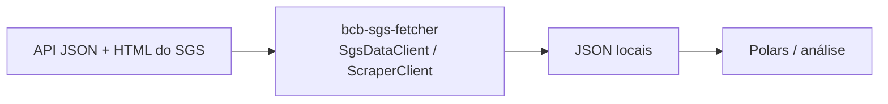
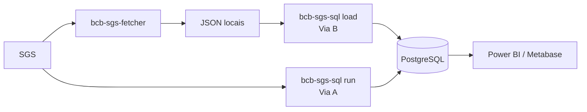

# Banco Central (BCB)

O Banco Central do Brasil publica, via **SGS** (Sistema Gerenciador de Séries Temporais),
mais de **17.000 séries** macroeconômicas — câmbio, juros (SELIC, CDI), inflação (IPCA,
IGP-M), crédito, balanço de pagamentos, meios de pagamento e atividade econômica — muitas
com histórico desde os anos 1980.

O ecossistema cobre o SGS com dois pacotes complementares: um para extração, outro para
persistência analítica em PostgreSQL.

## O desafio

Trabalhar com o SGS encontra barreiras específicas:

- **Sem API de metadados** — os valores vêm de uma API JSON limpa, mas os metadados (nome,
  unidade, frequência, tema, fonte) só existem em HTML, exigindo scraping com sessão
  stateful.
- **Séries diárias truncadas** — a API `/dados` não devolve o histórico completo de alta
  frequência; é preciso uma varredura retroativa ano a ano.
- **Revisões silenciosas** — o BCB revisa valores sem aviso; sobrescrever destrói a
  reprodutibilidade de pesquisa e modelos.

## Dois stacks: Exploração vs. Produção

### Stack 1 — Exploração (`bcb-sgs-fetcher` + Polars)

Para análise ad-hoc, notebooks, modelagem one-off. Use os clientes (`SgsDataClient` para
valores, `ScraperClient` para metadados); a saída é JSON/dataclasses, que você carrega em
Polars/pandas para análise.

### Stack 2 — Produção (`bcb-sgs-sql` + PostgreSQL)

Para carga recorrente e consumo BI: `bcb-sgs-sql` carrega catálogo, temas e observações no
PostgreSQL, com *soft-versioning* (histórico de revisões sem tabela de auditoria). Funciona
de dois modos — buscando direto do SGS (Via A) ou a partir de arquivos JSON já em disco
(Via B; o JSON vem do fetcher).

| Dimensão | Stack 1 (fetcher) | Stack 2 (sql) |
|---|---|---|
| Saída | JSON/dataclasses, DataFrames Polars | Tabelas PostgreSQL |
| Caso de uso | Exploração, notebooks | Carga recorrente, BI, histórico |
| Revisões | Cada arquivo é um snapshot | Soft-versioning (`ativo`/`loaded_at`) |
| Setup | Mínimo | PostgreSQL ≥ 15 |

## Pacotes

- **[bcb-sgs-fetcher](bcb-sgs-fetcher.md)** — extração do SGS: `SgsDataClient` (API JSON,
  com estratégia retroativa para séries diárias) e `ScraperClient` (metadados via HTML,
  sessão stateful). Saída em JSON/dataclasses (adaptador de fonte; sem Parquet).
- **[bcb-sgs-sql](bcb-sgs-sql.md)** — camada SQL/ETL: carrega catálogo (`series_metadata`),
  observações (`series_data`, soft-versioned) e hierarquia de temas (`theme`) em
  PostgreSQL. Pipelines TOML declarativos, ingestão via `COPY`, comando `load` para
  artefatos em disco.

Os [Princípios de Design](../concepts/principios.md) aparecem aqui de forma clara:
idempotência (recarga com zero churn), reprodutibilidade (histórico de revisões na própria
tabela-fato) e a separação de camadas fetcher/sql — o mesmo padrão de
[sidra-fetcher](../ibge/sidra-fetcher.md) / [sidra-sql](../ibge/sidra-sql.md).

## Temas do SGS

| Tema | Exemplos |
|---|---|
| Câmbio | USD/BRL, EUR/BRL, GBP/BRL |
| Juros | SELIC, CDI, TR, TBF |
| Inflação | IPCA, IPCA-15, IGP-M |
| Crédito | Estoque de crédito, inadimplência, spreads |
| Balanço de pagamentos | Conta corrente, investimento direto |
| Meios de pagamento | M1, M2, M3, M4 |
| Atividade econômica | IBC-Br, resultado primário |

## Próximos passos

- Para extrair séries: vá para **[bcb-sgs-fetcher](bcb-sgs-fetcher.md)**.
- Para carregar em PostgreSQL com histórico: vá para **[bcb-sgs-sql](bcb-sgs-sql.md)**.
- Para combinar SGS com IPCA/PIB do IBGE e Tesouro: veja **[Análise Econômica
  Multi-Fonte](../cookbook/analise-economica-multi-fonte.md)**.

## Recursos externos

- [SGS — Sistema Gerenciador de Séries Temporais](https://www3.bcb.gov.br/sgspub/)
- [API de dados abertos do BCB](https://dadosabertos.bcb.gov.br/)
