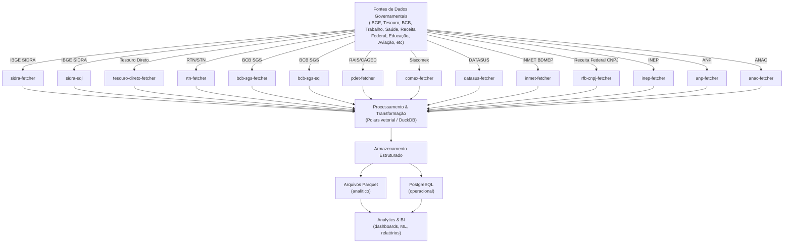

# Arquitetura do Ecossistema

Como o Ecossistema Quantilica é organizado e como as partes se conectam. Esta página descreve a forma do sistema; os [Princípios de Design](principios.md) explicam **por que** ele tem essa forma.

## Visão de sistema

```mermaid
graph TD
    Sources["Fontes de Dados Governamentais<br/>(IBGE, Tesouro, BCB, Trabalho, Saúde, Receita Federal, Educação, Aviação, etc)"]

    Sources -->|IBGE SIDRA| SF["sidra-fetcher"]
    Sources -->|IBGE SIDRA| SQL["sidra-sql"]
    Sources -->|Tesouro Direto| TD["tesouro-direto-fetcher"]
    Sources -->|RTN/STN| RTN["rtn-fetcher"]
    Sources -->|BCB SGS| BCB["bcb-sgs-fetcher"]
    Sources -->|BCB SGS| BCBSQL["bcb-sgs-sql"]
    Sources -->|RAIS/CAGED| PD["pdet-fetcher"]
    Sources -->|Siscomex| CX["comex-fetcher"]
    Sources -->|DATASUS| DS["datasus-fetcher"]
    Sources -->|INMET BDMEP| IN["inmet-fetcher"]
    Sources -->|Receita Federal CNPJ| RFB["rfb-cnpj-fetcher"]
    Sources -->|INEP| INEP["inep-fetcher"]
    Sources -->|ANP| ANP["anp-fetcher"]
    Sources -->|ANAC| ANAC["anac-fetcher"]

    SF --> Processing["Processamento & Transformação<br/>(Polars vetorial / DuckDB)"]
    SQL --> Processing
    TD --> Processing
    RTN --> Processing
    BCB --> Processing
    BCBSQL --> Processing
    PD --> Processing
    CX --> Processing
    DS --> Processing
    IN --> Processing
    RFB --> Processing
    INEP --> Processing
    ANP --> Processing
    ANAC --> Processing

    Processing --> Storage["Armazenamento Estruturado"]
    Storage --> PQ["Arquivos Parquet<br/>(analítico)"]
    Storage --> PG["PostgreSQL<br/>(operacional)"]

    PQ --> Analytics["Analytics & BI<br/>(dashboards, ML, relatórios)"]
    PG --> Analytics
```

O ecossistema é organizado em **quatro camadas**: extração, processamento, armazenamento, análise. Cada camada tem responsabilidades estritas.

## Fundações Técnicas

A infraestrutura da Quantilica repousa sobre o princípio da **Neutralidade de Domínio**. O pacote `quantilica-core` não possui conhecimento sobre fontes específicas (SIDRA, DATASUS, etc); ele lida exclusivamente com abstrações técnicas.

A fundação é dividida em dois pilares para equilibrar leveza e poder:

1.  **`quantilica-core` (Infraestrutura de I/O):** Base estável e sem dependências binárias pesadas. Contém clientes HTTP/FTP resilientes, gerenciamento de manifestos (proveniência) e abstrações de leitura resilientes para os péssimos encodings do Brasil.
2.  **`quantilica-analytics` (Data Access Layer):** Camada analítica construída sobre o Polars e DuckDB. Responsável por leitura lazy multi-formato, conversão otimizada para Parquet e contratos de dados (schemas). O `quantilica-catalog` acompanha definindo a visão sistêmica unificada.

### Tipos de Pacotes no Ecossistema

| Tipo | Padrão Esperado | Exemplos |
| :--- | :--- | :--- |
| **Client (Fetcher)** | Biblioteca Python + CLI simples | `sidra-fetcher`, `bcb-sgs-fetcher` |
| **Data Extractor (Bulk)** | Download Massivo + Transformação + Parquet | `rfb-cnpj-fetcher`, `inep-fetcher`, `pdet-fetcher` |
| **Pipeline DB** | Motor ETL + definições TOML/SQL | `sidra-sql`, `bcb-sgs-sql` |
| **CLI Host** | Hub unificado (PyPI) com instalação de fontes sob demanda (`quantilica install`) | `quantilica-cli` |

## Camadas e responsabilidades

### Extração (Os Fetchers)

Obter dados de APIs, páginas de HTML arcaicas e servidores FTP falhos com resiliência militar. 
*Tamanho somado: Mais de 800 GB em centenas de partições!*

**Faz:**
- Trata pegadinhas governamentais: paginação silenciosa, fallbacks de extensões, rate limits de servidores defasados (como o SISCOMEX) e falhas transitórias do FTP (DATASUS).
- Corrige anomalias na fronteira (ex: converte `-9999` do INMET para nulo).
- Exporta em formatos unificados limpos e salva Manifestos SHA-256 de auditoria para tudo.

**Não faz:**
- Tabelões analíticos mágicos em memória. Se a base do CNPJ tem 240 GB, ela baixa e escreve em chunk streaming.

### Processamento (Polars, DuckDB)

Transformação em ultra-velocidade.

- **Polars** — Padrão oficial da Quantilica. Essencial para varrer os zips de 59 GB da RAIS e importações granulares em modo `LazyFrame` (sem estourar RAM).
- **DuckDB** — Motor SQL analítico utilizado para joins complexos sobre as toneladas de arquivos Parquets criados pelos fetchers.

### Armazenamento (Parquet, PostgreSQL)

Persistência eficiente e confiável.

| Critério | Parquet (Default Analítico) | PostgreSQL (Operacional) |
|---|---|---|
| Uso Ideal | Censo INEP, RAIS, DATASUS, CNPJ | BCB SGS, IPCA Mensal |
| Tamanho Típico | 50 GB a 500 GB em disco | 100M+ linhas indexadas |
| Compressão | 80-90% vs. CSV Governamental | Moderada |
| I/O | Escaneamento em massa colunar | Consultas pontuais ACID |

## ETL vs. ELT

O ecossistema adota predominantemente **ELT** (Extract → Load → Transform).

Os datasets brasileiros são gigantescos e as fontes costumam retificar planilhas silenciosamente (ex: CAGED, Tesouro Direto). Preservar a linha bruta localmente antes de transformar é mandatório para não precisar fazer download de 50GB novamente em caso de quebra no código de agregação.

## Integração com ferramentas externas

A camada de armazenamento foi desenhada para ser estritamente **agnóstica** — as bases normalizadas conversam com todo o ecossistema mundial de dados.

| Categoria | Ferramentas comuns |
|---|---|
| BI | Tableau, Power BI, Metabase (via PostgreSQL) |
| Notebooks | Jupyter (lendo Parquet do `pdet-fetcher` via Polars) |
| Distribuído | Spark, Dask, DuckDB |
| Data warehouse | Snowflake, BigQuery |

---

## Arquitetura de CLI Híbrida

Para o usuário não lidar com 14 binários independentes, adotamos a estratégia de Hub Híbrido:

### CLI Nativa Autônoma
Cada fetcher carrega um `cli.py` utilizando puro `argparse`. Isso garante que bibliotecas pesadas (como o Typer) não sujem os pipelines rodando em containers Docker minimais em produção.

### Hub Plugin Central
Para exploração diária, todos os fetchers expõem uma ponte (entry point) Typer rica e em cores para o host `quantilica-cli` (como demonstrado extensivamente em toda a documentação, nos chamados "Uso com Ambiente Unificado").
