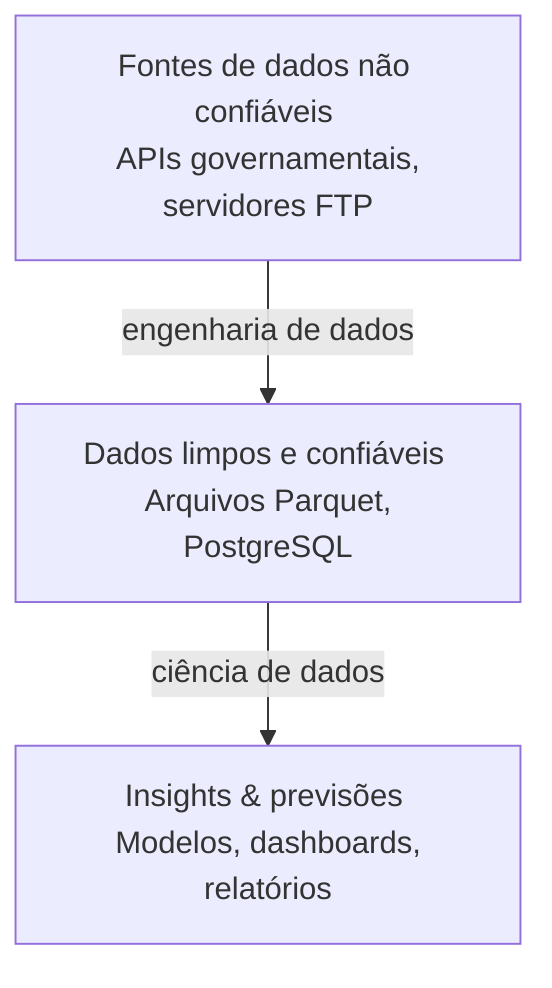
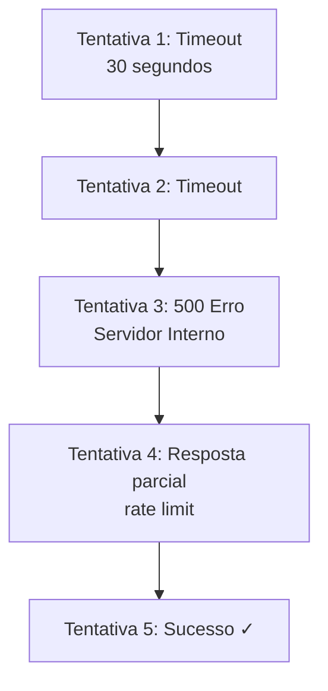
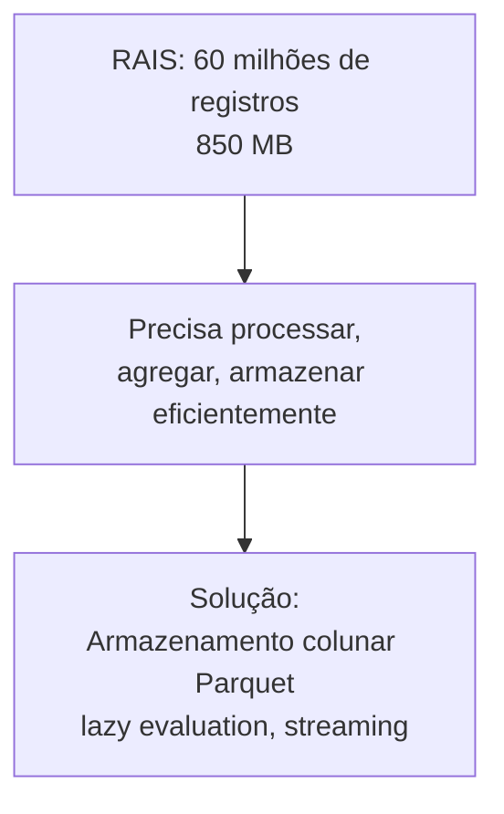
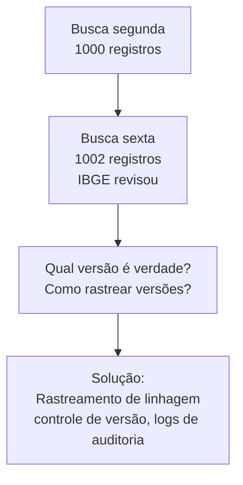
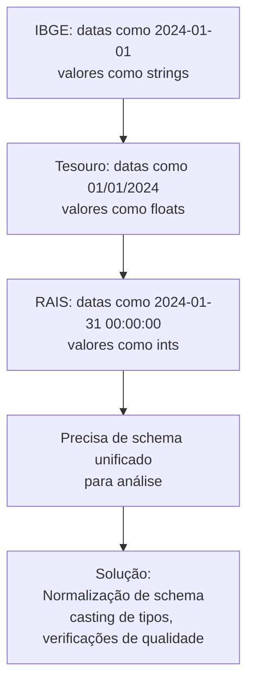
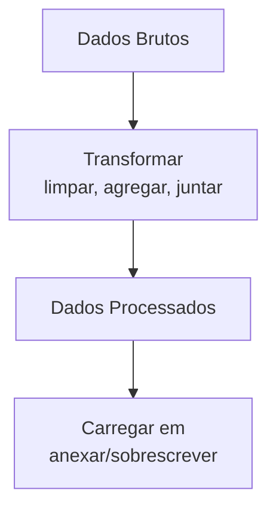
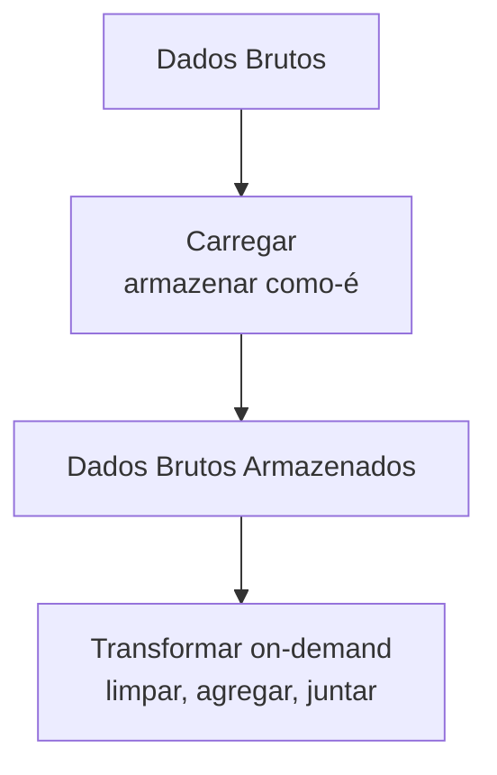

# Princípios de Engenharia de Dados

Conceitos fundamentais subjacentes à Plataforma Brasileira de Dados Públicos.

## O Que é Engenharia de Dados?

Engenharia de dados é a **infraestrutura para trabalho com dados**.

Enquanto ciência de dados responde "o que os dados nos dizem?", engenharia de dados responde "como obtemos, armazenamos e gerenciamos dados confiável?"



## Problemas Principais que Engenharia de Dados Resolve

### 1. Confiabilidade

**Problema**: APIs são pouco confiáveis



**Solução**: Retries com backoff exponencial, tratamento de timeout, recuperação de falha parcial

### 2. Performance

**Problema**: Dados são grandes



### 3. Consistência

**Problema**: Dados mudam ao longo do tempo



### 4. Integração

**Problema**: Dados vêm de diferentes fontes



## ETL vs ELT

### ETL: Extrair → Transformar → Carregar (tradicional)



**Quando usar**: Dados são pequenos, transformações são complexas

**Vantagens**:

- Armazenamento reduzido (apenas armazenar dados processados)
- Transferência reduzida (apenas mover dados limpos)

**Desvantagens**:

- Falhas de transformação perdem dados brutos
- Difícil mudar transformações depois (precisa refazer fetch)

### ELT: Extrair → Carregar → Transformar (moderno)



**Quando usar**: Dados são grandes, transformações evoluem

**Vantagens**:

- Dados brutos preservados (debug, re-processamento)
- Transformações flexíveis (sem re-fetch)
- Paralelizável (transformar de muitas formas em paralelo)

**Desvantagens**:

- Requer mais armazenamento
- Precisa de ferramentas para lidar com dados brutos

### Plataforma de Dados Públicos Brasileira Usa ELT

```python
# EXTRACT & LOAD: armazenar linhas brutas do SIDRA
import polars as pl
from sidra_fetcher import SidraClient
from sidra_fetcher.sidra import Parametro, Formato, Precisao

param = Parametro(
    agregado="1620",
    territorios={"1": ["all"]},
    variaveis=["116"],
    periodos=[],
    classificacoes={},
    formato=Formato.A,
    decimais={"": Precisao.M},
)
with SidraClient(timeout=60) as client:
    rows = client.get(param.url())  # list[dict]

pl.DataFrame(rows).write_parquet("gdp_raw.parquet")  # armazenar bruto

# TRANSFORM: processar on demand
gdp = pl.read_parquet("gdp_raw.parquet").with_columns(
    pl.col("V").cast(pl.Float64, strict=False).pct_change().alias("growth")
)
# Re-transformar anytime sem re-fetch; dados brutos preservados para debug.
```

## Dimensões de Qualidade de Dados

### 1. Precisão

Os dados representam a realidade?

```
Fontes:
- Algorítmica: Erros de cálculo, arredondamento
- Tipográfica: Typos em entrada manual
- Fonte: Erros em sistema original
- Temporal: Dados obsoletos

Verificar:
- Validar contra fontes independentes
- Procurar outliers e anomalias
- Verificar erros de sinal (crescimento PIB -50%?)
```

### 2. Completude

Todos os dados estão presentes?

```
Tabela IBGE SIDRA 1620:
  Esperado: 96 trimestres (2000-2024)
  Atual: 88 trimestres
  Faltando: 8 trimestres (dados não disponíveis)

Verificar:
- Contar linhas vs esperado
- Verificar valores NULL
- Verificar cobertura de datas
```

### 3. Consistência

Os dados estão formatados consistentemente?

```
Ruim: Misturando formatos
  "2024-01-01" (ISO)
  "01/01/2024" (US)
  "01-01-2024" (UE)
  "Jan 1, 2024" (texto)

Bom: Normalizado
  Todas as datas: "2024-01-01" (ISO 8601)
```

### 4. Tempestividade

Os dados estão atuais?

```
IBGE publica PIB com ~60 dias de atraso
Tesouro publica diariamente
RAIS publica anualmente (31 de dez. do ano seguinte)
↓
Conhecer sua frequência de atualização!
```

### 5. Validade

Dados se encaixam no schema?

```
Coluna "salary" deveria ser:
  Tipo: float (numérico)
  Intervalo: 0 a 1.000.000
  Não nulo

Verificar:
  assert df["salary"].dtype == pl.Float64
  assert (df["salary"] >= 0) & (df["salary"] <= 1_000_000)
  assert df["salary"].is_null().sum() == 0
```

## Padrões de Validação

### Validação de Schema

```python
import polars as pl

df = pl.read_parquet("gdp.parquet")

# Schema esperado
expected = {
    "date": pl.Date,
    "value": pl.Float64,
    "status_code": pl.Utf8
}

# Verificar
for col, dtype in expected.items():
    assert col in df.columns, f"Coluna ausente: {col}"
    assert df[col].dtype == dtype, f"Tipo incorreto para {col}"
```

### Validação de Intervalo

```python
# Crescimento do PIB deve estar entre -50% e +50%
assert (df["growth"] >= -0.50) & (df["growth"] <= 0.50)

# Taxa de desemprego deve estar entre 0-100%
assert (df["unemployment"] >= 0) & (df["unemployment"] <= 1.0)

# Salários devem ser positivos
assert df["salary"] > 0
```

### Validação Temporal

```python
# Verificar continuidade de datas (para séries temporais)
dates = df["date"].sort()
gaps = dates.diff()

max_gap = gaps.max()
if max_gap > timedelta(days=100):
    logger.warning(f"Gap encontrado: {max_gap}")
```

### Validação Estatística

```python
import polars as pl

df = pl.read_parquet("data.parquet")

# Detectar outliers (valores > 3 desvios padrão)
mean = df["value"].mean()
std = df["value"].std()

outliers = df.filter(
    (pl.col("value") - mean).abs() > 3 * std
)

if len(outliers) > 0:
    logger.warning(f"Outliers detectados: {len(outliers)} linhas")
```

## Camadas de Pipeline de Dados

### Camada 1: Dados Brutos

```
O quê: Exatamente como recebido da fonte
Por quê: Preserva original para debug
Formato: Parquet (armazenamento eficiente)
Exemplo: gdp_raw.parquet
```

### Camada 2: Dados Validados

```
O quê: Schema, tipos e intervalos verificados
Por quê: Detecta erros cedo
Formato: Parquet
Exemplo: gdp_validated.parquet
```

### Camada 3: Dados Processados

```
O quê: Limpo, padronizado, normalizado
Por quê: Pronto para análise
Formato: Parquet ou PostgreSQL
Exemplo: gdp_processed.parquet
```

### Camada 4: Dados Agregados

```
O quê: Agrupado, resumido, pré-computado
Por quê: Dashboards e relatórios rápidos
Formato: PostgreSQL (para acesso em tempo real)
Exemplo: tabela gdp_by_sector
```

## Monitoramento de Pipelines de Dados

### O Que Monitorar

```python
# 1. Atualidade
last_update = get_last_update_time()
age_hours = (now - last_update).total_seconds() / 3600

if age_hours > 72:  # Alerta se mais antigo que 3 dias
    alert(f"Dados com {age_hours} horas de idade")

# 2. Completude
expected_rows = get_expected_row_count()
actual_rows = len(df)

if actual_rows < expected_rows * 0.9:
    alert(f"Faltam {expected_rows - actual_rows} linhas")

# 3. Qualidade
null_rate = df.is_null().sum() / len(df)

if null_rate > 0.05:
    alert(f"{null_rate*100:.1f}% dados faltantes")

# 4. Anomalias
recent_mean = df.tail(30)["value"].mean()
all_time_mean = df["value"].mean()
change = abs(recent_mean - all_time_mean) / all_time_mean

if change > 0.50:
    alert(f"Valor mudou {change*100:.1f}%")
```

## Ferramentas para Engenharia de Dados

### Extração

- **Clientes HTTP**: requests, httpx
- **Drivers de banco de dados**: psycopg2, sqlite3
- **SDKs de nuvem**: boto3 (AWS), google-cloud (GCP)

### Transformação

- **Pandas**: Flexível, amplamente usado
- **Polars**: Rápido, eficiente em memória
- **DuckDB**: SQL em arquivos/dataframes
- **Spark**: Processamento distribuído

### Armazenamento

- **Parquet**: Colunar, comprimido
- **PostgreSQL**: Relacional, ACID
- **S3/Cloud Storage**: Data lake
- **Snowflake/BigQuery**: Data warehouse em nuvem

### Orquestração

- **Apache Airflow**: Agendador de workflows
- **Dagster**: Orquestração com consciência de dados
- **Prefect**: Orquestração de fluxos moderna
- **cron**: Jobs agendados simples

### Monitoramento

- **Prometheus**: Coleta de métricas
- **Grafana**: Dashboarding
- **DataDog**: APM e monitoramento
- **Scripts customizados**: Verificações específicas de aplicação

## Saiba Mais

- [Pipelines & Storage](pipelines.md)
- [Architecture Overview](../architecture/overview.md)
