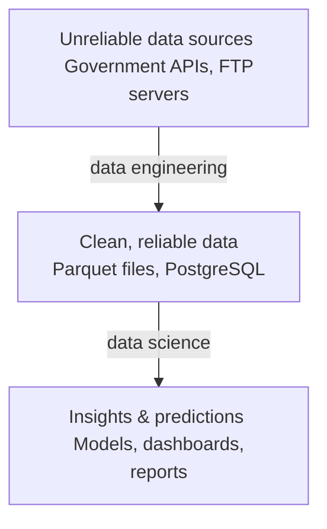
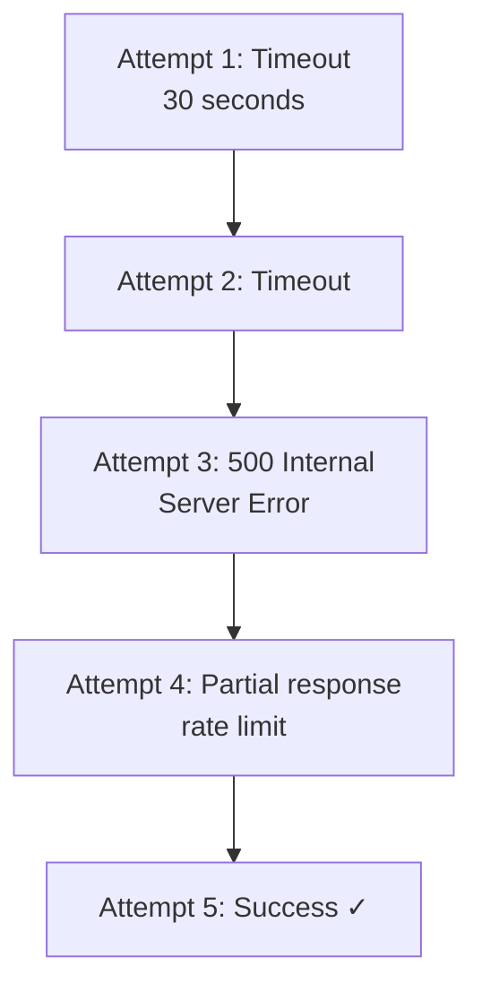
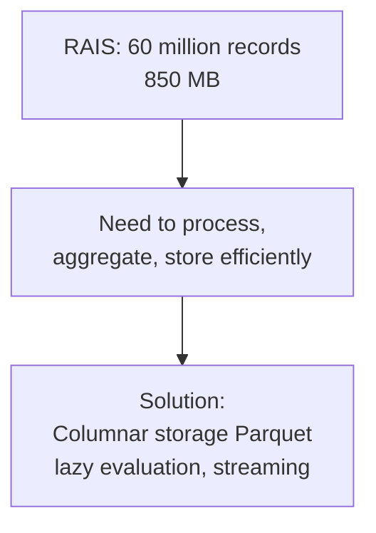
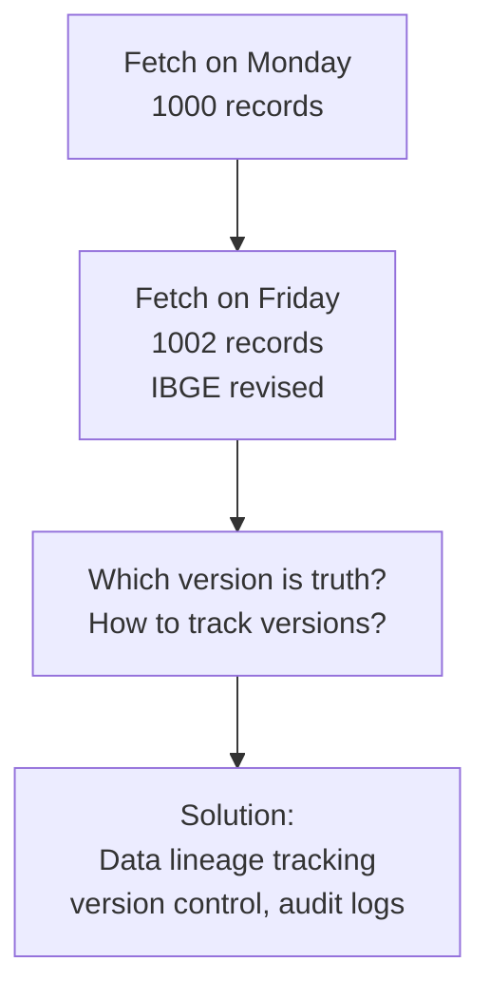
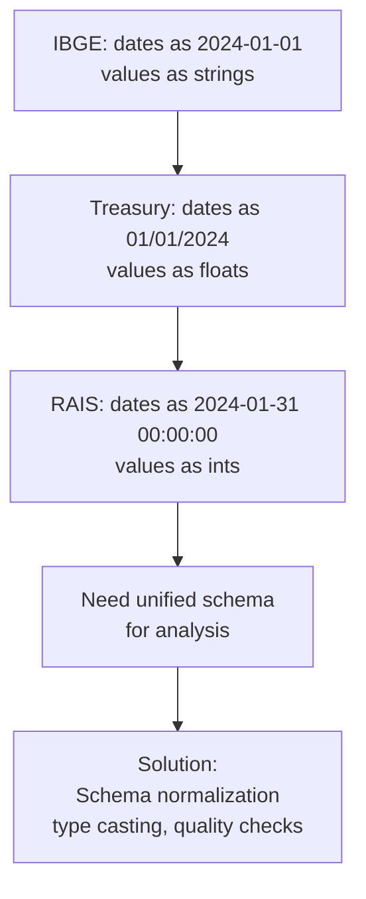
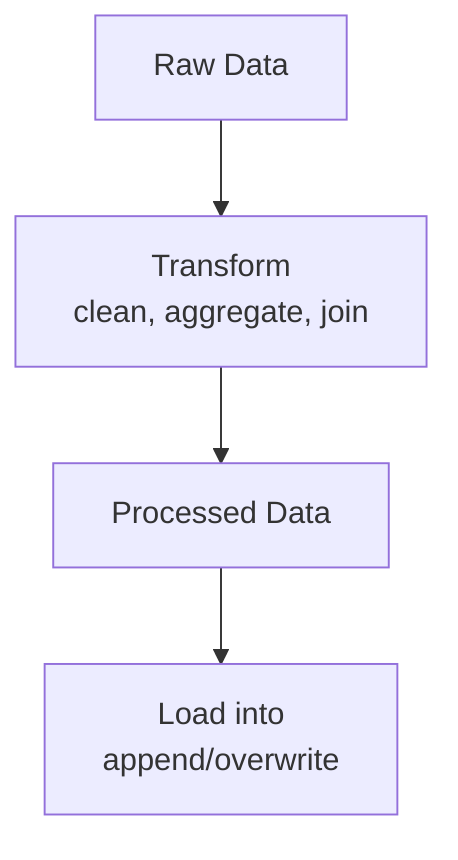
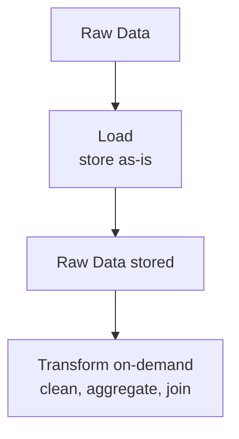

# Data Engineering Principles

Fundamental concepts underlying the Brazilian Public Data Suite.

## What Is Data Engineering?

Data engineering is the **infrastructure for data work**.

While data science answers "what does the data tell us?", data engineering answers "how do we reliably get, store, and manage data?"



## Core Problems Data Engineering Solves

### 1. Reliability

**Problem**: APIs are unreliable



**Solution**: Retries with exponential backoff, timeout handling, partial failure recovery

### 2. Performance

**Problem**: Data is large



### 3. Consistency

**Problem**: Data changes over time



### 4. Integration

**Problem**: Data comes from different sources



## ETL vs ELT

### ETL: Extract → Transform → Load (traditional)



**When to use**: Data is small, transformations are complex

**Pros**:

- Reduced storage (only store processed data)
- Reduced transfer (only move clean data)

**Cons**:

- Transformation failures lose raw data
- Hard to change transformations later (have to re-fetch)

### ELT: Extract → Load → Transform (modern)



**When to use**: Data is large, transformations evolve

**Pros**:

- Raw data preserved (debugging, re-processing)
- Flexible transformations (no re-fetch)
- Parallelizable (transform many ways in parallel)

**Cons**:

- Requires more storage
- Need tools to handle raw data

### Brazilian Public Data Suite Uses ELT

```python
# EXTRACT & LOAD: Store raw data
gdp = SidraClient().fetch(table="1620", variable=116)
gdp.to_parquet("gdp_raw.parquet")  # Store raw

# TRANSFORM: Process on-demand
import polars as pl
gdp = pl.read_parquet("gdp_raw.parquet")
gdp = gdp.with_columns([
    pl.col("value").pct_change().alias("growth")
])

# Can re-transform anytime without re-fetching
# Raw data is preserved for debugging
```

## Data Quality Dimensions

### 1. Accuracy

Does the data represent reality?

```
Sources:
- Algorithmic: Calculation errors, rounding
- Typographical: Typos in manual entry
- Source: Errors in original system
- Temporal: Stale data

Check:
- Validate against independent sources
- Look for outliers and anomalies
- Check for sign errors (GDP growth -50%?)
```

### 2. Completeness

Is all data present?

```
IBGE SIDRA table 1620:
  Expected: 96 quarters (2000-2024)
  Actual: 88 quarters
  Missing: 8 quarters (data not available)

Check:
- Count rows vs expected
- Check for NULL values
- Verify date coverage
```

### 3. Consistency

Is data formatted consistently?

```
Bad: Mixing formats
  "2024-01-01" (ISO)
  "01/01/2024" (US)
  "01-01-2024" (EU)
  "Jan 1, 2024" (text)

Good: Normalized
  All dates: "2024-01-01" (ISO 8601)
```

### 4. Timeliness

Is data current?

```
IBGE publishes GDP with ~60 day lag
Treasury publishes daily
RAIS publishes annually (Dec 31 of following year)
↓
Know your update frequency!
```

### 5. Validity

Does data fit the schema?

```
Column "salary" should be:
  Type: float (numeric)
  Range: 0 to 1,000,000
  Not null

Check:
  assert df["salary"].dtype == pl.Float64
  assert (df["salary"] >= 0) & (df["salary"] <= 1_000_000)
  assert df["salary"].is_null().sum() == 0
```

## Validation Patterns

### Schema Validation

```python
import polars as pl

df = pl.read_parquet("gdp.parquet")

# Expected schema
expected = {
    "date": pl.Date,
    "value": pl.Float64,
    "status_code": pl.Utf8
}

# Check
for col, dtype in expected.items():
    assert col in df.columns, f"Missing column: {col}"
    assert df[col].dtype == dtype, f"Wrong type for {col}"
```

### Range Validation

```python
# GDP growth should be -50% to +50%
assert (df["growth"] >= -0.50) & (df["growth"] <= 0.50)

# Unemployment rate should be 0-100%
assert (df["unemployment"] >= 0) & (df["unemployment"] <= 1.0)

# Wages should be positive
assert df["salary"] > 0
```

### Temporal Validation

```python
# Check date continuity (for time series)
dates = df["date"].sort()
gaps = dates.diff()

max_gap = gaps.max()
if max_gap > timedelta(days=100):
    logger.warning(f"Gap found: {max_gap}")
```

### Statistical Validation

```python
import polars as pl

df = pl.read_parquet("data.parquet")

# Detect outliers (values > 3 std devs)
mean = df["value"].mean()
std = df["value"].std()

outliers = df.filter(
    (pl.col("value") - mean).abs() > 3 * std
)

if len(outliers) > 0:
    logger.warning(f"Outliers detected: {len(outliers)} rows")
```

## Data Pipeline Layers

### Layer 1: Raw Data

```
What: Exactly as received from source
Why: Preserves original for debugging
Format: Parquet (efficient storage)
Example: gdp_raw.parquet
```

### Layer 2: Validated Data

```
What: Checked schema, types, ranges
Why: Catches errors early
Format: Parquet
Example: gdp_validated.parquet
```

### Layer 3: Processed Data

```
What: Cleaned, standardized, normalized
Why: Ready for analysis
Format: Parquet or PostgreSQL
Example: gdp_processed.parquet
```

### Layer 4: Aggregated Data

```
What: Grouped, summarized, pre-computed
Why: Fast dashboards and reports
Format: PostgreSQL (for real-time access)
Example: gdp_by_sector table
```

## Monitoring Data Pipelines

### What to Monitor

```python
# 1. Freshness
last_update = get_last_update_time()
age_hours = (now - last_update).total_seconds() / 3600

if age_hours > 72:  # Alert if older than 3 days
    alert(f"Data is {age_hours} hours old")

# 2. Completeness
expected_rows = get_expected_row_count()
actual_rows = len(df)

if actual_rows < expected_rows * 0.9:
    alert(f"Missing {expected_rows - actual_rows} rows")

# 3. Quality
null_rate = df.is_null().sum() / len(df)

if null_rate > 0.05:
    alert(f"{null_rate*100:.1f}% missing data")

# 4. Anomalies
recent_mean = df.tail(30)["value"].mean()
all_time_mean = df["value"].mean()
change = abs(recent_mean - all_time_mean) / all_time_mean

if change > 0.50:
    alert(f"Value changed {change*100:.1f}%")
```

## Tools for Data Engineering

### Extraction

- **HTTP clients**: requests, httpx
- **Database drivers**: psycopg2, sqlite3
- **Cloud SDKs**: boto3 (AWS), google-cloud (GCP)

### Transformation

- **Pandas**: Flexible, widely-used
- **Polars**: Fast, memory-efficient
- **DuckDB**: SQL on files/dataframes
- **Spark**: Distributed processing

### Storage

- **Parquet**: Columnar, compressed
- **PostgreSQL**: Relational, ACID
- **S3/Cloud Storage**: Data lake
- **Snowflake/BigQuery**: Cloud data warehouse

### Orchestration

- **Apache Airflow**: Workflow scheduler
- **Dagster**: Data-aware orchestration
- **Prefect**: Modern flow orchestration
- **cron**: Simple scheduled jobs

### Monitoring

- **Prometheus**: Metrics collection
- **Grafana**: Dashboarding
- **DataDog**: APM and monitoring
- **Custom scripts**: Application-specific checks

## See Also

- [Pipelines](pipelines.md)
- [Storage](storage.md)
- [Architecture Overview](../architecture/overview.md)
