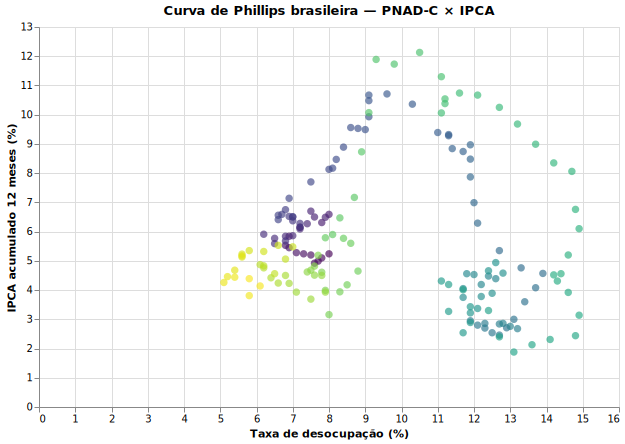

# A Curva de Phillips brasileira em 30 linhas

> **Tempo estimado:** 5 minutos. **Pacotes:** `sidra-fetcher`, `polars`, `altair`.

A Curva de Phillips é o gráfico clássico macroeconômico: inflação no eixo Y, desemprego no eixo X. Vamos baixar as duas séries direto do SIDRA, juntar por mês e plotar.

## O que você vai ver

Um scatter plot mensal com IPCA YoY contra a taxa de desocupação da PNAD Contínua. Esperaríamos uma relação negativa em curto prazo — na prática, o Brasil mostra ruído e quebras estruturais interessantes.



## Setup

```bash
uv add "sidra-fetcher @ git+https://github.com/Quantilica/sidra-fetcher.git" polars "altair[save]"
```

## A receita

```python
import polars as pl
import altair as alt
from sidra_fetcher.fetcher import SidraClient
from sidra_fetcher.sidra import Parametro, Formato, Precisao


def fetch_serie(client, agregado, variavel):
    param = Parametro(
        agregado=agregado,
        territorios={"1": ["all"]},   # Brasil
        variaveis=[variavel],
        periodos=[],
        classificacoes={},
        formato=Formato.A,
        decimais={"": Precisao.M},
    )
    rows = client.get(param.url())
    df = pl.DataFrame(rows[1:])  # primeira linha é cabeçalho descritivo
    return df.select(
        pl.col("D3C").alias("periodo"),
        pl.col("V").cast(pl.Float64, strict=False).alias("valor"),
    ).drop_nulls()


with SidraClient(timeout=60) as client:
    # IPCA YoY (12-meses) — agregado 1737, variável 2265
    ipca = fetch_serie(client, "1737", "2265").rename({"valor": "ipca_yoy"})

    # Taxa de desocupação trimestre móvel — agregado 6381, variável 4099
    desemprego = fetch_serie(client, "6381", "4099").rename({"valor": "desemprego"})

painel = ipca.join(desemprego, on="periodo", how="inner")

chart = (
    alt.Chart(painel.to_pandas())
    .mark_circle(size=60, opacity=0.6)
    .encode(
        x=alt.X("desemprego:Q", title="Taxa de desocupação (%)"),
        y=alt.Y("ipca_yoy:Q", title="IPCA 12 meses (%)"),
        tooltip=["periodo", "desemprego", "ipca_yoy"],
    )
    .properties(width=600, height=400, title="Curva de Phillips brasileira (PNAD-C × IPCA)")
)

chart.save("phillips.html")
```

## O que está acontecendo

- `agregado 1737` é o IPCA — variável `2265` é a variação acumulada em 12 meses.
- `agregado 6381` é a PNAD Contínua trimestre móvel — variável `4099` é a taxa de desocupação.
- Ambos vêm com período `YYYYMM`; o `join(... on="periodo")` faz o merge mensal direto.
- Conversão do `V` para `Float64` com `strict=False` ignora as células `"..."` (sem dado).

## Pegadinhas

- **Períodos não batem perfeitamente.** A PNAD-C é trimestre móvel — cada `periodo` representa três meses; o IPCA é mensal puro. O join inner pega só meses que aparecem em ambos.
- **A relação não é linear no Brasil.** Choques (greve dos caminhoneiros 2018, pandemia 2020, dólar 2024) deslocam a curva. Adicionar uma coloração por `ano` no `alt.encode` revela isso.

## Variações

- Substitua a PNAD-C pelo CAGED (`pdet-fetcher`) para fluxos de emprego mensais.
- Adicione expectativa de inflação (BCB Focus) e veja a Phillips com expectativas, à la Lucas.
- Recorte por região metropolitana (PNAD-C tem agregado por região).

## Veja também

- [sidra-fetcher](../ibge/sidra-fetcher.md)
- [Análise Econômica Multi-Fonte](analise-economica-multi-fonte.md) — adiciona finanças e mercado de trabalho ao mesmo painel.
