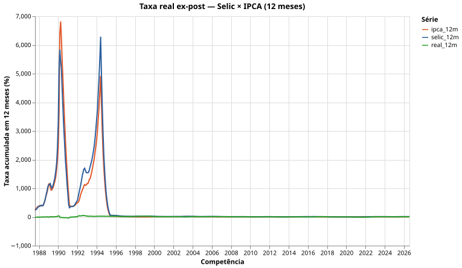

# Receita: Taxa Real Ex-Post — Selic × IPCA

Em agosto de 2026 o IPCA marcou −0,32% enquanto a Selic acumulava 1,09% no mês — dinheiro parado no CDI rendeu quase 10% acima da inflação em 12 meses. Mas quanto rendeu *de verdade*, mês a mês, descontada a corrosão dos preços? Esta receita combina IPCA e Selic do SGS/BCB para calcular a taxa real ex-post. Só `bcb-sgs-fetcher` + Polars (+ Altair para o gráfico).

## O que você vai ver



Três curvas em 12 meses: IPCA acumulado, Selic acumulada e a taxa real ex-post — o poder de compra que o juro nominal realmente entregou.

## Setup

```bash
quantilica install bcb-sgs
uv add bcb-sgs-fetcher polars altair --index https://index.quantilica.com/simple/
```

## A receita

```python
from bcb_sgs_fetcher.data import SgsDataClient
import polars as pl

IPCA_SERIE = 433    # IPCA — variação mensal (% a.m.)
SELIC_SERIE = 4390  # Selic — acumulada no mês (% a.m.)


def fetch(client: SgsDataClient, series_id: int, name: str) -> pl.DataFrame:
    points = client.fetch_series_data(series_id)
    rows = [(p.date, p.value) for p in points if p.value is not None]
    return (
        pl.DataFrame({"date": [d for d, _ in rows], name: [float(v) for _, v in rows]})
        .with_columns(pl.col("date").cast(pl.Date))
        .sort("date")
    )


def acum12(expr: pl.Expr) -> pl.Expr:
    """Fator acumulado de (1 + taxa/100) nos últimos 12 meses, em %."""
    log_cum = ((1 + expr / 100).log()).cum_sum()
    return (log_cum - log_cum.shift(12)).exp().sub(1).mul(100)


with SgsDataClient(timeout=60) as client:
    ipca = fetch(client, IPCA_SERIE, "ipca_m")
    selic = fetch(client, SELIC_SERIE, "selic_m")

painel = (
    ipca.join(selic, on="date", how="inner")
    .sort("date")
    .with_columns(
        (((1 + pl.col("selic_m") / 100) / (1 + pl.col("ipca_m") / 100)) - 1)
        .mul(100)
        .alias("real_m"),
        acum12(pl.col("ipca_m")).alias("ipca_12m"),
        acum12(pl.col("selic_m")).alias("selic_12m"),
    )
    .with_columns(
        (
            (1 + pl.col("selic_12m") / 100) / (1 + pl.col("ipca_12m") / 100) - 1
        )
        .mul(100)
        .alias("real_12m"),
    )
)

print(painel.select("date", "ipca_m", "selic_m", "real_12m").tail(6))
```

Na execução de referência (2026-09-28, 481 competências), a cauda do painel foi:

```text
┌────────────┬────────┬─────────┬───────────┐
│ date       ┆ ipca_m ┆ selic_m ┆ real_12m  │
│ 2026-04-01 ┆ 0.67   ┆ 1.09    ┆ 10.000601 │
│ 2026-05-01 ┆ 0.58   ┆ 1.07    ┆ 9.574739  │
│ 2026-06-01 ┆ 0.16   ┆ 1.12    ┆ 9.683952  │
│ 2026-07-01 ┆ 0.07   ┆ 1.22    ┆ 9.827104  │
│ 2026-08-01 ┆ -0.32  ┆ 1.09    ┆ 9.982324  │
└────────────┴────────┴─────────┴───────────┘
```

Janela terminada em 2026-08: IPCA acumulado em 12 meses de 4,22%, Selic acumulada de 14,63% e taxa real ex-post de **9,98%** — conferida por cálculo independente (produto direto dos 12 fatores mensais).

## O que está acontecendo

A identidade é a equação de Fisher ex-post, em fatores mensais:

```text
1 + r = (1 + i) / (1 + π)
```

onde `i` é a Selic do mês e `π` o IPCA do mês. O acumulado em 12 meses **não** é a soma das taxas mensais — é o produto dos fatores, calculado aqui via soma de logaritmos (`acum12`), numericamente estável para janelas longas. A mesma matemática de juros compostos sustenta o [Cálculo de Retornos de Renda Fixa](../concepts/calculo-retornos-renda-fixa.md).

## Pegadinhas

- **Série 11 não serve aqui.** A série 11 (Selic meta) é **diária** na API SGS — juntá-la direto com o IPCA mensal dá join vazio. O par mensal correto é 433 × 4390 (Selic acumulada no mês). Para análise diária, use a estratégia retroativa ano a ano do fetcher (`frequency_acronym="D"`).
- **As duas séries começam em datas diferentes.** O `join(..., how="inner")` alinha só as competências comuns (481 na execução de referência); os 12 primeiros meses ficam sem `real_12m` (`shift(12)` → nulo) e são descartados do gráfico com `drop_nulls`.
- **Revisões do BCB.** Valores mensais podem ser republicados; rode de novo e compare — o manifesto SHA-256 do fetcher detecta mudança silenciosa (ver [Proveniência](../concepts/proveniencia.md)).

## Variações

- **Taxa real ex-ante:** troque o IPCA realizado pela expectativa Focus (`bcb-sgs series search "expectativa"`) e obtenha o juro real esperado pelo mercado.
- **Janela longa:** filtre `painel` a partir de 2003 para estudar o ciclo completo de queda da taxa real (de ~10% para ~2% e de volta).
- **Em PostgreSQL:** carregue as séries com [`bcb-sgs-sql`](../bcb/bcb-sgs-sql.md) e compute `real_12m` numa view wide-pivot do [catálogo](../bcb/bcb-sgs-pipelines.md).

## Veja também

- [bcb-sgs-fetcher](../bcb/bcb-sgs-fetcher.md) — extração de séries do SGS
- [Cálculo de Retornos de Renda Fixa](../concepts/calculo-retornos-renda-fixa.md) — a matemática
- [Análise Econômica Multi-Fonte](analise-economica-multi-fonte.md) — IPCA + Tesouro + RAIS
