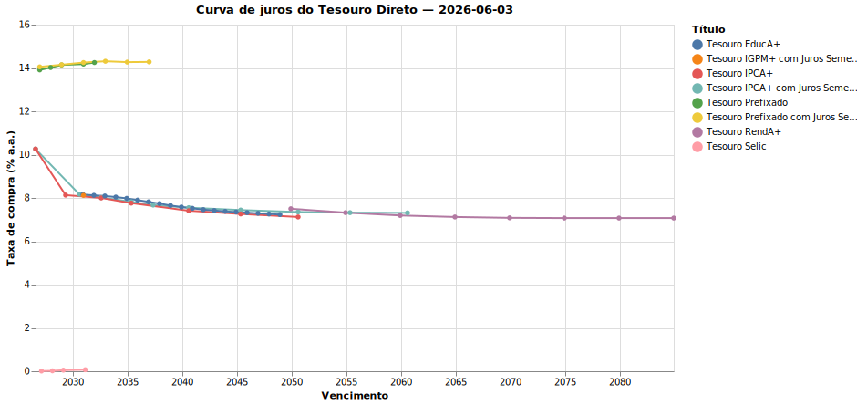
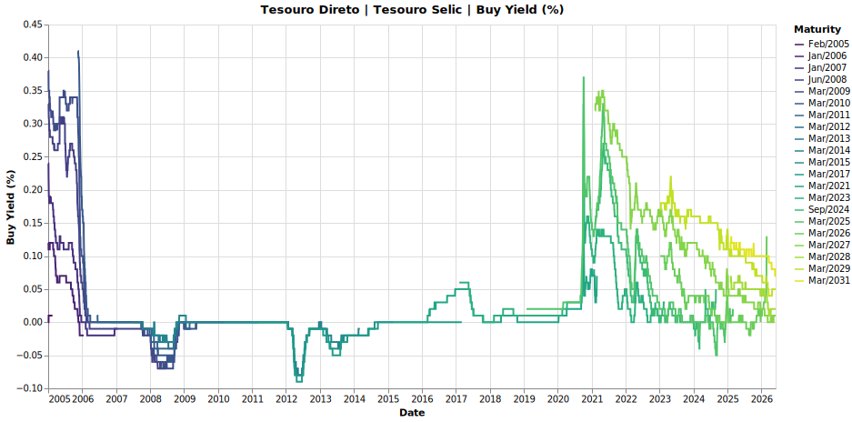
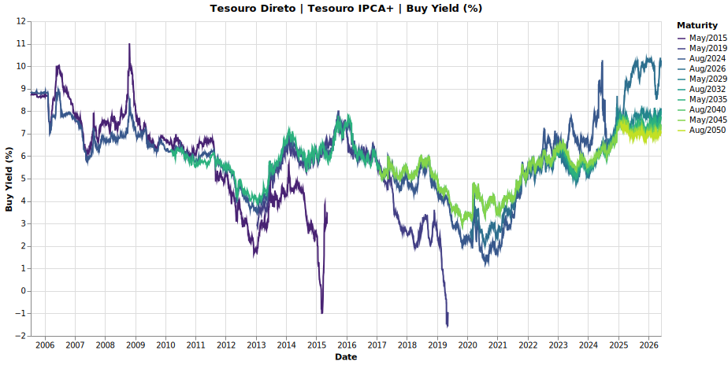

# Yield Curve em 10 linhas

> **Tempo estimado:** 3 minutos. **Pacotes:** `tesouro-direto-fetcher[analysis]`.

A curva de juros é o gráfico mais cobiçado da renda fixa brasileira: taxa contratada por vencimento. Vamos baixar o dataset completo de taxas do Tesouro Direto, filtrar uma data e plotar.

## O que você vai ver

Para uma data escolhida, a curva atual de cada classe de título (Selic, Prefixado, IPCA+). Em uma execução, dá para passar uma série de datas e comparar a evolução da inclinação.



Séries temporais por vencimento:




## Setup

```bash
uv add "tesouro-direto-fetcher[analysis] @ git+https://github.com/Quantilica/tesouro-direto-fetcher.git"
```

## A receita

```python
import asyncio
from pathlib import Path
from datetime import date
import polars as pl
import altair as alt
from tesouro_direto_fetcher import downloader, reader
from tesouro_direto_fetcher.constants import Column as C

dest = Path("./dados")
asyncio.run(
    downloader.download(
        dest_dir=dest,
        dataset_id="taxas-dos-titulos-ofertados-pelo-tesouro-direto",
    )
)

csv = max(dest.rglob("taxas-*.csv"), key=lambda p: p.stat().st_mtime)
df = reader.read_prices(csv)

# Usa a data mais recente disponível no dataset
latest = df[C.REFERENCE_DATE.value].max()
snapshot = (
    df.filter(pl.col(C.REFERENCE_DATE.value) == latest)
      .select(C.BOND_TYPE.value, C.MATURITY_DATE.value, C.BUY_YIELD.value)
      .drop_nulls()
)

chart = (
    alt.Chart(snapshot.to_pandas())
    .mark_line(point=True)
    .encode(
        x=alt.X(f"{C.MATURITY_DATE.value}:T", title="Vencimento"),
        y=alt.Y(f"{C.BUY_YIELD.value}:Q", title="Taxa contratada (% a.a.)"),
        color=f"{C.BOND_TYPE.value}:N",
        tooltip=[C.BOND_TYPE.value, C.MATURITY_DATE.value, C.BUY_YIELD.value],
    )
    .properties(width=700, height=400, title=f"Curva de juros do Tesouro Direto — {latest}")
)

chart.save("curva.html")
```

## O que está acontecendo

- O `downloader.download` baixa o CSV mais recente de taxas (com timestamp no nome).
- O `reader.read_prices` já trata `dd/mm/aaaa`, decimal `,` e os nomes pt-BR das colunas.
- Filtramos uma data-base, agrupamos por `Tipo Titulo` e plotamos `Taxa Compra Manha` por vencimento.

## Pegadinhas

- **Nem todo título tem cotação todo dia.** Feriados e dias sem oferta deixam buracos — escolha uma data de pregão útil.
- **IPCA+ e Selic não compartilham escala.** Selic é nominal pura; IPCA+ é taxa real. Ver os dois no mesmo eixo é informativo, mas exige contexto.
- **O dataset CSV vem com timestamp no nome.** Use `glob("taxas-*.csv")` + `max(...)` para pegar o mais recente, não chumbe nome.

## Variações

- **Evolução temporal:** loop sobre datas mensais e use `facet` do Altair para ver a curva mudando.
- **Spread Selic × Prefixado:** join interno por vencimento, calcule diferença, plote no tempo.
- **Compare com expectativas:** baixe o Focus (BCB) e sobreponha.

## Veja também

- [tesouro-direto-fetcher](../tesouro/tesouro-direto-fetcher.md)
- [Cálculo de Retornos de Renda Fixa](../concepts/calculo-retornos-renda-fixa.md)
