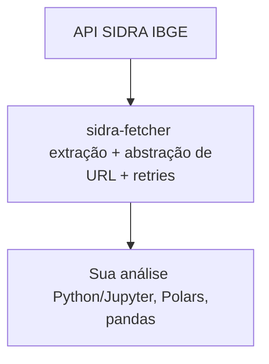
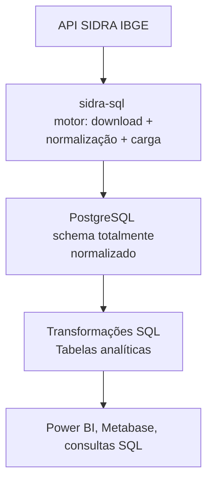
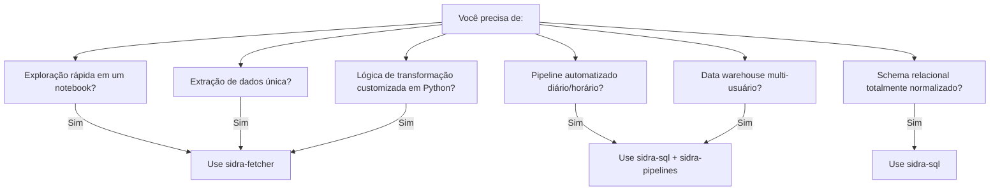

# IBGE: Dados Macroeconômicos

Instituto Brasileiro de Geografia e Estatística (IBGE) é a fonte oficial de estatísticas macroeconômicas. Seu sistema **SIDRA** contém milhares de séries temporais em PIB, inflação, emprego, comércio e demografia.

## O Desafio SIDRA

SIDRA é a fonte de dados mais rica do Brasil, mas consumi-la em escala encontra desafios críticos de engenharia:

### Instabilidade de Rede

- Servidores governamentais sofrem de sobrecarga e rate limiting
- Erros transitórios (HTTP 429, 500+) interrompem pipelines
- Timeouts são frequentes; retries requerem estratégias de backoff

### Complexidade Paramétrica

- API usa estruturas de URL posicionais crípticas: `/t/1620/n1/all/v/116/p/all/d/m`
- Construção manual de URL é propensa a erros e difícil de manter
- Falta de um único parâmetro quebra toda a requisição

### Escala de Dados

- **Catálogo massivo**: 30,000+ tabelas em dezenas de temas
- **Arquivos grandes**: Algumas séries históricas abrangem 50+ anos com granularidade mensal/diária
- **Estrutura complexa**: Tabelas contêm classificações aninhadas, categorias e dimensões
- **Documentação fragmentada**: Espalhada em múltiplos sites em português

---

## O Ecossistema de Ferramentas IBGE

Fornecemos **dois stacks complementares** para diferentes casos de uso:

### Stack 1: SDK Flexível (Para Exploração & Workflows Customizados)

**Ferramenta:** `sidra-fetcher`

Para cientistas de dados e analistas que precisam:

- Exploração rápida em notebooks
- Lógica de extração customizada
- Fetching de dados on-demand
- Formatos de output flexíveis (Parquet, CSV, DataFrames)



### Stack 2: Enterprise ETL (Para Production Pipelines)

**Ferramentas:** `sidra-sql` + `sidra-pipelines`

Para engenheiros de dados construindo:

- Pipelines automatizados e reproduzíveis
- Bancos de dados relacionais normalizados
- Data warehouses multi-usuário
- Definições declarativas (sem código)



---

## Referência de Ferramentas

### 🔍 Stack 1: Exploração & Notebooks

**[sidra-fetcher](sidra-fetcher.md) — SDK de Nível Industrial**

Um SDK Python avançado para extração robusta:

- **Clients duais:** `SidraClient` (sync) vs `AsyncSidraClient` (async, 3x mais rápido)
- **Resiliência inteligente:** Backoff exponencial, retries automáticos
- **Abstração de URL:** Sem magic strings; classe `Parametro`
- **Tipagem forte:** Metadados como dataclasses, não dicts
- **Múltiplos formatos:** Parquet, CSV, PostgreSQL, Polars DataFrames

**Melhor para:**

- Notebooks Jupyter & exploração rápida
- Análise one-off
- Datasets pequenos (<100 MB)
- Quando precisa de lógica de transformação customizada
- Workflows de pesquisa acadêmica

---

### 🏭 Stack 2: Production ETL

**[sidra-sql](sidra-sql.md) — Motor ETL**

Orquestração de pipeline de nível industrial:

- **Arquitetura de plugin:** Motor leve + definições de dados separadas
- **Normalização completa:** Schema relacional 5-tabelas (`sidra_tabela`, `localidade`, `periodo`, `dimensao`, `dados`)
- **Bulk loading:** Protocolo PostgreSQL COPY (400k+ rows/sec)
- **Operações idempotentes:** Re-execução segura
- **Transformações SQL:** Gere tabelas de análise automaticamente
- **Trilha de auditoria SCD Type II:** Colunas `ativo` + `modificacao` preservam histórico de revisões

**[sidra-pipelines](sidra-pipelines.md) — Biblioteca Standard**

Catálogo pré-construído de pipelines production-ready:

- PIB, inflação, população, agricultura, etc.
- Deployment one-command: `sidra-sql run std pib_municipal`
- Pronto para Power BI, Metabase, analytics
- Extensível para datasets customizados

**Melhor para:**

- Production data pipelines (hourly/daily)
- Enterprise data warehouses
- Acesso multi-usuário via PostgreSQL
- Datasets reproduzíveis e auditáveis
- Conformidade acadêmica/regulatória
- Workflows multi-tabela complexos

---

## Quando Usar Cada Stack

| Dimensão | Exploração (Stack 1) | Produção (Stack 2) |
|-----------|---|---|
| **Tempo de configuração** | Minutos (pip install) | ~30 minutos (config + PostgreSQL) |
| **Manutenção** | Nenhuma (ad-hoc) | Execuções de pipeline agendadas |
| **Recência dos dados** | On-demand | Horária/diária/semanal |
| **Escalabilidade** | Notebooks, uso pessoal | Multi-usuário, enterprise |
| **Dependências** | Apenas Python | Python + PostgreSQL |
| **Validação de dados** | Manual | Automatizada (constraints, unicidade) |
| **Trilha de auditoria** | Logging básico | Versionamento completo SCD Type II |
| **Transformação** | Python (Polars, pandas) | SQL (declarativa) |
| **Compartilhamento** | Exportações CSV/Parquet | Consultas SQL + ferramentas BI |

### Árvore de Decisão



---

## Categorias de Tabelas SIDRA

| Categoria | Exemplos | Caso de Uso |
|----------|----------|----------|
| **Contas Nacionais** | PIB, VVA, investimento | Análise macro |
| **Preços & Inflação** | IPCA, IGP-M, IPC | Rastreamento de inflação |
| **Produção Industrial** | Produção, utilização de capacidade | Análise cíclica |
| **Comércio** | Exportações, importações, saldo | Análise comercial |
| **Emprego** | Desemprego, horas trabalhadas | Mercado de trabalho |
| **Demografia** | População, migração | Pesquisa social |
| **Agricultura** | Cultivos, pecuária, silvicultura | Análise agrícola |

---

## Casos de Uso Comuns

### 📊 Monitoramento Econômico (→ Stack 2: Production ETL)

Rastrear o desempenho econômico brasileiro em tempo real com pipelines automatizados:

- Crescimento do PIB (trimestral e anual)
- Inflação (IPCA, INPC, IPCA-15)
- Produção industrial

**Comando:**

```bash
sidra-sql run std pib_municipal
sidra-sql run std ipca
```

### 📈 Análise Macroeconômica (→ Qualquer stack)

**Análise ad-hoc:** Use `sidra-fetcher` em Python

```python
from sidra_fetcher import AsyncSidraClient
client = AsyncSidraClient()
gdp = await client.fetch(table="1620", variable=116)
```

**Análise recorrente:** Use `sidra-sql` + PostgreSQL

```sql
SELECT * FROM analytics.pib_municipal
WHERE ano >= 2020;
```

### 👥 Demografia & Pesquisa Social (→ Stack 2: Production ETL)

População, composição de domicílios, dados censitários:

```bash
sidra-sql run std censo_populacao
sidra-sql run std estimativa_populacao
```

### 🌾 Análise Agrícola (→ Stack 2: Production ETL)

Dados de produção agrícola e pecuária:

```bash
sidra-sql run std pam_lavouras_temporarias
sidra-sql run std ppm_rebanhos
sidra-sql run std pevs_producao
```

---

## Fluxos de Trabalho de Exemplo

### Fluxo A: Análise Rápida (Stack 1)

```python
from sidra_fetcher import AsyncSidraClient
import asyncio

async def analyze_gdp():
    client = AsyncSidraClient()
    gdp = await client.fetch(table="1620", variable=116, initial_date="2020-01-01")
    gdp.write_parquet("gdp_recent.parquet")
    return gdp

# Executar uma vez, analisar em notebook
data = asyncio.run(analyze_gdp())
```

### Fluxo B: Dashboard Production (Stack 2)

```bash
# 1. Instalar pipelines
sidra-sql plugin install https://github.com/Quantilica/sidra-pipelines.git --alias std

# 2. Executar pipeline (cria tabelas PostgreSQL)
sidra-sql run std ipca

# 3. Conectar Power BI à tabela analytics.ipca
# → Dashboard em tempo real pronto
```

---

## Começando

### Exploração Rápida (sidra-fetcher)

#### Etapa 1: Descobrir a Tabela Correta

Navegue pelo [catálogo SIDRA](https://sidra.ibge.gov.br/) diretamente para encontrar códigos de tabela,
códigos de variáveis e IDs de classificação. Use a barra de pesquisa (Português) ou navegue
por tema. Cada página de tabela mostra:

- Código da tabela (ex. `1620` para PIB)
- Variáveis disponíveis e seus códigos
- Níveis territoriais suportados
- Classificações disponíveis

Você também pode fazer engenharia reversa de URLs do website SIDRA. URL de exemplo:

```
https://sidra.ibge.gov.br/tabela/1620
```

Código da tabela = `1620`. Clique na tabela para ver variáveis e classificações.

#### Etapa 2: Extrair Dados

**Síncrono (tabela única):**

```python
from sidra_fetcher import SidraClient

client = SidraClient()
gdp = client.fetch(
    table="1620",
    variable=116,
    frequency="quarterly",
    initial_date="2015-01-01"
)
print(f"✓ Exttraídas {len(gdp)} observações")
```

**Assíncrono (múltiplas tabelas, 3x mais rápido):**

```python
import asyncio
from sidra_fetcher import AsyncSidraClient

async def fetch_macro_suite():
    client = AsyncSidraClient()
    try:
        results = await asyncio.gather(
            client.fetch(table="1620", variable=116),  # PIB
            client.fetch(table="1612", variable=117),  # VVA
            client.fetch(table="1637", variable=119)   # Investimento
        )
        return results
    finally:
        await client.aclose()

gdp, gva, investment = asyncio.run(fetch_macro_suite())
```

#### Etapa 3: Armazenar e Analisar

```python
import polars as pl

# Calcular taxas de crescimento
gdp_analysis = gdp.with_columns([
    pl.col("value").pct_change().alias("qoq_growth"),
    pl.col("value").pct_change(4).alias("yoy_growth")
])

# Salvar em Parquet (compressão 80%+)
gdp_analysis.write_parquet("gdp_quarterly.parquet")
```

### Pipeline Production (sidra-sql)

```bash
# 1. Instalar sidra-sql
git clone https://github.com/Quantilica/sidra-sql.git
cd sidra-sql
python -m venv .venv
source .venv/bin/activate
pip install -e .

# 2. Configurar banco de dados
cat > config.ini << EOF
[storage]
data_dir = data

[database]
user = postgres
password = sua_senha
host = localhost
port = 5432
dbname = dados
schema = ibge_sidra
tablespace = pg_default
readonly_role = readonly_role
EOF

# 3. Instalar pipelines oficiais
sidra-sql plugin install https://github.com/Quantilica/sidra-pipelines.git --alias std

# 4. Executar um pipeline
sidra-sql run std pib_municipal

# 5. Consultar resultados
psql -U postgres -d dados << EOF
SELECT * FROM analytics.pib_municipal
WHERE ano >= 2015
ORDER BY localidade, periodo;
EOF
```

---

## Melhores Práticas

### 1. Escolha a Ferramenta Correta Cedo

- Notebook/exploração → sidra-fetcher
- Pipeline production → sidra-sql + sidra-pipelines

### 2. Use Async para Extração Multi-Tabela

Fetching concorrente é 3x mais rápido que sequencial:

```python
# 30 segundos (sync)
client = SidraClient()
gdp = client.fetch(table="1620", variable=116)
gva = client.fetch(table="1612", variable=117)

# 10 segundos (async)
results = await asyncio.gather(
    client.fetch(table="1620", variable=116),
    client.fetch(table="1612", variable=117)
)
```

### 3. Filtre Dados no Fetch

Reduza volume de dados antes de carregar:

```python
# Bom: Filtrar por data no fetch
recent = client.fetch(
    table="1620",
    variable=116,
    initial_date="2020-01-01"
)

# Menos eficiente: Buscar tudo, filtrar localmente
all_data = client.fetch(table="1620", variable=116)
recent = all_data.filter(pl.col("date") >= "2020-01-01")
```

### 4. Armazene em Parquet, Não CSV

Parquet é 80%+ menor e mais rápido para ler:

```python
# Bom
df.write_parquet("data.parquet")

# Não eficiente
df.write_csv("data.csv")
```

### 5. Aproveite Recursos de Production em sidra-sql

Use operações idempotentes para re-execução segura:

```bash
# Seguro executar múltiplas vezes
sidra-sql run std pib_municipal

# Arquivos cache pulados em re-execução → conclusão quase instantânea
sidra-sql run std pib_municipal
```

---

## Resolução de Problemas

### "Table not found"

Códigos de tabela SIDRA devem ser strings, não inteiros. Verifique se a tabela ainda existe em
[sidra.ibge.gov.br/tabela/{id}](https://sidra.ibge.gov.br/) — IBGE ocasionalmente
descontinua ou substitui tabelas.

```python
gdp = client.fetch(table="1620", variable=116)   # ✅ string
gdp = client.fetch(table=1620, variable=116)     # ❌ pode falhar
```

### Erros de Timeout

Aumente timeout e retries:
```python
client = SidraClient(
    timeout=60,
    max_retries=5,
    backoff_factor=2
)
```

### Erro de conexão PostgreSQL (sidra-sql)

Verifique `config.ini`:

- Banco de dados existe: `createdb dados`
- Usuário tem permissões: `ALTER USER postgres WITH PASSWORD 'senha';`
- Schema existe ou usuário pode criá-lo: `CREATE SCHEMA ibge_sidra;`
- Testar conexão: `psql -U postgres -h localhost -d dados`

### Plugin sidra-sql não encontrado

Verifique instalação:

```bash
sidra-sql plugin list
```

Se vazio, instale o catálogo padrão:

```bash
sidra-sql plugin install https://github.com/Quantilica/sidra-pipelines.git --alias std
```

---

## Saiba Mais

### Stack 1 (SDK):

- [Documentação sidra-fetcher](sidra-fetcher.md)

### Stack 2 (Production ETL):

- [Documentação sidra-sql](sidra-sql.md)
- [Catálogo sidra-pipelines](sidra-pipelines.md)

### Recursos Externos:

- [Website Oficial IBGE (Português)](https://www.ibge.gov.br/)
- [Banco de Dados SIDRA (Português)](https://sidra.ibge.gov.br/)
