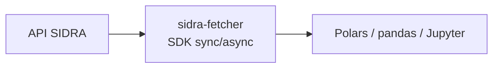
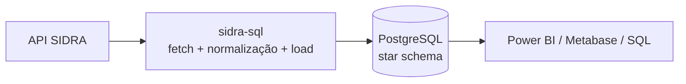

# IBGE — Macroeconomia

O Instituto Brasileiro de Geografia e Estatística (IBGE) é a fonte oficial das estatísticas macroeconômicas do país. O **SIDRA** é o sistema central — milhares de séries temporais sobre PIB, inflação, emprego, comércio interno e demografia.

## O desafio

SIDRA é a fonte mais rica do Brasil, mas consumi-la em escala enfrenta três obstáculos:

- **Instabilidade de rede** — servidores governamentais sofrem rate limiting e downtime; HTTP 429/500 são frequentes; timeouts exigem backoff.
- **Complexidade paramétrica** — a API usa URLs posicionais crípticas (`/t/1620/n1/all/v/116/p/all/d/m`); construção manual é frágil.
- **Escala** — 30 000+ tabelas; algumas séries cobrem 50+ anos com granularidade mensal/diária; classificações aninhadas; documentação espalhada em português.

## Dois stacks: Exploração vs. Produção

A plataforma fornece **dois stacks complementares** para SIDRA — escolha baseado em maturidade do pipeline e requisitos.

### Stack 1 — Exploração (`sidra-fetcher`)

Para análise ad-hoc, notebooks Jupyter, lógica customizada e fetching on-demand. SDK Python com clientes sync (`SidraClient`) e async (`AsyncSidraClient`, ~3× mais rápido em multi-tabela).

### Stack 2 — Produção (`sidra-sql` + `sidra-pipelines`)

Para pipelines automatizados, data warehouses multi-usuário e definições declarativas. Motor ETL baseado em plugins que ingere SIDRA num star schema PostgreSQL com bulk load `COPY FROM STDIN` (400k+ rows/s) e SCD Type II para preservar revisões históricas.

| Dimensão | Stack 1 | Stack 2 |
|---|---|---|
| Setup | minutos (`pip install`) | ~30 min (PostgreSQL + config) |
| Frequência | on-demand | horária / diária / semanal |
| Escala | uso pessoal, notebooks | multi-usuário, enterprise |
| Validação | manual | automatizada (constraints) |
| Auditoria | logging básico | SCD Type II completo |
| Transformação | Python (Polars) | SQL declarativo |

## Pacotes

- **[sidra-fetcher](sidra-fetcher.md)** — SDK sync/async para extração robusta, com smart caching via `Last-Modified`, classe `Parametro` para abstração de URL, e tipagem forte de metadados.
- **[sidra-sql](sidra-sql.md)** — motor ETL com plugins TOML (`fetch.toml` + `transform.toml` + `transform.sql`), bulk load `COPY`, schema relacional 5-tabelas, SCD Type II.
- **[sidra-pipelines](sidra-pipelines.md)** — catálogo pré-construído de pipelines production-ready (PIB, IPCA, população, agricultura). Deploy one-command via `sidra-sql run std <pipeline>`.

## Princípios em ação

Como o domínio IBGE concretiza os princípios da plataforma:

- **[Resiliência](../concepts/principios.md#resiliência)** — `sidra-fetcher` aplica `tenacity` com backoff exponencial em metadados; `sidra-sql` é idempotente, pode ser re-executado em pipelines parcialmente bem-sucedidos.
- **[Performance](../concepts/principios.md#performance)** — `AsyncSidraClient` paraleliza com `asyncio.gather`; `sidra-sql` usa `COPY FROM STDIN` para bulk load 400k+ rows/s.
- **[Sem Mágica](../concepts/principios.md#sem-mágica)** — a classe `Parametro` torna cada parâmetro de URL nomeado e visível; pipelines TOML declarativos não escondem comportamento em código.
- **[Reprodutibilidade](../concepts/principios.md#reprodutibilidade)** — SCD Type II preserva revisões IBGE; qualquer snapshot histórico pode ser reconstruído.

Receitas táticas em [Padrões Práticos](../concepts/padroes.md): [Concorrência para I/O](../concepts/padroes.md#concorrencia-io), [Auto-retry](../concepts/padroes.md#auto-retry).

## Próximos passos

- Para análise rápida em notebook: vá para **[sidra-fetcher](sidra-fetcher.md)**.
- Para data warehouse PostgreSQL: vá para **[sidra-sql](sidra-sql.md)** + **[sidra-pipelines](sidra-pipelines.md)**.
- Para combinar IBGE com outras fontes: veja a receita **[Análise Econômica Multi-Fonte](../cookbook/analise-economica-multi-fonte.md)**.

## Recursos externos

- [Site oficial IBGE](https://www.ibge.gov.br/)
- [Banco SIDRA](https://sidra.ibge.gov.br/)
