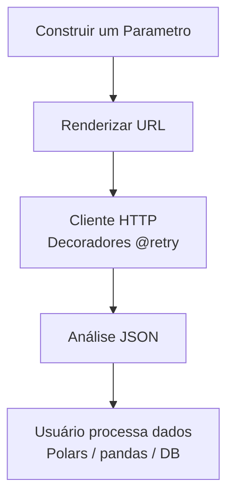

# sidra-fetcher

SDK avançado para extração programática da API SIDRA IBGE.

## O Que É

O **`sidra-fetcher`** é um SDK Python de nível de produção projetado para extração robusta de dados e metadados do Sistema IBGE de Recuperação Automática (SIDRA).

Ele serve como uma camada de infraestrutura de rede entre os servidores do IBGE e as aplicações de ciência de dados: oferecendo modelos de metadados tipados, abstração de URL via classe `Parametro` e clientes HTTP resilientes (síncrono + assíncrono) com tentativas automáticas (retries).

## Problema que Resolve

O SIDRA é uma das fontes de dados mais ricas do Brasil — contendo desde inflação (IPCA) até demografia do Censo. No entanto, consumir esses dados em escala encontra **dois gargalos severos de engenharia**:

### 1. Instabilidade de Rede

Os servidores governamentais frequentemente sofrem sobrecarga, resultando em:

- Desconexões e timeouts
- Erros transitórios (limitação de taxa HTTP 429, erros 500+)
- Scripts que falham e interrompem pipelines inteiros

### 2. Complexidade de Parâmetros

A API do SIDRA utiliza estruturas de URL posicionais crípticas:

```
/t/1737/n1/all/n3/all/v/2265/p/all/d/m
```

A construção manual de URLs via concatenação de strings é propensa a erros e difícil de manter.

**O `sidra-fetcher` foi arquitetado especificamente para mitigar ambos os gargalos:**

```python
# Construir requisição SIDRA declarativamente, sem concatenação de strings
from sidra_fetcher import SidraClient
from sidra_fetcher.sidra import Parametro, Formato, Precisao

param = Parametro(
    agregado="1620",
    territorios={"1": ["all"]},
    variaveis=["116"],
    periodos=[],
    classificacoes={},
    formato=Formato.A,
    decimais={"": Precisao.M},
)

with SidraClient(timeout=60) as client:
    data = client.get(param.url())  # list[dict] bruto do SIDRA
```

## Arquitetura e Principais Recursos

### Modelo de Cliente Dual (Síncrono + Assíncrono)

A biblioteca expõe dois clientes HTTP baseados no `httpx`:

- **`SidraClient`**: Cliente síncrono para extrações pontuais, exploração em notebooks ou fluxos de trabalho com `ThreadPoolExecutor`.
- **`AsyncSidraClient`**: 100% assíncrono via `asyncio`. Busque metadados, períodos e localidades concorrentemente com `asyncio.gather()`, reduzindo drasticamente os tempos de espera limitados por E/S (I/O-bound).

### Resiliência de Nível Industrial (Smart Retries)

Políticas de tolerância a falhas via `tenacity`:

- ✅ Até 3 tentativas em cada método de metadados.
- ✅ Backoff exponencial para requisições de períodos (`min=3`, `max=30` segundos).
- ✅ Lida com falhas transitórias do `httpx` (timeouts, erros de rede).

### Motor de Abstração de URL (`Parametro`)

O módulo `sidra_fetcher.sidra` elimina strings mágicas:

- ✅ Transforma dicionários/listas Python em URLs SIDRA válidas de forma transparente.
- ✅ Enums nativos para saída de `Formato` (`A`, `C`, `N`, `U`) e `Precisao` (`S`, `M`, `D0`–`D20`).
- ✅ Engenharia reversa: `parameter_from_url()` analisa qualquer URL do SIDRA e a transforma em um objeto `Parametro`.

### Modelagem de Domínio Estrita (Tipagem Forte)

As respostas de metadados são analisadas em dataclasses ricas:

- ✅ `Agregado` (raiz) → `Variavel`, `Classificacao`, `Categoria`, `Periodicidade`, `AgregadoNivelTerritorial`.
- ✅ `Periodo`, `Localidade`, `NivelTerritorial`.
- ✅ `IndicePesquisaAgregados`, `IndiceAgregado` para navegação no catálogo.
- ✅ Autocompletar na IDE + integração com linters.

### Recursos Adicionais

- ✅ Respostas HTTP em streaming (baixo consumo de memória).
- ✅ Análise JSON de todas as respostas.
- ✅ Auxiliares de leitura (`read_metadados`, `read_periodos`, `read_localidades`).
- ✅ Salvar/carregar metadados em disco (`save_agregado`, `load_agregado`).
- ✅ Registro de logs via `logging` da biblioteca padrão (nome do logger = `sidra_fetcher`).

## Instalação

### Usando "pip"

```bash
pip install sidra-fetcher
```

### Usando "uv"

```bash
uv pip install sidra-fetcher
```

### "A partir da fonte"

```bash
pip install git+https://github.com/Quantilica/sidra-fetcher.git
```

## Async/Await: Extração de Metadados de Alta Performance

Para coleta de metadados em larga escala, utilize o **`AsyncSidraClient`** para buscar múltiplos agregados simultaneamente. O gargalo é a E/S de rede; o `asyncio.gather()` o elimina.

### Desempenho Síncrono vs. Assíncrono

**Abordagem síncrona** (sequencial):

```
Buscar metadados para tabela 1620: ~2 segundos
Buscar metadados para tabela 1612: ~2 segundos
Buscar metadados para tabela 1637: ~2 segundos
Total: ~6 segundos
```

**Abordagem assíncrona** (concorrente):

```
Busca os três concorrentemente
Total: ~2 segundos (3x mais rápido)
```

### Exemplo Assíncrono

```python
import asyncio
from sidra_fetcher import AsyncSidraClient

async def fetch_macro_metadata():
    """Busca metadados para os agregados de PIB, VAB e Investimento concorrentemente."""
    async with AsyncSidraClient(timeout=60) as client:
        gdp_meta, gva_meta, inv_meta = await asyncio.gather(
            client.get_agregado(1620),  # PIB
            client.get_agregado(1612),  # VAB
            client.get_agregado(1637),  # Investimento
        )
    return gdp_meta, gva_meta, inv_meta

pib, vab, inv = asyncio.run(fetch_macro_metadata())
print(f"{pib.nome}: {len(pib.periodos)} períodos, {len(pib.localidades)} localidades")
```

## Exemplo Rápido (Síncrono)

```python
from sidra_fetcher import SidraClient
from sidra_fetcher.sidra import Parametro, Formato, Precisao

with SidraClient(timeout=60) as client:
    # 1. Buscar metadados
    agregado = client.get_agregado_metadados(1620)
    print(f"Tabela: {agregado.nome}")
    print(f"Variáveis: {[v.id for v in agregado.variaveis]}")

    # 2. Construir uma requisição de dados
    param = Parametro(
        agregado="1620",
        territorios={"1": ["all"]},   # Total Brasil
        variaveis=["116"],
        periodos=[],                  # todos os períodos
        classificacoes={},
        formato=Formato.A,
        decimais={"": Precisao.M},
    )

    # 3. Buscar os dados (list[dict] bruto)
    rows = client.get(param.url())
    print(f"Obtidas {len(rows)} linhas")
```

Os dados são retornados como uma `list[dict]` correspondente ao esquema JSON do endpoint `/values` do SIDRA.
Converta para um DataFrame utilizando Polars ou pandas:

```python
import polars as pl
df = pl.DataFrame(rows)
df.write_parquet("pib.parquet")
```

## Como Funciona

### Arquitetura



### Abstração de URL: Sem Mais Strings Mágicas

```python
# ❌ Propenso a erros (construção manual de URL)
url = f"/t/1620/n1/all/v/116/p/all/d/m?lang=pt"

# ✅ Tipagem segura (abstração de Parametro)
from sidra_fetcher.sidra import Parametro, Formato, Precisao

param = Parametro(
    agregado="1620",
    territorios={"1": ["all"]},
    variaveis=["116"],
    periodos=[],
    classificacoes={},
    formato=Formato.A,
    decimais={"": Precisao.M},
)
print(param.url())
# https://apisidra.ibge.gov.br/values/t/1620/n1/all/v/116/p/all/h/y/f/a/d/m
```

### Engenharia Reversa: URL para Python

Copiou uma URL do site do SIDRA? Analise-a diretamente:

```python
from sidra_fetcher.sidra import parameter_from_url

url = "https://apisidra.ibge.gov.br/values/t/1737/n1/all/v/2265/p/all/d/m"
param = parameter_from_url(url)
print(param.agregado)   # "1737"
print(param.variaveis)  # ["2265"]
print(param.territorios)  # {"1": ["all"]}
```

### Autenticação e Limites de Taxa

A API do SIDRA é pública — não é necessária autenticação. Seja cortês com a taxa de requisições (especialmente durante o horário comercial no Brasil); a biblioteca `tenacity` lida com falhas transitórias, mas não ajudará se você saturar o servidor.

### Lógica de Tentativas (Retry)

As tentativas estão configuradas via decoradores `tenacity` em cada método de metadados:

- `get_indice_pesquisas_agregados`: até 3 tentativas.
- `get_agregado_metadados`: até 3 tentativas.
- `get_agregado_periodos`: até 3 tentativas com backoff exponencial (3s → 30s).

O método `client.get(url)` bruto **não** possui decorador de retry. Se você precisar de retries no download de dados, envolva sua chamada:

```python
from tenacity import retry, stop_after_attempt, wait_exponential

@retry(stop=stop_after_attempt(5), wait=wait_exponential(multiplier=1, min=3, max=60))
def fetch_with_retry(client, url):
    return client.get(url)

rows = fetch_with_retry(client, param.url())
```

## Referência da API

### `SidraClient(timeout=60)` — Cliente Síncrono

```python
from sidra_fetcher import SidraClient

with SidraClient(timeout=60) as client:
    ...
```

**Construtor:**

| Parâmetro | Tipo | Padrão | Descrição |
|-----------|------|---------|-------------|
| `timeout` | int | 60 | Timeout por requisição em segundos |

**Métodos:**

| Método | Retorna | Objetivo |
|--------|---------|---------|
| `client.get(url)` | `Any` (JSON analisado) | Requisição GET bruta; use para downloads de dados via `Parametro.url()` |
| `client.get_indice_pesquisas_agregados()` | `list[IndicePesquisaAgregados]` | Índice de todas as pesquisas + seus agregados |
| `client.get_agregado_metadados(agregado_id)` | `Agregado` | Variáveis, classificações, periodicidade, níveis territoriais |
| `client.get_agregado_periodos(agregado_id)` | `list[Periodo]` | Todos os períodos do agregado |
| `client.get_agregado_localidades(agregado_id, localidades_nivel)` | `list[Localidade]` | Unidades territoriais no(s) nível(eis) solicitado(s) |
| `client.get_agregado(agregado_id)` | `Agregado` | Composto: metadados + períodos + todas as localidades |
| `client.get_acervo(acervo)` | `Any` | Busca o índice do acervo (`AcervoEnum.A` / `.E`) |

Use como um gerenciador de contexto (`with SidraClient(...) as client:`) para garantir que o `httpx.Client` subjacente seja fechado.

### `AsyncSidraClient(timeout=60)` — Cliente Assíncrono

```python
from sidra_fetcher import AsyncSidraClient
import asyncio

async def main():
    async with AsyncSidraClient(timeout=60) as client:
        results = await asyncio.gather(
            client.get_agregado(1620),
            client.get_agregado(1612),
            client.get_agregado(1637),
        )
    return results

asyncio.run(main())
```

Mesma interface de métodos que o `SidraClient`, mas cada método é `async`. Use `async with` para o gerenciador de contexto.

### `Parametro` — Construtor de URL do SIDRA

```python
from sidra_fetcher.sidra import Parametro, Formato, Precisao

param = Parametro(
    agregado="1620",
    territorios={"1": ["all"], "3": ["35", "33"]},
    variaveis=["116", "117"],
    periodos=["202301", "202302"],
    classificacoes={"11255": ["all"]},
    cabecalho=True,
    formato=Formato.A,
    decimais={"": Precisao.M},
)
url = param.url()
```

**Construtor:**

| Parâmetro | Tipo | Padrão | Descrição |
|-----------|------|---------|-------------|
| `agregado` | str | obrigatório | Código da tabela do SIDRA |
| `territorios` | dict[str, list[str]] | obrigatório | Nível territorial → códigos das unidades (`["all"]` ou `[]` = todos) |
| `variaveis` | list[str] | obrigatório | Códigos das variáveis (vazio = todas) |
| `periodos` | list[str] | obrigatório | Códigos dos períodos (vazio = todos) |
| `classificacoes` | dict[str, list[str]] | obrigatório | Classificação → códigos das categorias |
| `cabecalho` | bool | True | Incluir linha de cabeçalho (`/h/y` vs `/h/n`) |
| `formato` | Formato | `Formato.A` | Formato de saída (`A`, `C`, `N`, `U`) |
| `decimais` | dict[str, Precisao] | `{"": Precisao.M}` | Precisão decimal por variável |

**Auxiliares:**

| Função | Objetivo |
|----------|---------|
| `param.url()` | Renderiza a URL completa `/values` do SIDRA |
| `param.assign(name, value)` | Retorna uma cópia com um campo substituído |
| `parameter_from_url(url)` | Analisa uma URL do SIDRA → `Parametro` |
| `get_sidra_url_request_period(parametro, period_id)` | Renderiza URL com períodos substituídos por um único período |

### Modelo de Domínio (Dataclasses)

Retornados pelos métodos de metadados:

```python
from sidra_fetcher.agregados import (
    Agregado, Variavel, Classificacao, Categoria,
    Periodo, Localidade, NivelTerritorial,
    Periodicidade, AgregadoNivelTerritorial,
    Pesquisa, IndicePesquisaAgregados, IndiceAgregado,
)
```

`Agregado` (retornado por `get_agregado_metadados` / `get_agregado`):

| Atributo | Tipo | Descrição |
|-----------|------|-------------|
| `id` | str | ID do agregado |
| `nome` | str | Nome do agregado |
| `url` | str | URL do SIDRA para esta tabela |
| `pesquisa` | Pesquisa | Pesquisa proprietária |
| `assunto` | str | Assunto |
| `periodicidade` | Periodicidade | Frequência + intervalo de datas |
| `nivel_territorial` | AgregadoNivelTerritorial | Níveis suportados |
| `variaveis` | list[Variavel] | Variáveis disponíveis |
| `classificacoes` | list[Classificacao] | Classificações disponíveis |
| `periodos` | list[Periodo] | Períodos (preenchido por `get_agregado`) |
| `localidades` | list[Localidade] | Localidades (preenchido por `get_agregado`) |

### Auxiliares de Leitura

```python
from sidra_fetcher.reader import (
    read_metadados,
    read_periodos,
    read_localidades,
    save_agregado,
    load_agregado,
    flatten_aggregate_metadata,
    flatten_surveys_metadata,
)

# Persistir um Agregado em disco para reutilização posterior
save_agregado(agregado, "agregado_1620.json")

# Recarregá-lo sem acessar a API
agregado = load_agregado("agregado_1620.json")
```

## Padrões Comuns

### Descobrir Variáveis e Períodos de uma Tabela

```python
from sidra_fetcher import SidraClient

with SidraClient() as client:
    agregado = client.get_agregado_metadados(1620)

    print(f"Tabela: {agregado.nome}")
    print(f"Periodicidade: {agregado.periodicidade.frequencia}")

    print("\nVariáveis:")
    for v in agregado.variaveis:
        print(f"  {v.id}: {v.nome} ({v.unidade})")

    print("\nClassificações:")
    for c in agregado.classificacoes:
        print(f"  {c.id}: {c.nome} ({len(c.categorias)} categorias)")
```

### Construir uma Requisição de Dados a partir de uma URL Web do SIDRA

```python
from sidra_fetcher import SidraClient
from sidra_fetcher.sidra import parameter_from_url

# Copiado de sidra.ibge.gov.br
web_url = "https://apisidra.ibge.gov.br/values/t/1737/n1/all/v/2265/p/all/d/m"
param = parameter_from_url(web_url)

with SidraClient() as client:
    rows = client.get(param.url())
```

### Streaming Período por Período

Para tabelas grandes, busque um período por vez para limitar o uso de memória:

```python
from sidra_fetcher import SidraClient
from sidra_fetcher.sidra import Parametro, Formato, Precisao, get_sidra_url_request_period

base = Parametro(
    agregado="1620",
    territorios={"6": []},
    variaveis=["116"],
    periodos=[],
    classificacoes={},
    formato=Formato.A,
    decimais={"": Precisao.M},
)

with SidraClient() as client:
    periodos = client.get_agregado_periodos(1620)
    for p in periodos:
        url = get_sidra_url_request_period(base, p.id)
        rows = client.get(url)
        # processe / persista `rows` aqui
```

### Coleta Concorrente de Metadados

```python
import asyncio
from sidra_fetcher import AsyncSidraClient

async def harvest(table_ids):
    async with AsyncSidraClient(timeout=60) as client:
        return await asyncio.gather(
            *(client.get_agregado(tid) for tid in table_ids)
        )

agregados = asyncio.run(harvest([1620, 1612, 1637, 1737]))
```

### Conversão para DataFrame e Persistência

```python
import polars as pl

rows = client.get(param.url())  # list[dict]
df = pl.DataFrame(rows)
df.write_parquet("dados.parquet")
```

## Dicas de Desempenho

### 1. Cache de Metadados em Disco

Os metadados mudam com pouca frequência. Salve-os uma vez e recarregue do disco nas execuções subsequentes:

```python
from pathlib import Path
from sidra_fetcher import SidraClient
from sidra_fetcher.reader import save_agregado, load_agregado

cache = Path("agregado_1620.json")

if cache.exists():
    agregado = load_agregado(cache)
else:
    with SidraClient() as client:
        agregado = client.get_agregado(1620)
    save_agregado(agregado, cache)
```

### 2. Filtragem de Períodos no Servidor

Não busque todo o histórico se precisar apenas de uma janela temporal. Use o campo `periodos` no `Parametro`:

```python
param = Parametro(
    agregado="1620",
    territorios={"1": ["all"]},
    variaveis=["116"],
    periodos=["202001", "202002", "202003"],  # apenas Q1-Q3 de 2020
    classificacoes={},
)
```

### 3. Use Async para Muitas Tabelas

Se você estiver coletando metadados de dezenas de agregados, o `AsyncSidraClient` + `asyncio.gather` é significativamente mais rápido que um loop síncrono.

### 4. Stream Período por Período para Tabelas Gigantes

Tabelas como RAIS, Censo e PAM municipal possuem milhões de linhas. Itere os períodos individualmente e persista cada pedaço (chunk); nunca carregue a tabela inteira na memória.

## Depuração (Debugging)

O `sidra-fetcher` utiliza o módulo `logging` da biblioteca padrão sob o nome de logger `sidra_fetcher`. Habilite a saída de depuração:

```python
import logging
logging.basicConfig(level=logging.DEBUG)
logging.getLogger("sidra_fetcher").setLevel(logging.DEBUG)

from sidra_fetcher import SidraClient
with SidraClient() as client:
    rows = client.get("https://apisidra.ibge.gov.br/values/t/1620/n1/all/v/116/p/all/d/m")
# Registra a URL, duração da requisição e tamanho da resposta
```

## Saiba Mais

- [sidra-sql](sidra-sql.md) — Motor de data warehousing e ETL que consome o `sidra-fetcher`
- [sidra-pipelines](sidra-pipelines.md) — Catálogo padrão de pipelines
- [Base de Dados SIDRA](https://sidra.ibge.gov.br/)
- [Ajuda da API SIDRA](https://apisidra.ibge.gov.br/home/ajuda)
