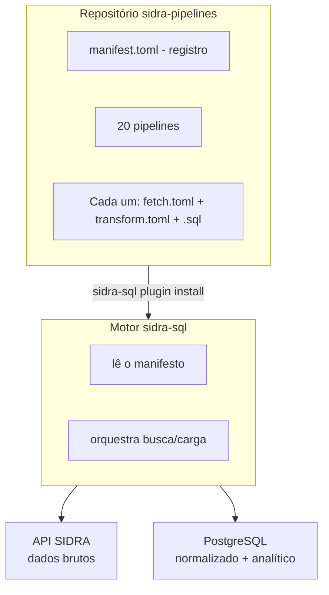

# sidra-pipelines

**Catálogo oficial de pipelines ETL pré-construídos para o motor sidra-sql.**

!!! warning "Pegadinhas da fonte oficial"

    - **IDs de tabela SIDRA mudam.** Quando o IBGE descontinua uma tabela e publica outra equivalente, o pipeline quebra silenciosamente com `404`. Os pipelines do catálogo são versionados — atualize com `sidra-sql plugin update std`.
    - **Wide format ≠ long format.** Os pipelines pivotam variáveis para colunas (`valor`, `ano`, `id_municipio`, `variavel`, `unidade`). Se você esperava long format puro, transforme com `UNPIVOT` ou Polars.
    - **Primeiras execuções são longas.** Censo, PAM municipal, PPM rebanhos têm milhões de linhas. Use `--start-period` / `--end-period` no `fetch.toml` para começar pequeno.
    - **Pipelines de agropecuária têm sazonalidade IBGE.** PAM publica entre setembro e dezembro do ano seguinte; PPM entre outubro e janeiro. Rodar fora dessa janela retorna o ano anterior.

## O Que É

`sidra-pipelines` é o catálogo padrão de pipelines de dados production-ready para o motor `sidra-sql` — atualmente com 20 pipelines cobrindo IBGE de ponta a ponta. É um único repositório Git contendo definições TOML + SQL declarativas para os datasets IBGE mais comumente usados.

Em vez de escrever suas próprias definições de pipeline, instale este catálogo e execute extrações pré-construídas com um único comando CLI:

```bash
sidra-sql run std pib_municipal    # PIB dos Municípios
sidra-sql run std snipc            # Inflação (INPC, IPCA, IPCA-15)
sidra-sql run std ppm              # Pesquisa Pecuária Municipal (PPM)
```

Sem código para escrever. Sem configuração para gerenciar. Apenas dados.

## Arquitetura



## Pipelines Incluídos

O catálogo cobre datasets brasileiros essenciais de economia, demografia, agricultura, indústria, comércio e serviços. A lista canônica está em [`manifest.toml`](https://github.com/Quantilica/sidra-pipelines/blob/main/manifest.toml); a tabela abaixo destaca os pipelines mais usados:

### Economia e Preços

| ID do Pipeline | Pesquisa | Tabela SIDRA | Tabela de Output |
|---|---|---|---|
| `pib_municipal` | **PIB por Município** | 5938 | `analytics.pib_municipal` |
| `contas_nacionais_trimestral` | **Contas Nacionais Trimestrais** | 5932, 1620, 1846, ... | `analytics.cnt_taxas`, `cnt_indices`, `cnt_valores`, ... |
| `snipc` | **Inflação** — INPC, IPCA e IPCA-15 | 22, 58, 7060, 7063, 7062, 1736, 1737, 3065, ... | `analytics.inpc`, `ipca`, `ipca15`, `inflacao`, `inflacao_numero_indice`, `inflacao_difusao`, `inflacao_hierarquia_subitem` |
| `ipp` | **IPP** (Preços ao Produtor) | 6904, 6903, 6723 | `analytics.ipp_categoria_economica`, `ipp_cnae`, `ipp_grupo_industrial` |
| `pmc` | **PMC** (Comércio) / `pms` (Serviços) | 8880, 5906, ... | `analytics.pmc_agregado`, `pms_agregado`, ... |

### Demografia

| ID do Pipeline | Pesquisa | Tabela SIDRA | Tabela de Output |
|---|---|---|---|
| `populacao` | **População** — censo, contagem e estimativas | 200, 305, 793, 4709, 6579 | `analytics.censo_populacao`, `contagem_populacao`, `estimativa_populacao`, `populacao` |

### Agricultura & Silvicultura

| ID do Pipeline | Pesquisa | Tabela SIDRA | Tabela de Output |
|---|---|---|---|
| `pam` | **PAM** (Produção Agrícola Municipal) | 839, 1000, 1001, 1002, 1612, 1613 | `analytics.pam_lavouras_temporarias`, `pam_lavouras_permanentes` |
| `ppm` | **PPM** (Pesquisa Pecuária Municipal) | 73, 74, 94, 95, 3939, 3940 | `analytics.ppm_rebanhos`, `ppm_producao`, `ppm_exploracao` |
| `pevs` | **PEVS** (Extração Vegetal e Silvicultura) | 289, 291, 5930 | `analytics.pevs_producao`, `pevs_area_florestal` |
| `lspa` | **LSPA** (Produção Agrícola) | 6588 | `analytics.lspa` |

## Instalação

### 1. Instalar sidra-sql

```bash
git clone https://github.com/Quantilica/sidra-sql.git
cd sidra-sql
python -m venv .venv
source .venv/bin/activate
pip install -e .
```

### 2. Configurar Banco de Dados

Crie `config.ini` no diretório de trabalho:

```ini
[storage]
data_dir = data

[database]
user          = postgres
password      = sua_senha
host          = localhost
port          = 5432
dbname        = dados
schema        = ibge_sidra
tablespace    = pg_default
readonly_role = readonly_role
```

### 3. Instalar Este Catálogo

```bash
sidra-sql plugin install https://github.com/Quantilica/sidra-pipelines.git --alias std
```

Verifique a instalação:

```bash
sidra-sql plugin list
```

## Início Rápido

### Executar um Pipeline

```bash
# Baixar dados de PIB e criar tabela analítica
sidra-sql run std pib_municipal

# Saída esperada:
# ✓ Buscando metadados da tabela 5938
# ✓ Baixando períodos (2002–2022)
# ✓ Carregando 4.537 linhas em ibge_sidra.dados
# ✓ Executando SQL de transformação
# ✓ Criado analytics.pib_municipal (4.537 linhas)
```

### Consultar o Resultado

```sql
-- Tabela analítica pronta para Power BI, Metabase, consultas SQL
SELECT
    ano,
    id_municipio,
    variavel,
    unidade,
    valor
FROM analytics.pib_municipal
WHERE ano >= 2020
ORDER BY id_municipio, ano DESC;
```

### Executar Todos os Pipelines

```bash
# Baixar e transformar vários datasets
for pipeline in pib_municipal snipc populacao ppm pam pevs; do
    sidra-sql run std $pipeline
done
```

## Estrutura do Pipeline

Cada pipeline é um diretório com três arquivos:

### fetch.toml

Especifica quais tabelas e variáveis SIDRA baixar:

```toml
[[tabelas]]
tabela_sidra = "5938"      # ID da tabela de PIB
variables    = ["37"]      # Variável de PIB
territories  = {6 = []}    # Lista vazia = todos os municípios
```

### transform.toml

Declara uma ou mais tabelas analíticas de saída (uma entrada `[[table]]` por tabela):

```toml
[[table]]
name        = "pib_municipal"
schema      = "analytics"
strategy    = "replace"
sql         = "transform.sql"
description = "PIB a preços correntes, anual por município"
primary_key = ["ano", "id_municipio"]
```

### transform.sql

SELECT SQL que desnormaliza dados brutos:

```sql
SELECT
    p.ano                                              AS ano,
    l.d1c                                              AS id_municipio,
    dim.d2n                                            AS variavel,
    dim.mn                                             AS unidade,
    CASE WHEN d.v ~ '^-?[0-9]' THEN d.v::numeric END   AS valor
FROM dados d
JOIN periodo    p   ON d.periodo_id    = p.id
JOIN dimensao   dim ON d.dimensao_id   = dim.id
JOIN localidade l   ON d.localidade_id = l.id
WHERE d.tabela_sidra_id = '5938'
  AND d.ativo = true;
```

## Extensão: Adicionar Seu Próprio Pipeline

Para adicionar um novo dataset a este catálogo:

### 1. Criar um diretório

```bash
mkdir meu-novo-indicador
cd meu-novo-indicador
```

### 2. Escrever fetch.toml

Encontre o ID de tabela SIDRA em [sidra.ibge.gov.br](https://sidra.ibge.gov.br), depois defina:

```toml
[[tabelas]]
tabela_sidra = "XXXX"
variables    = ["YY"]
territories  = {6 = []}
```

### 3. Escrever transform.toml

```toml
[[table]]
name   = "meu_indicador"
schema = "analytics"
sql    = "transform.sql"
```

### 4. Escrever transform.sql

```sql
SELECT /* sua query de desnormalização */
```

### 5. Registrar em manifest.toml

Na raiz do repositório:

```toml
[[pipeline]]
id          = "meu_novo_indicador"
description = "Meu indicador customizado"
path        = "meu-novo-indicador"
```

### 6. Testar e Enviar

```bash
sidra-sql run std meu_novo_indicador
git add .
git commit -m "Adicionar pipeline meu-novo-indicador"
git push
```

Depois contribua via Pull Request!

## Notas de Performance

### Primeira Execução

Primeira execução baixa todos os dados históricos. Dependendo do tamanho da tabela:

- **Tabelas pequenas** (inflação): 10–30 segundos
- **Tabelas médias** (agricultura): 1–5 minutos
- **Tabelas grandes** (censo): 5–15 minutos

### Execuções Subsequentes

Cache hit para dados inalterados = conclusão quase instantânea.

### Dicas de Otimização

1. **Filtrar datas em fetch.toml** — Não baixe todo histórico se precisa apenas de dados recentes
2. **Executar pipelines em paralelo** — Múltiplos comandos `sidra-sql run` podem executar concorrentemente
3. **Usar PostgreSQL corretamente** — Indexar tabelas analíticas para consultas mais rápidas

## Casos de Uso

### Monitoramento Econômico

Rastreie o desempenho macroeconômico do Brasil em tempo real:

```sql
SELECT periodo, item, variacao, peso
FROM analytics.ipca
WHERE periodo >= '2024-01-01'
ORDER BY periodo DESC;
```

### Relatórios Analíticos

Construa dashboards em Power BI, Metabase ou Superset:

```
Tabelas analíticas prontas para importação BI imediata:
├── analytics.pib_municipal
├── analytics.ipca
├── analytics.ipca15
├── analytics.inpc
├── analytics.estimativa_populacao
└── ... (8 mais)
```

### Pesquisa Acadêmica

Baixe dados históricos limpos e normalizados:

```sql
SELECT * FROM analytics.censo_populacao
WHERE ano IN (1991, 2000, 2010, 2020);
```

### Análise Agrícola

Analise produção agrícola e rebanhos:

```sql
SELECT
    id_municipio,
    variavel,
    SUM(valor) AS total_producao
FROM analytics.pam_lavouras_temporarias
GROUP BY id_municipio, variavel
ORDER BY total_producao DESC;
```

## Resolução de Problemas

### "Plugin não encontrado"

```bash
# Verifique instalação
sidra-sql plugin list

# Reinstale se não encontrado
sidra-sql plugin install https://github.com/Quantilica/sidra-pipelines.git --alias std
```

### "Tabela não encontrada" (404)

IDs de tabelas SIDRA mudam ocasionalmente. Verifique portal oficial:

- [Banco de Dados SIDRA](https://sidra.ibge.gov.br/)
- Atualize `fetch.toml` com o ID de tabela correto

### Downloads lentos

- API pode estar com rate limiting durante horas de pico; tente mais tarde
- Use versão Python recente (3.11+) para melhor performance
- Verifique sua conexão de internet

### Erro de conexão PostgreSQL

Verifique `config.ini`:

- Banco de dados existe: `createdb dados`
- Usuário tem permissões: `ALTER USER postgres WITH PASSWORD 'password';`
- Conexão: `psql -U postgres -h localhost -d dados`

## Contribuindo

Falta um dataset? Siga os passos em [Extensão](#extensão-adicionar-seu-próprio-pipeline), depois abra um Pull Request!

## Saiba Mais

- **Motor sidra-sql:** [Quantilica/sidra-sql](https://github.com/Quantilica/sidra-sql)
- **Guia de criação de pipelines:** [CREATING_PIPELINES.md](https://github.com/Quantilica/sidra-sql/blob/main/CREATING_PIPELINES.md)
- **Portal SIDRA:** [sidra.ibge.gov.br](https://sidra.ibge.gov.br/)
- **Site Oficial IBGE:** [ibge.gov.br](https://www.ibge.gov.br/)
