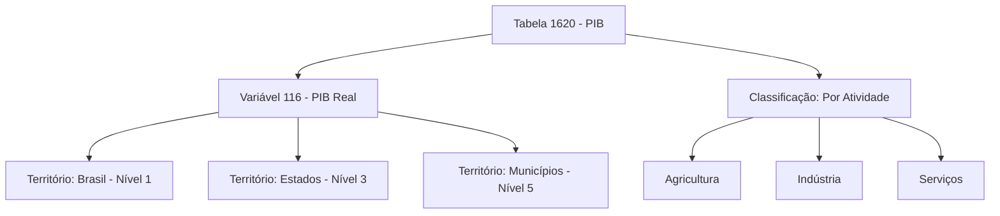
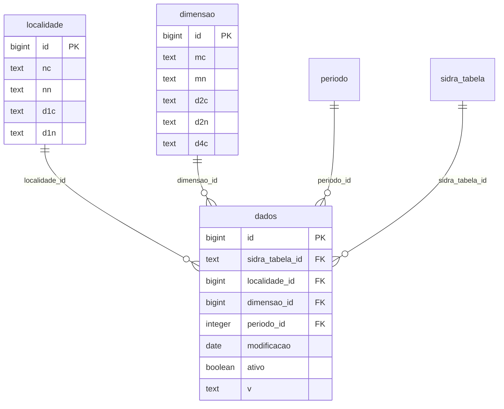
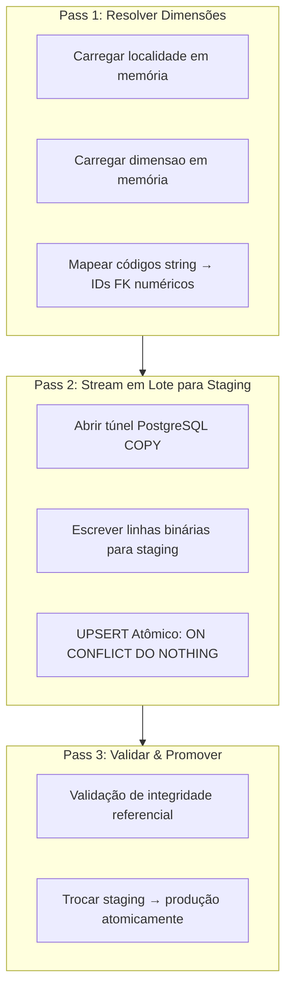

# sidra-sql

**Infraestrutura avançada de ETL e Data Warehousing para dados SIDRA do IBGE.**


## O Que É

**`sidra-sql`** é uma infraestrutura completa de Data Warehousing e ETL (Extração, Transformação, Carregamento) projetada para ingerir, estruturar e versionarizare dados extraídos do SIDRA.

Enquanto **sidra-fetcher** resolve o problema de comunicação (obter dados da API), **sidra-sql** resolve o problema de **governança, persistência e reprodutibilidade**. Converte dados IBGE brutos e hierárquicos em um banco de dados relacional PostgreSQL otimizado para consultas analíticas pesadas.

## Problema que Resolve

Trabalhar com dados IBGE para pesquisa rigorosa ou modelagem financeira envolve desafios estruturais além do simples download:

### 1. Ontologia Complexa do IBGE

SIDRA organiza dados em estruturas altamente aninhadas:

- **Agregados** (tabelas) contêm **variáveis** em múltiplos **níveis territoriais**
- Até **6 classificações diferentes** podem se cruzar
- Achatar isso em arquivos CSV destrói **integridade referencial** e causa duplicação massiva

Estrutura SIDRA (hierárquica):



Problema: Como representar isso em um CSV flat sem duplicação?

### 2. Gargalos de I/O de Ingestão

Salvar dezenas de milhões de linhas usando métodos tradicionais (inserção ORM linha por linha) pode levar **horas** e esgotar RAM.

### 3. Revisões & Reprodutibilidade

O IBGE frequentemente revisa dados históricos. Simplesmente substituir dados antigos por novos destrói a reprodutibilidade de pesquisa acadêmica ou modelos de ML treinados em "snapshots históricos."

**sidra-sql** resolve todos os três com arquitetura sênior de Data Engineering:

## Architecture & Recursos Principais

### 1. Ingestão Streaming (Performance "Gold Standard")

Para volumes massivos de dados sem exaustão de memória:

- **Estratégia Two-Pass**: Primeiro pass resolve dimensões e chaves estrangeiras; segundo pass faz bulk load
- **PostgreSQL COPY FROM STDIN**: Protocolo binário nativo transmite milhões de registros em segundos
- **Upsert Atômico**: Usa `ON CONFLICT DO NOTHING` para deduplicação
- **Tabelas de Staging**: Tabela temporária `_staging_dados` para operações atômicas

**Performance**: Inserir 10M linhas em ~30 segundos (vs horas com `INSERT` tradicional)

### 2. Star Schema Dimensional

Modelagem relacional estrita separa metadados de fatos:

**Tabelas de Dimensão:**

- `sidra_tabela`: Metadados brutos em formato `JSONB` (preserva estrutura IBGE)
- `localidade`: Malha territorial (Brasil, estados, municípios, regiões)
- `periodo`: Dimensão de tempo com níveis apropriados de agregação
- `dimensao`: Cruzamentos de classificações (categorias × variáveis)

**Tabela de Fatos (`dados`):**

- Extremamente enxuta: Apenas chaves estrangeiras, data de modificação, flag de versão, valor
- Constraint unique composto previne duplicatas
- Otimizada para consultas analíticas (workloads OLAP)



### 3. Dimensões que Mudam Lentamente (SCD Type II)

Auditabilidade para ambientes de pesquisa e regulatória:

- **Nunca deletar**: Quando IBGE revisa dados históricos, inserir nova versão + marcar antiga como `ativo = FALSE`
- **Histórico completo preservado**: Saber exatamente como o banco de dados estava em qualquer data passada
- **Colunas**: `modificacao` (data), `ativo` (flag booleano)

**Caso de uso acadêmico**: Reproduzir pesquisa de 2015 exatamente com dados de 2015, mesmo se 2026 tem correções

### 4. Pipelines Declarativos via TOML

Lógica de negócio isolada de código:

```toml
# fetch.toml - Definir pipelines sem codificar
[[tabelas]]
sidra_tabela = "1620"
variables = ["116"]                    # Variável PIB
territories = {6 = []}                 # Total Brasil

[[tabelas]]
sidra_tabela = "1737"
variables = ["63"]                     # Inflação IPCA
territories = {1 = [], 3 = []}        # Níveis 1 & 3
```

### 5. Explosão Automática de Classificações

A diretiva `unnest_classifications = true` dispara algoritmo recursivo:

- Mapeia todos os cross-produtos variável × categoria automaticamente
- Elimina descoberta manual de ID
- Gera consultas dimensionais otimizadas

### 6. Arquitetura de Plugin

O motor é leve e genérico; definições de dados vivem em repositórios Git separados:

```
Plugin (seu repo Git)
├── manifest.toml       ← registro de pipeline
├── pipeline-a/
│   ├── fetch.toml      ← o que baixar do SIDRA
│   ├── transform.toml  ← config de tabela analytics
│   └── transform.sql   ← consulta de desnormalização
```

Instalar e executar:

```bash
sidra-sql plugin install https://github.com/Quantilica/sidra-pipelines.git --alias std
sidra-sql run std pib_municipal
```

### Recursos Adicionais

- ✅ Busca full-text em metadados SIDRA (JSONB português)
- ✅ Cache de metadados para performance (arquivos JSON locais)
- ✅ Integração PostgreSQL (transações ACID)
- ✅ Operações idempotentes (re-execução segura)
- ✅ Lógica de retry com backoff exponencial (até 5 tentativas)
- ✅ Trilhas de auditoria via colunas `ativo` + `modificacao`

## Instalação

### "pip"

```bash
pip install sidra-sql
```

### "uv"

```bash
uv pip install sidra-sql
```

### "from source"

```bash
git clone https://github.com/Quantilica/sidra-sql.git
cd sidra-sql
python -m venv .venv
source .venv/bin/activate
pip install -e .
```

## Configuração

sidra-sql lê um arquivo `config.ini` no diretório de trabalho:

```ini
[storage]
data_dir = data

[database]
user = postgres
password = suasenha
host = localhost
port = 5432
dbname = dados
schema = ibge_sidra
tablespace = pg_default
readonly_role = readonly_role
```

Carregue a config em Python:

```python
from sidra_sql.config import Config

config = Config()  # lê config.ini do diretório atual
```

## Exemplo Rápido: Pipeline ETL

### Opção 1: CLI (Recomendado)

Use pipelines padrão pré-construídos de [sidra-pipelines](sidra-pipelines.md):

```bash
# Instalar catálogo padrão
sidra-sql plugin install https://github.com/Quantilica/sidra-pipelines.git --alias std

# Executar pipeline (baixar + carregar + transformar)
sidra-sql run std pib_municipal

# Consultar resultados em PostgreSQL
psql -c "SELECT * FROM analytics.pib_municipal WHERE ano >= 2020"
```

### Opção 2: TOML Declarativo (Recomendado para pipelines customizados)

Define a fetch pipeline:

```toml
# pipelines/economic/fetch.toml
[[tabelas]]
sidra_tabela = "1620"
variables = ["116"]
territories = {6 = []}
unnest_classifications = true

[[tabelas]]
sidra_tabela = "1737"
variables = ["63"]
territories = {1 = [], 3 = []}
```

Define a transform:

```toml
# pipelines/economic/transform.toml
[table]
name = "economic_indicators"
schema = "analytics"
strategy = "replace"
```

```sql
-- pipelines/economic/transform.sql
SELECT
    l.d1n  AS territory,
    p.codigo AS period,
    d.d2n  AS variable,
    r.v    AS value
FROM ibge_sidra.dados r
JOIN ibge_sidra.localidade l ON r.localidade_id = l.id
JOIN ibge_sidra.periodo    p ON r.periodo_id    = p.id
JOIN ibge_sidra.dimensao   d ON r.dimensao_id   = d.id
WHERE r.ativo = TRUE
```

Execute o pipeline:

```python
from pathlib import Path
from sidra_sql.config import Config
from sidra_sql.toml_runner import TomlScript
from sidra_sql.transform_runner import TransformRunner

config = Config()

# Extract + Load
TomlScript(config, Path("pipelines/economic/fetch.toml")).run()

# Transform (SQL → analytics schema)
TransformRunner(config, Path("pipelines/economic/transform.toml")).run()
```

### Opção 3: ETL Programático

Controle total sobre cada fase:

```python
from sidra_sql.config import Config
from sidra_sql.sidra import Fetcher
from sidra_sql.storage import Storage
from sidra_sql.database import get_engine, save_agregado, load_dados

config = Config()
engine = get_engine(config)
storage = Storage.default(config)

with Fetcher(config, storage=storage, max_workers=4) as fetcher:
    # 1. BUSCAR metadados (territórios, períodos, classificações)
    metadata = fetcher.fetch_metadata("1620")
    save_agregado(engine, metadata)

    # 2. BAIXAR arquivos de dados para armazenamento local
    data_files = fetcher.download_table(
        sidra_tabela="1620",
        territories={"6": []},  # Total Brasil
        variables=["116"],
    )

# 3. CARREGAR em PostgreSQL via COPY FROM STDIN
load_dados(engine, storage, data_files)
```

## Governança de Dados: Tratamento de Revisões

IBGE frequentemente publica revisões de dados. Warehouse preserva histórico ao invés de sobrescrever.

### Como Funcionam as Dimensões que Mudam Lentamente (SCD Type II)

**Cenário**: IBGE revisa PIB Q3 2020 em 2026-01-15

```sql
-- Em 2024-01-01 (dados originais ingeridos)
-- dados row: id=1, v='1234.56', modificacao='2024-01-01', ativo=TRUE

-- Em 2026-01-15 (revisão IBGE detectada durante re-ingestão)
-- O ON CONFLICT DO NOTHING previne sobrescrita.
-- Nova linha é inserida com modificacao atualizada:

-- 1. Marcar versão antiga como inativa
UPDATE ibge_sidra.dados
SET ativo = FALSE
WHERE sidra_tabela_id = '1620'
  AND localidade_id = 6
  AND periodo_id = 123
  AND ativo = TRUE;

-- 2. Inserir nova versão
INSERT INTO ibge_sidra.dados
  (sidra_tabela_id, localidade_id, dimensao_id, periodo_id, v, modificacao, ativo)
VALUES
  ('1620', 6, 1, 123, '1234.89', '2026-01-15', TRUE);
```

### Consultando Snapshots Históricos

```python
from datetime import date
from sqlalchemy import select, and_
from sidra_sql.database import get_engine
from sidra_sql.config import Config
from sidra_sql.models import Dados

engine = get_engine(Config())

# Data as it existed on 2024-06-01
snapshot_date = date(2024, 6, 1)

with engine.connect() as conn:
    rows = conn.execute(
        select(Dados).where(
            and_(
                Dados.sidra_tabela_id == "1620",
                Dados.modificacao <= snapshot_date,
                Dados.ativo == True,
            )
        )
    ).fetchall()
```

### Trilha de Auditoria

```python
from sqlalchemy import select, and_
from sidra_sql.models import Dados

# Todas as versões de um ponto de dados específico
with engine.connect() as conn:
    history = conn.execute(
        select(Dados).where(
            and_(
                Dados.sidra_tabela_id == "1620",
                Dados.localidade_id == 6,
                Dados.periodo_id == 123,
            )
        ).order_by(Dados.modificacao)
    ).fetchall()

for row in history:
    status = "ATIVO" if row.ativo else "SUBSTITUÍDO"
    print(f"{row.modificacao}: {row.v}  [{status}]")
```

---

## Ingestão Streaming: Análise Profunda de Performance

### Problema: INSERT Tradicional

```python
# ❌ Inserção linha-por-linha (abordagem ingênua)
for row in data_generator():
    conn.execute(
        insert(dados).values(
            localidade_id=row["localidade_id"],
            dimensao_id=row["dimensao_id"],
            v=row["v"],
        )
    )
conn.commit()

# Tempo: Dias para 10M linhas
# RAM: Explode (mantém todas linhas em memória)
# I/O: Pior possível (milhões de round-trips)
```

### Solução: Streaming em Dois Passes


Tempo: Segundos para 10M linhas
RAM: Limitada (streaming, não tudo-em-memória)
I/O: Ótima (túnel único, protocolo binário)

### Exemplo de Uso

```python
from sidra_sql.database import load_dados
from sidra_sql.storage import Storage
from sidra_sql.config import Config
from sidra_sql.database import get_engine

config = Config()
engine = get_engine(config)
storage = Storage.default(config)

# data_files is the list returned by Fetcher.download_table()
load_dados(engine, storage, data_files)
```

---

## Referência de API

### CLI

```
sidra-sql run <alias> <pipeline-id> [--force-metadata]
```

Executar um pipeline de um plugin instalado. `--force-metadata` re-busca metadados da
tabela SIDRA mesmo se já estiverem em cache.

```
sidra-sql plugin install <url> [--alias ALIAS]
sidra-sql plugin update [alias]
sidra-sql plugin remove <alias>
sidra-sql plugin list
```

---

### `Config` — Configuração em Tempo de Execução

```python
from sidra_sql.config import Config

config = Config()  # lê config.ini
```

Lê `config.ini` do diretório de trabalho atual. Atributos principais:

| Atributo | Chave ini | Descrição |
|-----------|---------|-------------|
| `config.data_dir` | `storage.data_dir` | Raiz de armazenamento local para arquivos JSON |
| `config.db_user` | `database.user` | Usuário PostgreSQL |
| `config.db_password` | `database.password` | Senha PostgreSQL |
| `config.db_host` | `database.host` | Host PostgreSQL |
| `config.db_port` | `database.port` | Porta PostgreSQL |
| `config.db_name` | `database.dbname` | Nome do banco de dados |
| `config.db_schema` | `database.schema` | Schema (padrão: `ibge_sidra`) |

---

### `Fetcher` — Extração de Dados

```python
from sidra_sql.sidra import Fetcher
from sidra_sql.storage import Storage

storage = Storage.default(config)

with Fetcher(config, storage=storage, max_workers=4) as fetcher:
    ...
```

**Métodos Principais:**

| Método | Propósito |
|--------|-----------|
| `fetcher.fetch_metadata(sidra_tabela)` | Buscar metadados completos da tabela (territórios, períodos, variáveis) |
| `fetcher.download_table(sidra_tabela, territories, variables, classifications)` | Baixar todos os períodos; retorna lista de `{"filepath": Path, "modificacao": str}` |

Parâmetros de `download_table`:

| Parâmetro | Tipo | Descrição |
|-----------|------|-------------|
| `sidra_tabela` | str | Código da tabela SIDRA |
| `territories` | dict[str, list[str]] | Nível territorial → códigos (lista vazia = todos) |
| `variables` | list[str] \| None | Códigos de variáveis; `None` = todos |
| `classifications` | dict[str, list[str]] \| None | Classificação → códigos de categorias |

---

### `Storage` — Gerenciamento de Arquivos Locais

```python
from sidra_sql.storage import Storage

storage = Storage.default(config)         # usa config.data_dir
storage = Storage("/custom/path")         # raiz explícita
```

**Métodos Principais:**

| Método | Propósito |
|--------|-----------|
| `storage.exists(parameter, modification)` | Verificar se arquivo já foi baixado |
| `storage.write_data(data, parameter, modification)` | Salvar arquivo de dados JSON |
| `storage.read_data(filepath)` | Carregar arquivo de dados previamente salvo |
| `storage.write_metadata(agregado)` | Salvar metadados da tabela JSON |
| `storage.read_metadata(agregado)` | Carregar metadados da tabela |

---

### `TomlScript` — Executor de ETL Declarativo

```python
from pathlib import Path
from sidra_sql.toml_runner import TomlScript

script = TomlScript(
    config,
    toml_path=Path("pipelines/economic/fetch.toml"),
    max_workers=4,
    force_metadata=False,
)
script.run()  # baixar + carregar todas as tabelas declaradas no TOML
```

**Parâmetros:**

| Parâmetro | Tipo | Padrão | Descrição |
|-----------|------|--------|----------|
| `config` | Config | | Configuração em tempo de execução |
| `toml_path` | Path | | Caminho para `fetch.toml` |
| `max_workers` | int | 4 | Threads de download paralelo |
| `force_metadata` | bool | False | Re-buscar metadados mesmo se em cache |

---

### `TransformRunner` — Executor de Transformação SQL

```python
from sidra_sql.transform_runner import TransformRunner

runner = TransformRunner(config, toml_path=Path("pipelines/economic/transform.toml"))
runner.run()
```

Lê `transform.toml` + arquivo `.sql` pareado. Executa a SELECT SQL e
materializa o resultado na tabela ou view alvo.

---

### `database` — Auxiliares de Banco de Dados de Baixo Nível

```python
from sidra_sql.database import get_engine, save_agregado, load_dados

engine = get_engine(config)
save_agregado(engine, metadata)          # upsert metadados de tabela/período/localidade
load_dados(engine, storage, data_files)  # bulk load via COPY FROM STDIN
```

---

## Formato de Pipeline TOML

### `fetch.toml` — Configuração de Extração

```toml
[[tabelas]]
sidra_tabela = "1620"          # código da tabela SIDRA (obrigatório)
variables = ["116"]             # códigos de variáveis; omitir para todas
territories = {6 = []}          # {nível: [códigos]}; lista vazia = todas
unnest_classifications = true   # expandir todos os cross-produtos de categorias

[[tabelas]]
sidra_tabela = "1737"
variables = ["63"]
territories = {1 = [], 3 = []}
split_variables = true          # uma requisição por variável (evita limites SIDRA)
classifications = {81 = ["allxt"]}
```

**Campos de `[[tabelas]]`:**

| Campo | Tipo | Obrigatório | Descrição |
|-------|------|------------|----------|
| `sidra_tabela` | str | ✅ | Código da tabela SIDRA |
| `territories` | dict[str, list] | ✅ | Nível territorial → códigos de unidade |
| `variables` | list[str] | | Códigos de variáveis (padrão: todas) |
| `classifications` | dict[str, list] | | Classificação → códigos de categorias |
| `unnest_classifications` | bool | | Expandir todas as combinações de categorias |
| `split_variables` | bool | | Uma requisição por variável |

### `transform.toml` — Configuração de Transformação

```toml
[table]
name = "pib_municipal"          # nome da tabela/view alvo
schema = "analytics"            # schema alvo
strategy = "replace"            # "replace" (tabela) ou "view"
description = "PIB Municipal"
primary_key = ["municipio_id", "ano"]
indexes = [
  { name = "idx_pib_ano", columns = ["ano"], unique = false }
]
```

Pareado com arquivo `transform.sql` (mesmo nome) contendo consulta SELECT.

### `manifest.toml` — Registro de Plugin

```toml
name = "Pipelines Padrão"
description = "Pipelines SIDRA padrão Quantilica"
version = "1.0.0"

[[pipeline]]
id = "pib_municipal"
description = "PIB Municipal da tabela SIDRA 5938 IBGE"
fetch = "pib_municipal/fetch.toml"
transform = "pib_municipal/transform.toml"
```

---

## Schema Dimensional

### Tabelas de Banco de Dados (schema: `ibge_sidra`)

**`sidra_tabela`** — Registro de tabela SIDRA

| Coluna | Tipo | Descrição |
|--------|------|----------|
| `id` | text PK | Código da tabela SIDRA |
| `nome` | text | Nome da tabela |
| `periodicidade` | text | Frequência de atualização |
| `ultima_atualizacao` | date | Última atualização |
| `metadados` | jsonb | Objeto de metadados completo |

**`localidade`** — Dimensão territorial

| Coluna | Tipo | Descrição |
|--------|------|----------|
| `id` | bigint PK | Auto-incremento |
| `nc` | text | Código de nível territorial (ex: `N6`) |
| `nn` | text | Nome de nível territorial |
| `d1c` | text | Código de unidade territorial |
| `d1n` | text | Nome de unidade territorial |

Constraint único: `(nc, d1c)`

**`periodo`** — Dimensão de tempo

| Coluna | Tipo | Descrição |
|--------|------|----------|
| `id` | integer PK | Auto-incremento |
| `codigo` | text | Código do período |
| `frequencia` | text | Frequência (mensal, trimestral…) |
| `literals` | text[] | Rótulos de período brutos |
| `data_inicio` / `data_fim` | date | Intervalo de datas do período |
| `ano` / `ano_fim` | integer | Ano(s) |
| `semestre` | smallint | 1-2 |
| `trimestre` | smallint | 1-4 |
| `mes` | smallint | 1-12 |

Constraint único: `(codigo, literals)`

**`dimensao`** — Dimensão variável × classificação

| Coluna | Tipo | Descrição |
|--------|------|----------|
| `id` | bigint PK | Auto-incremento |
| `mc` | text | ID de unidade de medida |
| `mn` | text | Nome de unidade de medida |
| `d2c` / `d2n` | text | Código / nome de variável |
| `d4c`–`d9c` | text \| null | Códigos de categorias (até 6 classificações) |
| `d4n`–`d9n` | text \| null | Nomes de categorias |

Constraint único: `(mc, d2c, d4c, d5c, d6c, d7c, d8c, d9c)`

**`dados`** — Tabela de fatos

| Coluna | Tipo | Descrição |
|--------|------|----------|
| `id` | bigint PK | Auto-incremento |
| `sidra_tabela_id` | text FK | → `sidra_tabela.id` |
| `localidade_id` | bigint FK | → `localidade.id` |
| `dimensao_id` | bigint FK | → `dimensao.id` |
| `periodo_id` | integer FK | → `periodo.id` |
| `modificacao` | date | Data de publicação IBGE |
| `ativo` | boolean | Flag de registro ativo (SCD) |
| `v` | text | Valor de dados |

Constraint único: `(sidra_tabela_id, localidade_id, dimensao_id, periodo_id)`

### Exemplo de Consulta Analítica

```python
from sqlalchemy import select
from sidra_sql.models import Dados, Localidade, Periodo, Dimensao

# PIB por estado (apenas registros ativos)
query = (
    select(
        Localidade.d1n.label("estado"),
        Periodo.codigo.label("periodo"),
        Dimensao.d2n.label("variavel"),
        Dados.v.label("valor"),
    )
    .join(Localidade, Dados.localidade_id == Localidade.id)
    .join(Periodo,    Dados.periodo_id    == Periodo.id)
    .join(Dimensao,   Dados.dimensao_id   == Dimensao.id)
    .where(
        Dados.ativo == True,
        Localidade.nc == "N3",          # estados
        Dados.sidra_tabela_id == "1620",
    )
    .order_by(Periodo.codigo.desc())
)

with engine.connect() as conn:
    for row in conn.execute(query):
        print(f"{row.estado} | {row.periodo} | {row.valor}")
```

---

## Performance

### Cache Local

Dados baixados são armazenados como arquivos JSON sob `data_dir`. Re-executar um pipeline
pula arquivos que já existem em disco:

```
Primeira execução:  baixa do IBGE (segundos a minutos)
Re-execução:        verifica cache local, pula arquivos existentes (overhead <1s)
```

Force re-download deletando diretório de dados ou usando `--force-metadata`.

### Benchmarks de Ingestão Streaming

Performance no mundo real em hardware padrão (8-core, 16 GB RAM):

| Dataset | Linhas | Tempo | Throughput |
|---------|--------|-------|-----------|
| IPCA mensal | 3.2M | 8s | 400k linhas/sec |
| PIB trimestral | 50k | <1s | — |
| RAIS anual | 60M | 2.5m | 400k linhas/sec |

## Melhores Práticas para Governança de Dados

### 1. Use Pipelines Declarativos (TOML) para Reprodutibilidade

```toml
# pipelines/annual_snapshot/fetch.toml
[[tabelas]]
sidra_tabela = "1620"
variables = ["116"]
territories = {6 = [], 3 = []}

[[tabelas]]
sidra_tabela = "1737"
variables = ["63"]
territories = {1 = []}
```

Vantagens:

- ✅ Não-desenvolvedores podem manter pipelines
- ✅ Controle de versão (TOML em git)
- ✅ Reprodutível entre máquinas
- ✅ Desacoplado de mudanças de código

### 2. Documente Datas de Snapshot para Reprodutibilidade Acadêmica

```python
import json
from datetime import datetime

# Registrar quando você construiu o dataset
metadata = {
    "snapshot_date": datetime.now().isoformat(),
    "pipeline": "pipelines/analysis/fetch.toml",
    "sidra_sql_version": "1.2.0",
}
with open("data/metadata.json", "w") as f:
    json.dump(metadata, f, indent=2)
```

Então consulte com `Dados.modificacao <= snapshot_date` para reproduzir o dataset exato.

### 3. Use Star Schema para Ferramentas BI

Conecte PostgreSQL diretamente a:

- **Tableau** (conexão ODBC para PostgreSQL)
- **Power BI** (conector nativo PostgreSQL)
- **Looker** (SQL runner)
- **Metabase** (consultas SQL em warehouse)

Schema normalizado é otimizado para workloads OLAP de ferramentas BI.

---

## Resolução de Problemas

### Download Falha com Erro de Rede

`Fetcher` retenta automaticamente (até 5 vezes, backoff exponencial: 5s → 10s → 20s…).
Se todas as tentativas falharem, verifique disponibilidade da API SIDRA ou reduza `max_workers`.

### Tabela Não Encontrada

Códigos de tabela SIDRA devem ser strings, não inteiros. Use `"1620"`, não `1620`.

```python
metadata = fetcher.fetch_metadata("1620")   # ✅
metadata = fetcher.fetch_metadata(1620)     # ❌
```

### ID de Variável Desconhecido

Procure no catálogo SIDRA IBGE diretamente em [sidra.ibge.gov.br](https://sidra.ibge.gov.br/)
para procurar códigos de variáveis e classificações para uma tabela dada.

### Arquivo de Configuração Não Encontrado

`Config()` lê `config.ini` do diretório de trabalho atual.
Execute Python da raiz do projeto, ou defina o caminho explicitamente:

```python
import os
os.chdir("/path/to/project")
config = Config()
```

### Schema Já Existe

`TransformRunner` com `strategy = "replace"` descarta e recria a tabela alvo.
`strategy = "view"` usa `CREATE OR REPLACE VIEW` e é não-destrutivo.

---

## Saiba Mais

- [Visão Geral IBGE](index.md)
- [sidra-fetcher](sidra-fetcher.md) — Ferramenta de extração de dados
- [sidra-pipelines](sidra-pipelines.md) — Catálogo de pipelines padrão
- [Princípios de Design](../concepts/principios.md)
- [Banco de Dados SIDRA (Português)](https://sidra.ibge.gov.br/)
- [Documentação PostgreSQL](https://www.postgresql.org/docs/)
