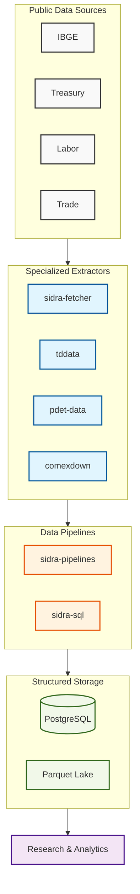

# Brazilian Public Data Suite

A modular platform for extracting, processing and analyzing Brazilian public datasets.

<div align="center">
  
</div>

## The Problem

Brazilian public data is fragmented across multiple government agencies, each with its own data infrastructure:

- **Unstable APIs**: Endpoints change without warning, rate limiting is unpredictable, and downtime is common
- **Legacy infrastructure**: FTP servers, CKAN instances, and older web APIs lack modern data formats
- **Inconsistent schemas**: Table structures differ across years, missing values are handled inconsistently
- **Large files**: Datasets range from hundreds of MB to tens of GB, requiring careful handling
- **No standardization**: Each source has its own naming conventions, column ordering, and data types

Building reliable data pipelines on top of this requires:

- Resilient extraction logic that handles API failures gracefully
- Data validation and cleaning at the source level
- Structured storage formats that enable efficient analytics
- Reproducible transformation pipelines

## The Solution

This platform provides a set of **specialized, modular tools** designed to handle real-world Brazilian public data. Each tool is engineered for its specific infrastructure, with distinct architectural patterns:

| Component | Architecture Pattern | Infrastructure Challenge |
|-----------|---------------------|--------------------------|
| **sidra-fetcher** | Dual sync/async clients with smart caching | Unstable IBGE REST API, rate limiting |
| **sidra-sql** | Plugin-based ETL motor with star-schema modeling | Streaming bulk load + revision history (SCD II) |
| **tddata** | Financial engineering with FIFO lot matching | Streaming portfolio transactions, GIPS compliance |
| **pdet-data** | Big Data transformation with Polars vectorial processing | 50M+ row CSVs that exhaust Pandas memory |
| **comexdown** | Resilient extraction agent with temporal idempotency | Legacy government servers, SSL issues, colossal files |
| **datasus-fetcher** | Multithreaded concurrent crawler with semantic parsing | Legacy FTP infrastructure, cryptic nomenclature, weeks of sequential downloads |

Each tool is production-hardened for its domain:

- **Resilience**: Exponential backoff, auto-retry, graceful degradation
- **Efficiency**: Smart caching, idempotence checks, streaming processing
- **Reliability**: Data validation, deduplication, comprehensive audit trails
- **Performance**: Multithreaded concurrency, vectorial processing, columnar storage
- **Reproducibility**: Deterministic transformations, versioned outputs, complete lineage

## Domains Covered

### IBGE (Macroeconomics)
SIDRA is the official source for Brazilian macroeconomic time series: GDP, inflation, employment, trade, etc. Our tools make it accessible.

### Treasury Direct (Finance)
Fixed-income yields and bond pricing data. Used for financial analysis, portfolio construction, and risk modeling.

### Labor Market (Trabalho)
RAIS (annual employment census) and CAGED (monthly job flows) provide granular labor market data by region and sector.

### Foreign Trade (Comex)
Siscomex export/import flows enable trade analysis and competitiveness studies.

### Public Health (Saúde)
DATASUS epidemiological data for disease surveillance, health economics, and public health research.

## Platform Architecture



## Key Components

### sidra-fetcher

**Dual client pattern** for IBGE SIDRA macroeconomic extraction. Provides both synchronous (simplicity) and asynchronous (performance) clients with smart caching via HEAD requests checking Last-Modified headers.

- **Sync mode** (~60s): Sequential table fetches for one-off queries or simplicity
- **Async mode** (~15s): Concurrent fetches via `asyncio.gather` with 4x speedup
- **Smart caching**: Skip unchanged tables via URL parametrization; idempotence checks
- **Use when**: You need real-time economic indicators, inflation data, or employment statistics from SIDRA with flexible sync/async requirements

### sidra-sql

**Plugin-based ETL motor** that ingests SIDRA tables into a normalized PostgreSQL star schema. Streaming bulk load via PostgreSQL `COPY FROM STDIN` (400k+ rows/sec). Implements Slowly Changing Dimensions (SCD Type II) so historical revisions are preserved instead of overwritten.

- **Declarative TOML pipelines**: `fetch.toml` + `transform.toml` + `transform.sql` per dataset; no Python required
- **Plugin system**: Pre-built catalog at `sidra-pipelines`; one-command install + run
- **Star schema**: 5 tables (`sidra_tabela`, `localidade`, `periodo`, `dimensao`, `dados`) decouple metadata from facts
- **SCD Type II**: `ativo` + `modificacao` columns reproduce any historical snapshot
- **Use when**: Building a reproducible data warehouse, exposing IBGE data to BI tools, or tracking IBGE revisions over time

### tddata

**Financial engineering suite** for Treasury Direct fixed-income analysis. Features FIFO inventory control algorithm, Modified Dietz Method for GIPS-compliant portfolio performance measurement, and async concurrent bond downloads.

- **Smart async fetching** (3x faster than sync): Parallel bond downloads with idempotence checks
- **FIFO inventory control**: Per-lot return attribution with coupon injection
- **Modified Dietz Method**: GIPS-compliant weighted cash flow portfolio returns
- **Polars vectorial processing**: 10x faster than Pandas for bulk calculations
- **Use when**: Building fixed-income analytics, calculating portfolio performance, or analyzing Brazilian government bond yields

### pdet-data

**Big Data transformation engine** for Brazilian labor market microdata. Multithreaded Polars vectorial processing transforms legacy CSV/TXT formats into efficient Parquet columnar storage with 95%+ compression.

- **Raw-to-Parquet conversion**: 8 GB CSV → 0.4 GB Parquet (96% compression)
- **Vectorial processing**: Multithreaded Rust execution; 10x faster than Pandas
- **Intelligent memory management**: Streaming decompression with dynamic cleanup
- **Idempotent processing**: First run 62s → cached runs 0.08s (778x speedup)
- **Use when**: Processing 50M+ row employment datasets that exhaust Pandas memory

### comexdown

**Resilient network extraction agent** for Siscomex trade data with streaming efficiency and SSL resilience. Handles legacy government infrastructure instability through temporal idempotency and exponential backoff.

- **Temporal idempotency** (57x speedup): HEAD requests check Last-Modified; skip unchanged files
- **Streaming chunks** (8KB blocks): Zero memory overhead regardless of file size
- **SSL resilience**: Handles expired/misconfigured certificates; User-Agent spoofing
- **Auto-retry**: Exponential backoff on transient failures
- **Concurrent downloads**: 5-10x speedup with parallel workers
- **Use when**: Downloading gigabyte-scale trade datasets or analyzing import/export patterns

### datasus-fetcher

**Multithreaded concurrent crawler** for DATASUS epidemiological systems hosted on legacy FTP servers. Producer-Consumer threading pattern with recursive directory crawling and semantic filename parsing.

- **Multithreaded concurrency** (6-10x speedup): Pool-based parallelization with 5-10 concurrent FTP connections
- **Smart resume** (1,350x speedup on re-runs): Size-based idempotence; skip unchanged files
- **Recursive crawling**: Dynamic directory mapping; no hardcoded paths
- **Semantic parsing**: Decode filenames into metadata (year, month, state, system) for surgical subsetting
- **Complete ecosystem**: Download data + layouts + documentation with versioning
- **Use when**: Extracting complete public health microdata (SIM, SINASC, SIA, SIHSUS, CNES) for epidemiological research

## Quick Examples

### Economic Analysis: Async Fetching with Dual Clients

```python
import asyncio
from sidra_fetcher import AsyncSidraClient
from sidra_fetcher.sidra import Parametro, Formato, Precisao

def _param(agregado: str, variavel: str) -> Parametro:
    return Parametro(
        agregado=agregado,
        territorios={"1": ["all"]},
        variaveis=[variavel],
        periodos=[],
        classificacoes={},
        formato=Formato.A,
        decimais={"": Precisao.M},
    )

async def fetch_economic_indicators():
    async with AsyncSidraClient(timeout=60) as client:
        # Concurrent fetch: GDP + Inflation + Unemployment
        return await asyncio.gather(
            client.get(_param("1620", "116").url()),   # GDP
            client.get(_param("1419", "63").url()),    # IPCA inflation
            client.get(_param("6381", "4099").url()),  # Unemployment
        )

results = asyncio.run(fetch_economic_indicators())
# Concurrent gathers complete in ~max(latency) instead of sum(latencies).
```

### Labor Market: Big Data Processing with Polars

```bash
# Bulk-convert every RAIS / CAGED archive to Parquet
pdet-data convert ./raw ./parquet
```

```python
import polars as pl

# Analyze 100M+ employment records efficiently
df = pl.scan_parquet("parquet/rais-vinculos/2023.parquet")
wage_by_sector = (
    df.group_by("cnae_secao")
      .agg([
          pl.col("vl_remun_medio_nominal").mean().alias("salario_medio"),
          pl.col("id_vinculo").count().alias("n_vinculos"),
      ])
      .collect()
)
```

### Fixed-Income: Financial Engineering with FIFO Lot Matching

```python
from tddata import reader
from tddata.analytics import (
    calculate_operations_returns,
    calculate_portfolio_monthly_returns,
)

operations = reader.read_operations("operacoes-do-tesouro-direto.csv")
prices     = reader.read_prices("taxas-dos-titulos-ofertados-pelo-tesouro-direto.csv")

# Per-lot returns with FIFO matching (sells matched against oldest buys)
lots = calculate_operations_returns(operations, prices)

# Monthly portfolio returns using Modified Dietz (GIPS-compliant)
monthly = calculate_portfolio_monthly_returns(operations, prices)
```

### Trade Analysis: Resilient Extraction with Smart Caching

```python
from pathlib import Path
import comexdown

# Streams in 8 KiB chunks, atomic *.tmp -> rename, retries 3× with backoff.
# HEAD + Last-Modified makes re-runs effectively free.
comexdown.get_year(Path("./DATA"), year=2023)
```

```bash
# Or via the CLI for a multi-year batch
comexdown trade 2014:2023 -o ./DATA
```

### Public Health: Concurrent Crawler for FTP Infrastructure

```sh
# Multithreaded FTP crawling (6x speedup)
datasus-fetcher data --data-dir ./data sim-do-cid10 \
    --start 2018 --end 2023 \
    --threads 5
# Sequential: 300 min | Concurrent: 50 min
```

```python
# Equivalent Python entrypoint used by the CLI
from pathlib import Path
from datasus_fetcher import fetcher
from datasus_fetcher.slicer import Slicer

fetcher.download_data(
    datasets=["sim-do-cid10"],
    destdir=Path("./data"),
    threads=5,
    slicer=Slicer(start_time="2018", end_time="2023", regions=None),
)
```

## Use Cases

### Real-Time Economic Monitoring

Use async sidra-fetcher to concurrently fetch GDP, inflation, and employment from IBGE SIDRA. 4x faster than sequential approaches. Combine with tddata for yield curves and macro analysis.

### Portfolio Analytics & Risk Management

Fetch Treasury Direct historical yields with tddata. Calculate GIPS-compliant returns using Modified Dietz Method with FIFO lot matching. Analyze duration and convexity risk across your fixed-income holdings.

### Labor Market Dynamics

Process 50M+ row RAIS employment records with pdet-data (raw CSV → Parquet in 62s). Analyze wage trends, job creation, and sectoral shifts using Polars vectorial processing. Track monthly flows with CAGED data.

### Trade Competitiveness & Supply Chain

Download complete trade flows from Siscomex with comexdown (57x speedup via smart caching). Analyze export specialization, import dependency, and competitiveness indices by commodity and destination.

### Epidemiological Surveillance & Public Health

Concurrently crawl DATASUS FTP servers with datasus-fetcher (6-10x speedup). Build disease burden studies from complete microdata (SIM mortality, SINASC births). Track health inequities and resource allocation efficiency.

## Design Philosophy

### Modularity

Each tool is independent. Use only what you need; don't pull in unnecessary dependencies.

### Performance

Prefer columnar storage (Parquet) for analytical queries. Support PostgreSQL for operational access.

### Resilience

Handle API failures, retries, and partial failures gracefully. Never silently drop data.

### Reproducibility

All transformations are deterministic and logged. Replay any pipeline from raw data.

### No Magic

Explicit is better than implicit. Know what data is being fetched, transformed, and stored.

## Getting Started

### By Use Case

**Economic Indicators?** → [IBGE (sidra-fetcher, sidra-sql, sidra-pipelines)](ibge/index.md)

- Real-time GDP, inflation, employment statistics
- Async fetching for ad-hoc analysis; declarative TOML pipelines for production warehousing

**Fixed-Income Analysis?** → [Treasury Direct (tddata)](tesouro/tddata.md)

- GIPS-compliant portfolio returns with Modified Dietz
- FIFO inventory control for per-lot attribution

**Employment & Wages?** → [Labor Market (pdet-data)](trabalho/pdet-data.md)

- 50M+ row RAIS microdata processed in seconds with Polars
- Monthly job flows from CAGED

**Trade Patterns?** → [Foreign Trade (comexdown)](comex/comexdown.md)

- Complete Siscomex datasets with temporal idempotency
- 57x speedup via smart caching

**Disease Surveillance?** → [Public Health (datasus-fetcher)](saude/datasus-fetcher.md)

- Multithreaded FTP crawling (6-10x faster than sequential)
- Complete microdata from DATASUS epidemiological systems

### By Learning Path

1. **[Architecture Overview](architecture/overview.md)**: How each tool solves its infrastructure challenge
2. **[Design Philosophy](design-philosophy.md)**: Resilience, efficiency, reliability, reproducibility
3. **[Pick a Domain](ibge/index.md)**: Dive deep into IBGE, Treasury, Labor, Trade, or Health
4. **[Best Practices](best-practices.md)**: Idempotent processing, smart caching, concurrent downloads

## Next Steps

- **Quick win**: Fetch macroeconomic data with [sidra-fetcher (async)](ibge/index.md)
- **Production pipeline**: Build a Treasury Direct analytics engine with [tddata](tesouro/index.md)
- **Big data**: Process RAIS with [pdet-data](trabalho/pdet-data.md) and Polars
- **Complete ecosystem**: Download DATASUS with [datasus-fetcher concurrent crawler](saude/datasus-fetcher.md)
