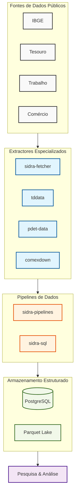

# Plataforma Brasileira de Dados Públicos

Uma plataforma modular para extrair, processar e analisar datasets públicos brasileiros.

<div align="center">
  
</div>

## O Problema

Dados públicos brasileiros estão fragmentados em múltiplas agências governamentais, cada uma com sua própria infraestrutura:

- **APIs instáveis**: Endpoints mudam sem aviso, rate limiting é imprevisível, e downtime é comum
- **Infraestrutura legada**: Servidores FTP, instâncias CKAN e APIs web antigas carecem de formatos modernos
- **Esquemas inconsistentes**: Estruturas de tabelas diferem ao longo dos anos, valores ausentes são tratados inconsistentemente
- **Arquivos grandes**: Datasets variam de centenas de MB a dezenas de GB, exigindo tratamento cuidadoso
- **Sem padronização**: Cada fonte tem suas próprias convenções de nomenclatura, ordenação de colunas e tipos de dados

Construir pipelines de dados confiáveis em cima disso requer:

- Lógica de extração resiliente que lida com falhas de API graciosamente
- Validação e limpeza de dados no nível da fonte
- Formatos de armazenamento estruturados que permitem análise eficiente
- Pipelines de transformação reproduzíveis

## A Solução

Esta plataforma fornece um conjunto de **ferramentas especializadas e modulares** projetadas para lidar com dados públicos brasileiros do mundo real. Cada ferramenta é projetada para sua infraestrutura específica, com padrões arquiteturais distintos:

| Componente | Padrão Arquitetural | Desafio de Infraestrutura |
|-----------|---------------------|--------------------------|
| **sidra-fetcher** | Clientes sync/async dual com smart caching | API REST IBGE instável, rate limiting |
| **sidra-sql** | Motor ETL baseado em plugins com modelagem star-schema | Bulk load streaming + histórico de revisões (SCD II) |
| **tddata** | Engenharia financeira com matching FIFO de lotes | Transações de portfólio streaming, conformidade GIPS |
| **pdet-data** | Transformação Big Data com processamento vetorial Polars | CSVs 50M+ linhas que esgotam memória Pandas |
| **comexdown** | Agente de extração resiliente com idempotência temporal | Servidores governamentais legados, problemas SSL, arquivos colossais |
| **datasus-fetcher** | Crawler concorrente multithreaded com parsing semântico | Infraestrutura FTP legada, nomenclatura críptica, semanas de downloads sequenciais |

Cada ferramenta é endurecida em produção para seu domínio:

- **Resiliência**: Backoff exponencial, auto-retry, degradação graciosa
- **Eficiência**: Smart caching, verificações de idempotência, processamento streaming
- **Confiabilidade**: Validação de dados, deduplicação, trilhas de auditoria abrangentes
- **Performance**: Concorrência multithreaded, processamento vetorial, armazenamento colunares
- **Reprodutibilidade**: Transformações determinísticas, outputs versionados, linhagem completa

## Domínios Cobertos

### IBGE (Macroeconomia)

SIDRA é a fonte oficial para séries temporais macroeconômicas brasileiras: PIB, inflação, emprego, comércio, etc. Nossas ferramentas a tornam acessível.

### Tesouro Direto (Finanças)

Dados de rendimento de renda fixa e precificação de títulos. Usado para análise financeira, construção de portfólio e modelagem de risco.

### Mercado de Trabalho

RAIS (censo anual de emprego) e CAGED (fluxos mensais de empregos) fornecem dados granulares do mercado de trabalho por região e setor.

### Comércio Exterior

Fluxos de exportação/importação do Siscomex permitem análise de comércio e estudos de competitividade.

### Saúde Pública

Dados epidemiológicos DATASUS para vigilância de doenças, economia da saúde e pesquisa em saúde pública.

## Arquitetura da Plataforma



## Componentes Principais

### sidra-fetcher

**Padrão dual client** para extração macroeconômica SIDRA IBGE. Fornece clientes síncronos (simplicidade) e assíncronos (performance) com smart caching via requisições HEAD verificando headers Last-Modified.

- **Modo Sync** (~60s): Fetches sequenciais de tabelas para queries one-off ou simplicidade
- **Modo Async** (~15s): Fetches concorrentes via `asyncio.gather` com speedup 4x
- **Smart caching**: Pula tabelas inalteradas via parametrização de URL; verificações de idempotência
- **Use quando**: Precisa de indicadores econômicos em tempo real, dados de inflação ou estatísticas de emprego da SIDRA com requisitos flexíveis sync/async

### sidra-sql

**Motor ETL baseado em plugins** que ingere tabelas SIDRA em um schema star normalizado PostgreSQL. Bulk load streaming via `COPY FROM STDIN` PostgreSQL (400k+ rows/sec). Implementa Slowly Changing Dimensions (SCD Type II) para que revisões históricas sejam preservadas em vez de sobrescritas.

- **Pipelines TOML declarativos**: `fetch.toml` + `transform.toml` + `transform.sql` por dataset; sem Python necessário
- **Sistema de plugins**: Catálogo pré-construído em `sidra-pipelines`; install + run one-command
- **Star schema**: 5 tabelas (`sidra_tabela`, `localidade`, `periodo`, `dimensao`, `dados`) desacoplam metadata de facts
- **SCD Type II**: Colunas `ativo` + `modificacao` reproduzem qualquer snapshot histórico
- **Use quando**: Construindo um data warehouse reproduzível, expondo dados IBGE a ferramentas BI, ou rastreando revisões IBGE ao longo do tempo

### tddata

**Suite de engenharia financeira** para análise de renda fixa Tesouro Direto. Conta com algoritmo de controle de inventário FIFO, Modified Dietz Method para medição de performance de portfólio em conformidade GIPS, e downloads de títulos concorrentes assíncronos.

- **Smart async fetching** (3x mais rápido que sync): Downloads paralelos de títulos com verificações de idempotência
- **Controle de inventário FIFO**: Atribuição de retorno por lote com injeção de cupom
- **Modified Dietz Method**: Retornos de portfólio de fluxo de caixa ponderado em conformidade GIPS
- **Processamento vetorial Polars**: 10x mais rápido que Pandas para cálculos em massa
- **Use quando**: Construindo análise de renda fixa, calculando performance de portfólio, ou analisando rendimentos de títulos do governo brasileiro

### pdet-data

**Motor de transformação Big Data** para microdados de mercado de trabalho brasileiro. Processamento vetorial Polars multithreaded transforma formatos CSV/TXT legados em armazenamento colunares Parquet eficiente com compressão 95%+.

- **Conversão Raw-to-Parquet**: 8 GB CSV → 0.4 GB Parquet (compressão 96%)
- **Processamento vetorial**: Execução Rust multithreaded; 10x mais rápido que Pandas
- **Gerenciamento inteligente de memória**: Descompressão streaming com limpeza dinâmica
- **Processamento idempotent**: Primeira execução 62s → execuções em cache 0.08s (speedup 778x)
- **Use quando**: Processando datasets de emprego 50M+ linhas que esgotam memória Pandas

### comexdown

**Agente de extração de rede resiliente** para dados de comércio Siscomex com eficiência streaming e resiliência SSL. Lida com instabilidade de infraestrutura governamental legada através de idempotência temporal e backoff exponencial.

- **Idempotência temporal** (speedup 57x): Requisições HEAD verificam Last-Modified; pula arquivos inalterados
- **Chunks streaming** (blocos 8KB): Zero overhead de memória independentemente do tamanho do arquivo
- **Resiliência SSL**: Lida com certificados expirados/mal configurados; spoofing de User-Agent
- **Auto-retry**: Backoff exponencial em falhas transitórias
- **Downloads concorrentes**: Speedup 5-10x com workers paralelos
- **Use quando**: Baixando datasets de comércio em escala gigabyte ou analisando padrões de importação/exportação

### datasus-fetcher

**Crawler concorrente multithreaded** para sistemas epidemiológicos DATASUS hospedados em servidores FTP legados. Padrão threading Producer-Consumer com crawling recursivo de diretório e parsing semântico de nome de arquivo.

- **Concorrência multithreaded** (speedup 6-10x): Paralelização baseada em pool com 5-10 conexões FTP concorrentes
- **Smart resume** (speedup 1,350x em re-runs): Idempotência baseada em tamanho; pula arquivos inalterados
- **Crawling recursivo**: Mapeamento dinâmico de diretório; sem caminhos hardcoded
- **Parsing semântico**: Decodificar nomes de arquivo em metadados (ano, mês, estado, sistema) para subsetting cirúrgico
- **Ecossistema completo**: Baixa dados + layouts + documentação com versionamento
- **Use quando**: Extraindo microdados completos de saúde pública (SIM, SINASC, SIA, SIHSUS, CNES) para pesquisa epidemiológica

## Exemplos Rápidos

### Economic Analysis: Async Fetching with Dual Clients

```python
import asyncio
from sidra_fetcher import AsyncSidraClient
from sidra_fetcher.sidra import Parametro, Formato, Precisao

def _param(agregado: str, variavel: str) -> Parametro:
    return Parametro(
        agregado=agregado,
        territorios={"1": ["all"]},
        variaveis=[variavel],
        periodos=[],
        classificacoes={},
        formato=Formato.A,
        decimais={"": Precisao.M},
    )

async def fetch_economic_indicators():
    async with AsyncSidraClient(timeout=60) as client:
        # Concurrent fetch: GDP + Inflation + Unemployment
        return await asyncio.gather(
            client.get(_param("1620", "116").url()),   # GDP
            client.get(_param("1419", "63").url()),    # IPCA inflation
            client.get(_param("6381", "4099").url()),  # Unemployment
        )

results = asyncio.run(fetch_economic_indicators())
# Concurrent gathers complete in ~max(latency) instead of sum(latencies).
```

### Labor Market: Big Data Processing with Polars

```bash
# Bulk-convert every RAIS / CAGED archive to Parquet
pdet-data convert ./raw ./parquet
```

```python
import polars as pl

# Analyze 100M+ employment records efficiently
df = pl.scan_parquet("parquet/rais-vinculos/2023.parquet")
wage_by_sector = (
    df.group_by("cnae_secao")
      .agg([
          pl.col("vl_remun_medio_nominal").mean().alias("salario_medio"),
          pl.col("id_vinculo").count().alias("n_vinculos"),
      ])
      .collect()
)
```

### Fixed-Income: Financial Engineering with FIFO Lot Matching

```python
from tddata import reader
from tddata.analytics import (
    calculate_operations_returns,
    calculate_portfolio_monthly_returns,
)

operations = reader.read_operations("operacoes-do-tesouro-direto.csv")
prices     = reader.read_prices("taxas-dos-titulos-ofertados-pelo-tesouro-direto.csv")

# Per-lot returns with FIFO matching (sells matched against oldest buys)
lots = calculate_operations_returns(operations, prices)

# Monthly portfolio returns using Modified Dietz (GIPS-compliant)
monthly = calculate_portfolio_monthly_returns(operations, prices)
```

### Trade Analysis: Resilient Extraction with Smart Caching

```python
from pathlib import Path
import comexdown

# Streams in 8 KiB chunks, atomic *.tmp -> rename, retries 3× with backoff.
# HEAD + Last-Modified makes re-runs effectively free.
comexdown.get_year(Path("./DATA"), year=2023)
```

```bash
# Or via the CLI for a multi-year batch
comexdown trade 2014:2023 -o ./DATA
```

### Public Health: Concurrent Crawler for FTP Infrastructure

```sh
# Multithreaded FTP crawling (6x speedup)
datasus-fetcher data --data-dir ./data sim-do-cid10 \
    --start 2018 --end 2023 \
    --threads 5
# Sequential: 300 min | Concurrent: 50 min
```

```python
# Equivalent Python entrypoint used by the CLI
from pathlib import Path
from datasus_fetcher import fetcher
from datasus_fetcher.slicer import Slicer

fetcher.download_data(
    datasets=["sim-do-cid10"],
    destdir=Path("./data"),
    threads=5,
    slicer=Slicer(start_time="2018", end_time="2023", regions=None),
)
```

## Casos de Uso

### Monitoramento Econômico em Tempo Real

Use async sidra-fetcher para fazer fetch concorrente de PIB, inflação e emprego da SIDRA IBGE. 4x mais rápido que abordagens sequenciais. Combine com tddata para curvas de rendimento e análise macro.

### Análise de Portfólio & Gestão de Risco

Faça fetch de rendimentos históricos Tesouro Direto com tddata. Calcule retornos em conformidade GIPS usando Modified Dietz Method com matching FIFO de lotes. Analise risco de duration e convexidade em suas participações de renda fixa.

### Dinâmica do Mercado de Trabalho

Processe 50M+ registros RAIS de emprego com pdet-data (CSV bruto → Parquet em 62s). Analise tendências salariais, criação de emprego e deslocamentos setoriais usando processamento vetorial Polars. Rastreie fluxos mensais com dados CAGED.

### Competitividade Comercial & Cadeia de Suprimentos

Baixe fluxos de comércio completos do Siscomex com comexdown (speedup 57x via smart caching). Analise especialização de exportação, dependência de importação e índices de competitividade por commodity e destino.

### Vigilância Epidemiológica & Saúde Pública

Faça crawl concorrente de servidores FTP DATASUS com datasus-fetcher (speedup 6-10x). Construa estudos de carga de doença a partir de microdados completos (mortalidade SIM, nascimentos SINASC). Rastreie inequidades de saúde e eficiência de alocação de recursos.

## Filosofia de Design

### Modularidade

Cada ferramenta é independente. Use apenas o que precisa; não puxe dependências desnecessárias.

### Performance

Prefira armazenamento colunares (Parquet) para queries analíticas. Suporte PostgreSQL para acesso operacional.

### Resiliência

Lide com falhas de API, retries e falhas parciais graciosamente. Nunca descarte dados silenciosamente.

### Reprodutibilidade

Todas as transformações são determinísticas e registradas. Repita qualquer pipeline a partir de dados brutos.

### Sem Mágica

Explícito é melhor que implícito. Saiba quais dados estão sendo buscados, transformados e armazenados.

## Começando

### Por Caso de Uso

**Indicadores Econômicos?** → [IBGE (sidra-fetcher, sidra-sql, sidra-pipelines)](ibge/index.md)

- Estatísticas de PIB, inflação, emprego em tempo real
- Fetching assíncrono para análise ad-hoc; pipelines TOML declarativos para data warehousing em produção

**Análise de Renda Fixa?** → [Tesouro Direto (tddata)](tesouro/tddata.md)

- Retornos de portfólio em conformidade GIPS com Modified Dietz
- Controle de inventário FIFO para atribuição por lote

**Emprego & Salários?** → [Mercado de Trabalho (pdet-data)](trabalho/pdet-data.md)

- Microdados RAIS 50M+ linhas processados em segundos com Polars
- Fluxos mensais de empregos do CAGED

**Padrões de Comércio?** → [Comércio Exterior (comexdown)](comex/comexdown.md)

- Datasets completos Siscomex com idempotência temporal
- Speedup 57x via smart caching

**Vigilância de Doenças?** → [Saúde Pública (datasus-fetcher)](saude/datasus-fetcher.md)

- Crawling FTP multithreaded (6-10x mais rápido que sequencial)
- Microdados completos de sistemas epidemiológicos DATASUS

### Por Caminho de Aprendizado

1. **[Visão Geral da Arquitetura](architecture/overview.md)**: Como cada ferramenta resolve seu desafio de infraestrutura
2. **[Filosofia de Design](design-philosophy.md)**: Resiliência, eficiência, confiabilidade, reprodutibilidade
3. **[Escolha um Domínio](ibge/index.md)**: Aprofunde em IBGE, Tesouro, Trabalho, Comércio ou Saúde
4. **[Melhores Práticas](best-practices.md)**: Processamento idempotent, smart caching, downloads concorrentes

## Próximas Etapas

- **Vitória rápida**: Faça fetch de dados macroeconômicos com [sidra-fetcher (async)](ibge/index.md)
- **Pipeline em produção**: Construa um engine de análise Tesouro Direto com [tddata](tesouro/index.md)
- **Big data**: Processe RAIS com [pdet-data](trabalho/pdet-data.md) e Polars
- **Ecossistema completo**: Baixe DATASUS com [concurrent crawler datasus-fetcher](saude/datasus-fetcher.md)
