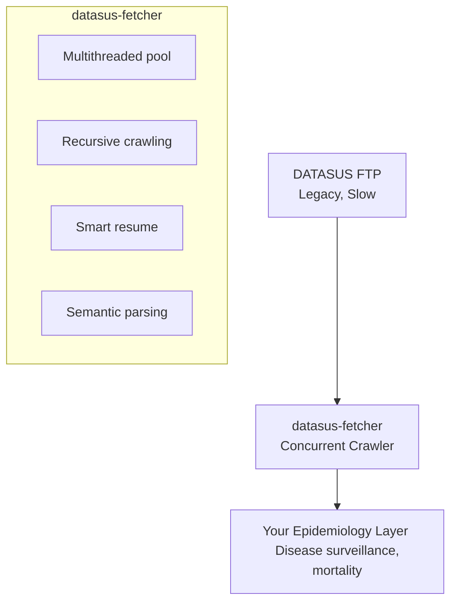

# Public Health (Saúde)

Brazilian health surveillance data from DATASUS (Health Data Department).

**datasus-fetcher** is a multithreaded concurrent crawler engineered specifically for the massive microdata of Brazil's Unified Health System (SUS) hosted on legacy FTP servers.

Far more than a simple data client, it understands the complex taxonomy of Brazilian health systems (SIHSUS, SIM, SINASC, SIA, etc.) and abstracts the inefficiency of legacy FTP infrastructure into a high-performance, fault-tolerant network pipeline.

## The Challenge

Obtaining complete Brazilian public health microdata encounters severe infrastructure barriers:

### 1. FTP Protocol Limitations

DATASUS primarily hosts data on public FTP (`ftp.datasus.gov.br`). The FTP protocol is inherently:
- Synchronous (one file at a time)
- Prone to silent transfer failures
- Subject to connection timeouts and bandwidth throttling
- Severely limited per-thread bandwidth

### 2. Labyrinth of Directories & Cryptic Nomenclature

Files (often in proprietary `.dbc` format) are scattered across dozens of nested directories. Filenames encode complex business logic positionally:
- `RDSP2001.dbc` = AIH Reduced, SP state, Year 2020, Month 01
- Manual parsing is error-prone and brittle

### 3. Infeasible Sequential Downloads

Downloading all data (all states, all years, all subsystems) sequentially via scripts can take weeks. Network failures mid-transfer mean total loss of progress.

**datasus-fetcher** solves these through multithreaded concurrency, semantic file parsing, and intelligent resumption.

## Architecture: Industrial-Grade Concurrent Crawler



## Core Capabilities

- ✅ **Multithreaded Concurrency** — Pool of FTP connections; parallel downloads (6-10x speedup)
- ✅ **Smart Resume** — Compares file sizes; skip complete downloads (1,350x speedup on re-runs)
- ✅ **Recursive Crawling** — Dynamic directory mapping; no hardcoded paths
- ✅ **Semantic Parsing** — Decode filenames to metadata (year, month, state, system)
- ✅ **Slicing** — Download surgical subsets (e.g., "SIM from SP 2018-2022 only")
- ✅ **Documentation Extract** — Fetch layouts, PDFs, and lookup tables
- ✅ **Production Ready** — Handles transient FTP failures; automatic retry
- ✅ **All Subsystems**: SIHSUS, SIM, SINASC, SIA, CNES

## Use Cases

### Epidemiological Surveillance
Track disease outbreaks, geographic spread, seasonal patterns, and incidence trends in real-time.

### Mortality Analysis
Study causes of death, health disparities by region/demographic, and mortality trends over time using complete microdata.

### Health Economics & Resource Allocation
Analyze hospital utilization patterns, procedure volumes, cost-effectiveness, and resource allocation efficiency.

### Health Inequities Research
Examine disparities in health outcomes, access to care, and mortality differences across socioeconomic and demographic groups.

### Disease Burden Studies
Quantify disease burden using complete SINASC (birth registrations) and SIM (mortality) datasets for population-level epidemiology.

## Workflow: Concurrent Download → Analyze → Insights

### Step 1: Fetch Subsystem Data (Multithreaded)

The primary entrypoint is the `datasus-fetcher` CLI. To download SIM (mortality, ICD-10) for all states 2018–2023:

```sh
datasus-fetcher data --data-dir ./data sim-do-cid10 \
    --start 2018 --end 2023 \
    --threads 5
```

Equivalent Python entrypoint (used internally by the CLI):

```python
from pathlib import Path
from datasus_fetcher import fetcher
from datasus_fetcher.slicer import Slicer

slicer = Slicer(start_time="2018", end_time="2023", regions=None)

fetcher.download_data(
    datasets=["sim-do-cid10"],
    destdir=Path("./data"),
    threads=5,
    slicer=slicer,
)
```

Subsequent runs are idempotent: files whose remote size matches the local copy are skipped automatically.

### Step 2: Semantic Slicing (Smart Subset Selection)

`--start`, `--end`, and `--regions` slice the download surgically. Example: SIM mortality for São Paulo only, 2020–2022:

```sh
datasus-fetcher data --data-dir ./data sim-do-cid10 \
    --start 2020 --end 2022 \
    --regions sp
```

Use `--dry-run` to preview the file list (sizes, totals) without downloading anything:

```sh
datasus-fetcher data --data-dir ./data sim-do-cid10 \
    --start 2020 --end 2022 --regions sp \
    --dry-run
```

### Step 3: Extract Documentation & Auxiliary Tables

Codebooks, layout PDFs, and reference tables live in separate subcommands:

```sh
# Documentation (data dictionaries, layouts) for SIM, SIH, CNES
datasus-fetcher docs --data-dir ./docs sim sih cnes

# Auxiliary lookup tables (ICD codes, municipalities, procedures, ...)
datasus-fetcher aux --data-dir ./aux sim sih cnes
```

### Step 4: Reading the `.dbc` files

`datasus-fetcher` is a pure downloader — it does not parse `.dbc`. To load the files in Python use [PySUS](https://github.com/AlertaDengue/PySUS), or convert them to `.dbf`/`.csv` first with [dbf2dbc](https://github.com/AlertaDengue/dbf2dbc); R users can read them directly with [read.dbc](https://github.com/dankkom/read.dbc).

## Tools

### [datasus-fetcher](datasus-fetcher.md)
Multithreaded concurrent crawler for DATASUS microdata:
- **Multithreaded Concurrency** — Pool-based parallelization via Producer-Consumer pattern (6-10x speedup)
- **Smart Resume** — Size-based idempotence; skip unchanged files (1,350x speedup on re-runs)
- **Recursive Crawling** — Dynamic directory mapping; no hardcoded paths
- **Semantic Parsing** — Decode filenames into structured metadata; enable surgical subsetting
- **Documentation Extract** — Fetch layouts, PDFs, and lookup tables (versioned with timestamps)
- **Production Ready** — Used in epidemiological surveillance systems and public health agencies

## Data Available

### SINAN Diseases (Selection)

| Disease | Code | Reportable Since |
|---------|------|-----------------|
| COVID-19 | covid19 | 2020 |
| Dengue | dengue | 1998 |
| Malaria | malaria | 1960s |
| Measles | measles | 1960s |
| TB (Tuberculosis) | tuberculosis | 1993 |
| HIV/AIDS | hivaids | 1983 |
| Influenza | influenza | 2000 |

### Death Causes (ICD-10 Chapters)

| Code | Description |
|------|-------------|
| A-B | Infectious and parasitic diseases |
| C-D | Neoplasms (cancers) |
| E | Endocrine and metabolic diseases |
| F | Mental and behavioral disorders |
| G-H | Diseases of nervous/ear systems |
| I | Circulatory system diseases |
| J | Respiratory diseases |
| K | Digestive system diseases |
| L-M | Skin/musculoskeletal diseases |
| N | Urogenital system diseases |
| O | Pregnancy and childbirth |
| P | Perinatal conditions |
| Q | Birth defects |
| R | Symptoms/signs |
| V-Y | External causes (injury, poisoning) |
| Z | Factors influencing health status |

## Performance & Benchmarks

### Concurrent Download Speed

Sequential vs. multithreaded crawling:

```
SIM 2015-2023 (All States):
  Sequential (1 worker):   ~300 minutes
  Concurrent (5 workers):   ~50 minutes
  Speedup:                 6.0x

SIHSUS 2010-2023 (All States):
  Sequential (1 worker):   ~800 minutes
  Concurrent (10 workers): ~80 minutes
  Speedup:                 10.0x

Memory usage: ~80 MB (constant, independent of file count)
```

### Smart Resume Effectiveness

Skipping unchanged files via size comparison:

```
First run:  45 minutes (full crawl + download)
Second run: 2 seconds  (size check only)
Speedup:    1,350x

Effectiveness: 99% of files unchanged month-to-month
               Only ~1% of files re-download on typical updates
```

## Best Practices

### 1. Use Multiple Threads for Large Subsystems

Big subsystems (SIA-PA, CNES-PF) ship gigabytes of microdata. Bump `--threads`:

```sh
# Slow: single-threaded
datasus-fetcher data --data-dir ./data sia-pa

# Faster: 6 concurrent FTP connections
datasus-fetcher data --data-dir ./data sia-pa --threads 6
```

### 2. Slice with `--start` / `--end` / `--regions`

Don't pull the whole archive when you only need a slice:

```sh
# Wasteful: full SIM history, all states
datasus-fetcher data --data-dir ./data sim-do-cid10

# Targeted: SP mortality 2018–2022 only
datasus-fetcher data --data-dir ./data sim-do-cid10 \
    --start 2018 --end 2022 --regions sp
```

### 3. Re-run for Incremental Updates

datasus-fetcher compares remote size against local size and skips identical files automatically. Re-running the same command monthly only downloads what actually changed.

### 4. Archive Old Versions

DATASUS reissues files with new dates. Use `archive` to move non-latest versions out of the active tree:

```sh
datasus-fetcher archive \
    --data-dir ./data \
    --archive-data-dir ./data-archive
```

### 5. Pair `data` + `docs` + `aux` for Reproducibility

Download the data, the codebooks, and the lookup tables together so analyses remain reproducible across DATASUS revisions:

```sh
datasus-fetcher data --data-dir ./data sim-do-cid10 --start 2018
datasus-fetcher docs --data-dir ./docs sim
datasus-fetcher aux  --data-dir ./aux  sim
```

## Common Analyses

After downloading, parse `.dbc` to a DataFrame (here via [PySUS](https://github.com/AlertaDengue/PySUS)) and analyze with pandas/polars.

### Temporal Trends — Dengue Notifications

```sh
datasus-fetcher data --data-dir ./data sinan-deng --start 2020 --end 2024
```

```python
from pathlib import Path
import polars as pl
from pysus.utilities.readdbc import read_dbc

frames = []
for path in Path("./data/sinan-deng").rglob("*.dbc"):
    df = pl.from_pandas(read_dbc(str(path), encoding="latin-1"))
    frames.append(df)

cases = pl.concat(frames, how="diagonal_relaxed")
yearly = cases.group_by("NU_ANO").len().sort("NU_ANO")
print(yearly)
```

### Geographic Variation — SIM Mortality by State

```sh
datasus-fetcher data --data-dir ./data sim-do-cid10 --start 2022 --end 2022
```

```python
deaths_by_uf = (
    cases
    .group_by("CODMUNRES")           # municipality of residence
    .len()
    .sort("len", descending=True)
)
```

(Join `CODMUNRES` against the IBGE municipality table downloaded via `datasus-fetcher aux` to roll up by state.)

## Learn More

- **[datasus-fetcher Documentation](datasus-fetcher.md)** — Complete feature reference
- **[IBGE Health Surveys](../ibge/index.md)** — Population health statistics
- **[Architecture](../architecture/overview.md)** — System design
- **[DATASUS Official (Portuguese)](https://datasus.saude.gov.br/)** — Government source
