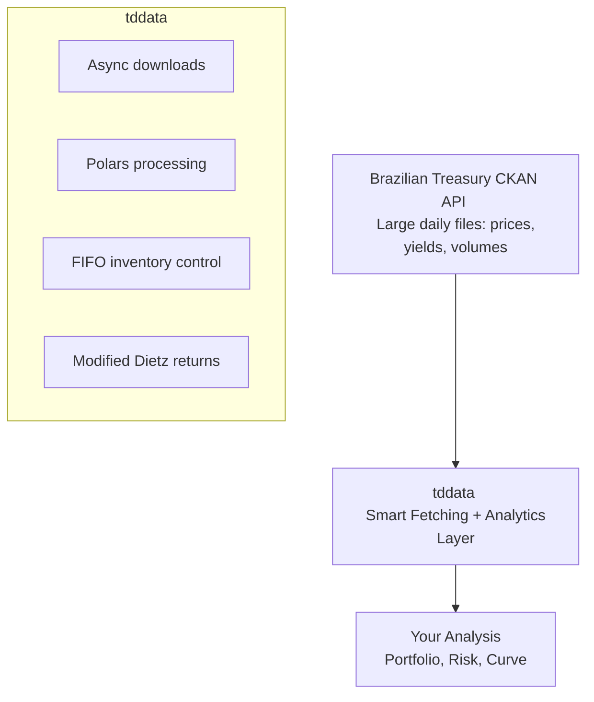

# Treasury (Finance)

Brazil's Federal Treasury (Tesouro Nacional) publishes two very different kinds of data: **fixed-income securities microdata** through the Treasury Direct (Tesouro Direto) program, and **fiscal aggregates** through reports such as the *Resultado do Tesouro Nacional* (RTN) — revenues, expenses, and primary results of the Federal Government.

This section covers two packages: **[tddata](tddata.md)** for Treasury Direct microdata and portfolio analytics, and **[rtnpy](rtnpy.md)** for the RTN fiscal-results spreadsheet.

## tddata: Treasury Direct Analytics

**tddata** is an industrial-grade financial engineering suite for Treasury Direct microdata—far more than a data client, it abstracts government communication and natively implements sophisticated financial mathematics for portfolio analytics.

## The Challenge

Treasury Direct data analysis encounters critical obstacles:

- **Volume & Speed**: Massive daily files with millions of records; traditional libraries (Pandas) cause memory exhaustion
- **FIFO Complexity**: Computing returns for investors with multiple purchases and partial sales requires strict accounting controls
- **Portfolio Performance**: Calculating monthly returns with deposits, withdrawals, and coupon income demands GIPS-compliant methodologies (Modified Dietz)

**tddata** solves these through smart async fetching, Polars-powered processing (10x faster), automatic FIFO lot matching, and Modified Dietz portfolio analytics.

## Architecture: How tddata Powers Treasury Analysis



## Core Capabilities

- ✅ **Smart async fetching** with idempotence (skip unchanged files)
- ✅ **Polars-powered analytics** (10x faster than Pandas)
- ✅ **FIFO lot matching** (precise per-lot returns with coupon injection)
- ✅ **Modified Dietz portfolio returns** (GIPS-compliant performance measurement)
- ✅ **Market-to-market pricing** (O(1) lookups for speed)
- ✅ **All bond types**: LTN, NTN-B, NTN-F, LFT, NTN-C
- ✅ **Export to Parquet, CSV, PostgreSQL**

## Use Cases

### Economic Monitoring

Track real-time Brazilian fixed-income market conditions:

- Yield curve trends (prefixed vs. inflation-indexed spreads)
- Duration risk exposure
- Market volatility and repricing

### Portfolio Management

Build and optimize Brazilian government bond portfolios:

- FIFO lot matching for per-lot returns
- Modified Dietz portfolio performance (GIPS-compliant)
- Asset allocation and duration management

### Quantitative Analysis

Model term structure and price dynamics:

- Yield curve modeling
- Interest rate sensitivity (duration/convexity)
- Market microstructure

### Academic Research

Study emerging market fixed-income dynamics with 20+ years of historical data.

### Risk Management

Calculate bond-level and portfolio-level risks:

- Interest rate risk (duration)
- Liquidity risk (bid-ask spreads)
- Credit risk (government solvency)

## Data Available

### Bond Types

| Code | Full Name | Characteristics |
|------|-----------|-----------------|
| **LTN** | Treasury Notes | Prefixed (zero-coupon), short-term |
| **NTN-B** | IPCA-indexed Notes | Inflation-protected, semi-annual coupons |
| **NTN-F** | Fixed-rate Notes | Prefixed with coupons, longer-term |
| **NTN-C** | CCI-indexed Notes | Currency-indexed (INPC) |
| **LFT** | Financial Treasury Letters | Selic-linked, floating-rate bonds |

### Available Metrics

For each bond and date:

- **Yield (YTM)**: Annual percentage yield
- **Price**: Market price as % of par
- **Duration**: Modified duration in years
- **Maturity Date**: When the bond expires
- **Accrued Interest**: Interest accrued since last coupon
- **Outstanding Volume**: Amount in circulation

## Workflow: Fetch → Process → Analyze

### Step 1: Fetch Treasury Data (Async, Last-Modified idempotent)

`tddata.downloader.download` is async and uses CKAN's `last_modified` plus the local filename timestamp to skip already-current files. Up to `max_concurrency` resources are fetched in parallel.

```bash
# Pull every Treasury Direct dataset once
tddata download --dataset all -o ./data
```

```python
import asyncio
from pathlib import Path
from tddata import downloader

DATASETS = [
    "taxas-dos-titulos-ofertados-pelo-tesouro-direto",
    "operacoes-do-tesouro-direto",
    "estoque-do-tesouro-direto",
    "investidores-do-tesouro-direto",
    "vendas-do-tesouro-direto",
    "recompras-do-tesouro-direto",
]

async def fetch_all(dest_dir: Path):
    for ds in DATASETS:
        await downloader.download(dest_dir, dataset_id=ds, max_concurrency=3)

asyncio.run(fetch_all(Path("./data")))
```

### Step 2: Read CSVs into typed Polars DataFrames

```python
from pathlib import Path
from tddata import reader

data_dir = Path("./data")

prices     = reader.read_prices(next(data_dir.glob("taxas-dos-titulos*.csv")))
operations = reader.read_operations(next(data_dir.glob("operacoes-do-tesouro-direto*.csv")))
stock      = reader.read_stock(next(data_dir.glob("estoque-do-tesouro-direto*.csv")))
investors  = reader.read_investors(next(data_dir.glob("investidores-do-tesouro-direto*.csv")))
```

### Step 3: Per-Lot Returns with FIFO Matching

```python
from tddata.analytics import calculate_operations_returns

lots = calculate_operations_returns(
    operations=operations,
    prices=prices,
    coupons=None,  # optional coupons DataFrame
)
# One row per lot (closed or still open). FIFO matches sells against oldest buys
# and splits partial sells into closed + open positions automatically.
```

### Step 4: Monthly Portfolio Returns (Modified Dietz, GIPS-compliant)

```python
from tddata.analytics import calculate_portfolio_monthly_returns

monthly = calculate_portfolio_monthly_returns(
    operations=operations,
    prices=prices,
    coupons=None,
)
# Columns: month, monthly_return, cumulative_return, portfolio_value, net_cash_flow
print(monthly.select(["month", "monthly_return", "cumulative_return"]))
```

## Best Practices

### 1. Use the async downloader; let `max_concurrency` do the work

```python
import asyncio
from pathlib import Path
from tddata import downloader

# `download` overlaps up to `max_concurrency` resource downloads inside one
# dataset. It also HEAD-checks CKAN's last_modified, so re-runs only fetch
# what changed.
asyncio.run(
    downloader.download(
        Path("./data"),
        dataset_id="taxas-dos-titulos-ofertados-pelo-tesouro-direto",
        max_concurrency=5,
    )
)
```

### 2. Use Modified Dietz for Portfolio Returns

`calculate_portfolio_monthly_returns` already implements Modified Dietz, weighting cash flows by timing within each month — never roll your own simple-return formula when buys/sells happen mid-period.

```python
from tddata.analytics import calculate_portfolio_monthly_returns

# ❌ Wrong: ignores the timing of buys/sells within each month
# simple = (ending_value - beginning_value) / beginning_value

# ✅ GIPS-compliant: Modified Dietz weights cash flows by their day-of-month
monthly_returns = calculate_portfolio_monthly_returns(
    operations=operations,
    prices=prices,
)
```

### 3. Include Coupons in FIFO Returns

Pass a coupons DataFrame to `calculate_operations_returns` / `calculate_portfolio_monthly_returns` so coupon income is injected as positive cash flow on the payment dates:

```python
from tddata import reader
from tddata.analytics import calculate_operations_returns

coupons = reader.read_interest_coupons(coupons_csv)

# ✅ Includes coupon payments
lots_with_coupons = calculate_operations_returns(
    operations=operations,
    prices=prices,
    coupons=coupons,
)

# ❌ Misses coupon income for NTN-B / NTN-F lots
lots_no_coupons = calculate_operations_returns(operations, prices)
```

### 4. Use Polars, Not Pandas

Polars is 10x faster for large Treasury datasets:

```python
import polars as pl

# ❌ Slow (Pandas)
import pandas as pd
df = pd.read_csv("treasury.csv")  # Slow, high memory
grouped = df.groupby("bond_type").agg({"yield": "mean"})  # Minutes

# ✅ Fast (Polars)
df = pl.read_parquet("treasury.parquet")  # Fast, low memory
grouped = df.group_by("bond_type").agg(pl.col("yield").mean())  # <1s
```

### 5. Store in Parquet Format

Parquet provides 80%+ compression and faster I/O:

```python
import polars as pl

# Save processed data
result.write_parquet("treasury_processed.parquet")

# Load later (10x faster than CSV)
df = pl.read_parquet("treasury_processed.parquet")
```

## Key Concepts

### Prefixed Bonds (LTN, NTN-F)

You know the exact return when you buy. Fixed interest rate, paid at maturity (LTN) or semi-annually (NTN-F).

### IPCA-Indexed Bonds (NTN-B)

Principal adjusts by IPCA inflation. Coupon rate is typically 4-6% above inflation—the real return.

### Selic-Linked Bonds (LFT)

Interest rate tracks the Selic overnight rate. Minimal interest rate risk, but subject to inflation.

### Duration

Measures bond price sensitivity to interest rate changes. Higher duration = greater price volatility.

### Yield Curve

Relationship between yield and time-to-maturity. Steep curve suggests rate increases expected; flat suggests uncertainty.

## Tools in This Section

### [tddata](tddata.md)

Industrial-grade financial engineering suite for Treasury Direct. Master:

- **Smart async fetching** with idempotence (skip unchanged files)
- **FIFO lot matching** (per-lot returns with coupon injection)
- **Modified Dietz** (GIPS-compliant portfolio performance)
- **Polars processing** (10x faster than Pandas)
- **High-performance analytics** (10M+ rows in seconds)

### [rtnpy](rtnpy.md)

Downloader and normalizer for the *Resultado do Tesouro Nacional* (RTN) fiscal-results spreadsheet:

- **Auto-download** of the latest RTN workbook with timestamp dedup
- **24 supported sheets** (monthly / quarterly / annual; current / constant; % of GDP)
- **Long-format normalization** with year/month or year/quarter split
- **Account hierarchy expansion** as a separate dimension table
- **CLI export** to formatted Excel or SQLite

### [Portfolio Returns Guide](calculo-retornos.md)

Deep dive into fixed-income mathematics:

- YTM and duration calculations
- Modified Dietz methodology
- Real returns for inflation-indexed bonds

## Performance & Benchmarks

- **Async fetching**: First run 30s → cached runs <1s (40x speedup)
- **Polars processing**: 15M rows in 0.34s (44M rows/sec throughput)
- **FIFO matching**: 500k transactions in 2.4s (208k tx/sec)

## When to Use tddata

**Use tddata when:**

- Building production Treasury Direct pipelines
- Calculating GIPS-compliant portfolio returns
- Analyzing millions of historical transactions
- Need precise per-lot return attribution (FIFO)
- Combining Treasury data with other data sources

**Use simple scripts when:**

- Quick one-off analysis
- Small datasets (<100MB)
- Academic exploration

## Learn More

- **[tddata Documentation](tddata.md)** — Complete feature reference
- **[IBGE Macroeconomics](../ibge/index.md)** — Pair Treasury yields with inflation data
- **[Architecture Overview](../architecture/overview.md)** — System design principles
- **[Treasury Direct Official](https://www.tesouro.gov.br/tesouro-direto)** — Government site (Portuguese)
