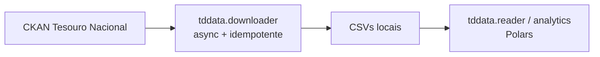
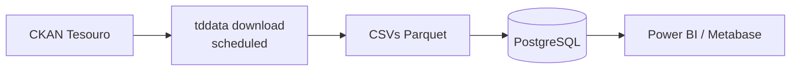

# Tesouro — Finanças

O Tesouro Nacional brasileiro publica dois tipos muito diferentes de dados:

- **Microdados de renda fixa** via Tesouro Direto — preços, yields, operações de compra/venda, estoques, investidores.
- **Agregados fiscais** via *Resultado do Tesouro Nacional* (RTN) — receitas, despesas e resultado primário do Governo Federal.

A plataforma cobre ambos com pacotes dedicados.

## O desafio

Análise de Tesouro Direto encontra três barreiras críticas:

- **Volume e velocidade** — arquivos diários com milhões de registros; Pandas estoura memória rapidamente.
- **Complexidade FIFO** — calcular retornos para investidores com múltiplas compras e vendas parciais exige controle contábil estrito (matching FIFO de lotes com injeção de cupons).
- **Performance de portfólio** — calcular retornos mensais com depósitos, saques e renda de cupom exige metodologia GIPS-compliant (Modified Dietz).

A planilha RTN apresenta outro desafio: 24 abas mensais/trimestrais/anuais em formato wide, com hierarquia de contas que precisa ser normalizada para análise.

## Dois stacks: Exploração vs. Produção

### Stack 1 — Exploração (`tddata` SDK + Polars)

Para análise ad-hoc, notebooks Jupyter, modelagem de yield curve, análise de portfólio one-off. Use o downloader assíncrono + readers Polars + analytics direto.

### Stack 2 — Produção (Pipeline `tddata` + Parquet/PostgreSQL)

Para análise diária recorrente: scheduler chama `tddata download` (idempotente via `Last-Modified`), converte CSVs para Parquet, persiste em PostgreSQL para consumo BI.

Para dados fiscais (RTN), o fluxo é mais simples: `rtnpy` baixa a planilha mais recente, normaliza para formato longo e exporta para Excel/SQLite.

## Pacotes

- **[tddata](tddata.md)** — suíte de engenharia financeira: async fetching com idempotência, processamento Polars (10× vs. Pandas), matching FIFO de lotes com injeção de cupom, retornos Modified Dietz GIPS-compliant. Suporta LTN, NTN-B/F/C, LFT.
- **[rtnpy](rtnpy.md)** — downloader e normalizador da planilha RTN: 24 abas mensais/trimestrais/anuais (corrente / constante / % do PIB), normalização em formato longo com expansão de hierarquia de contas, CLI de exportação Excel/SQLite.
- **[Cálculo de Retornos](calculo-retornos.md)** — guia matemático: YTM, duration, FIFO, Modified Dietz, retornos reais para títulos indexados à inflação.

## Princípios em ação

- **[Resiliência](../concepts/principios.md#resiliencia)** — `tddata.downloader` verifica `last_modified` no CKAN antes de baixar, pulando arquivos atualizados; `rtnpy` deduplica por timestamp.
- **[Performance](../concepts/principios.md#performance)** — async fetching paraleliza até `max_concurrency` recursos por dataset; readers Polars processam 15M linhas em 0.34s.
- **[Reprodutibilidade](../concepts/principios.md#reprodutibilidade)** — Modified Dietz pondera fluxos de caixa pelo timing dentro do mês, garantindo conformidade GIPS auditável; matching FIFO é determinístico (vendas associadas às compras mais antigas).
- **[Sem Mágica](../concepts/principios.md#sem-magica)** — algoritmos complexos (FIFO, Modified Dietz) são documentados inline; cupons são injetados explicitamente como fluxo de caixa.

Receitas táticas em [Padrões Práticos](../concepts/padroes.md): [Idempotência](../concepts/padroes.md#processamento-idempotente), [Concorrência para I/O](../concepts/padroes.md#concorrencia-io), [Lazy evaluation](../concepts/padroes.md#lazy-evaluation).

## Tipos de títulos do Tesouro Direto

| Código | Nome | Características |
|---|---|---|
| **LTN** | Letras do Tesouro Nacional | Prefixados (cupom zero), curto prazo |
| **NTN-B** | Notas do Tesouro Série B | Indexados ao IPCA, cupons semestrais |
| **NTN-F** | Notas do Tesouro Série F | Prefixados com cupons, longo prazo |
| **NTN-C** | Notas do Tesouro Série C | Indexados ao IGP-M (legado) |
| **LFT** | Letras Financeiras do Tesouro | Atrelados à Selic, pós-fixados |

Métricas disponíveis por título e data: yield (YTM), preço (% do par), duration modificada, vencimento, juros acumulados, volume em circulação.

## Próximos passos

- Para análise de portfólio: vá para **[tddata](tddata.md)** e use `calculate_portfolio_monthly_returns`.
- Para a matemática por trás dos cálculos: leia **[Cálculo de Retornos](calculo-retornos.md)**.
- Para dados fiscais (RTN): vá para **[rtnpy](rtnpy.md)**.
- Para combinar Tesouro com IPCA/PIB: veja **[Análise Econômica Multi-Fonte](../cookbook/analise-economica-multi-fonte.md)**.

## Recursos externos

- [Tesouro Direto (oficial)](https://www.tesouro.gov.br/tesouro-direto)
- [Resultado do Tesouro Nacional (RTN)](https://www.gov.br/tesouronacional/pt-br/estatisticas-fiscais-e-planejamento/resultado-do-tesouro-nacional-rtn)
