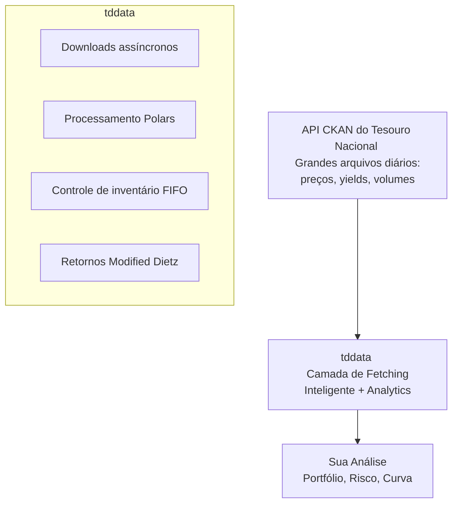

# Tesouro (Finanças)

O Tesouro Nacional Brasileiro publica dois tipos bem diferentes de dados: **microdados de títulos de renda fixa** através do programa Tesouro Direto, e **agregados fiscais** através de relatórios como o *Resultado do Tesouro Nacional* (RTN) — receitas, despesas e resultado primário do Governo Federal.

Esta seção cobre dois pacotes: **[tddata](tddata.md)** para microdados Tesouro Direto e análise de portfólio, e **[rtnpy](rtnpy.md)** para a planilha fiscal RTN.

## tddata: Análise Tesouro Direto

**tddata** é uma suíte de engenharia financeira de nível industrial para microdados Tesouro Direto — muito mais que um cliente de dados, abstrai a comunicação com o governo e implementa nativamente matemática financeira sofisticada para análise de portfólio.

## O Desafio

A análise de dados do Tesouro Direto encontra obstáculos críticos:

- **Volume e Velocidade**: Arquivos diários massivos com milhões de registros; bibliotecas tradicionais (como Pandas) causam esgotamento de memória.
- **Complexidade FIFO**: Computar retornos para investidores com múltiplas compras e vendas parciais requer controles contábeis estritos.
- **Performance de Portfólio**: Calcular retornos mensais com depósitos, saques e renda de cupom demanda metodologias em conformidade com GIPS (Modified Dietz).

**tddata** resolve isso através de fetching assíncrono inteligente, processamento Polars (10x mais rápido), matching automático FIFO de lotes e análise de portfólio Modified Dietz.

## Arquitetura: Como o tddata Potencializa a Análise do Tesouro



## Capacidades Principais

- ✅ **Fetching assíncrono inteligente** com idempotência (pula arquivos inalterados).
- ✅ **Analytics powered by Polars** (10x mais rápido que Pandas).
- ✅ **Matching de lotes FIFO** (retornos precisos por lote com injeção de cupom).
- ✅ **Retornos de portfólio Modified Dietz** (medição de performance GIPS-compliant).
- ✅ **Precificação mark-to-market** (buscas O(1) para velocidade).
- ✅ **Todos os tipos de títulos**: LTN, NTN-B, NTN-F, LFT, NTN-C.
- ✅ **Exportação para Parquet, CSV, PostgreSQL**.

## Casos de Uso

### Monitoramento Econômico

Rastrear condições reais do mercado de renda fixa brasileiro:

- Tendências da curva de rendimento (prefixados vs. spreads indexados à inflação).
- Exposição ao risco de duration.
- Volatilidade de mercado e repricing.

### Gestão de Portfólio

Construir e otimizar portfólios de títulos do governo brasileiro:

- Matching de lotes FIFO para retornos por lote.
- Performance de portfólio Modified Dietz (GIPS-compliant).
- Gestão de alocação de ativos e duration.

### Análise Quantitativa

Modelar estrutura a termo e dinâmica de preços:

- Modelagem de curva de rendimento (YTM).
- Sensibilidade a taxas de juros (duration/convexity).
- Microestrutura de mercado.

### Pesquisa Acadêmica

Estudar dinâmica de renda fixa de mercados emergentes com mais de 20 anos de dados históricos.

### Gestão de Riscos

Calcular riscos no nível de título e portfólio:

- Risco de taxa de juros (duration).
- Risco de liquidez (spreads bid-ask).
- Risco de crédito (solvência do governo).

## Dados Disponíveis

### Tipos de Títulos

| Código | Nome Completo | Características |
|------|-----------|-----------------|
| **LTN** | Letras do Tesouro Nacional | Prefixados (cupom zero), curto prazo |
| **NTN-B** | Notas do Tesouro Nacional Série B | Indexados ao IPCA, cupons semestrais |
| **NTN-F** | Notas do Tesouro Nacional Série F | Prefixados com cupons, longo prazo |
| **NTN-C** | Notas do Tesouro Nacional Série C | Indexados ao IGP-M (antigamente INPC) |
| **LFT** | Letras Financeiras do Tesouro | Atrelados à Selic, pós-fixados |

### Métricas Disponíveis

Para cada título e data:

- **Yield (YTM)**: Rendimento em percentual anual.
- **Price**: Preço de mercado em % do par (mark-to-market).
- **Duration**: Duration modificada em anos.
- **Maturity Date**: Data de vencimento do título.
- **Accrued Interest**: Juros acumulados desde o último cupom.
- **Outstanding Volume**: Quantidade em circulação.

## Fluxo de Trabalho: Buscar → Processar → Analisar

### Etapa 1: Buscar Dados do Tesouro (Assíncrono, idempotente por Last-Modified)

`tddata.downloader.download` é assíncrono e utiliza o `last_modified` do CKAN junto com o timestamp do arquivo local para pular arquivos já atualizados. Até `max_concurrency` recursos são buscados em paralelo.

```bash
# Baixar cada conjunto de dados do Tesouro Direto uma vez
tddata download --dataset all -o ./data
```

```python
import asyncio
from pathlib import Path
from tddata import downloader

DATASETS = [
    "taxas-dos-titulos-ofertados-pelo-tesouro-direto",
    "operacoes-do-tesouro-direto",
    "estoque-do-tesouro-direto",
    "investidores-do-tesouro-direto",
    "vendas-do-tesouro-direto",
    "recompras-do-tesouro-direto",
]

async def fetch_all(dest_dir: Path):
    for ds in DATASETS:
        # Busca recursos em paralelo
        await downloader.download(dest_dir, dataset_id=ds, max_concurrency=3)

asyncio.run(fetch_all(Path("./data")))
```

### Etapa 2: Ler CSVs em DataFrames Polars Tipados

```python
from pathlib import Path
from tddata import reader

data_dir = Path("./data")

# Leitura performática com Polars
prices     = reader.read_prices(next(data_dir.glob("taxas-dos-titulos*.csv")))
operations = reader.read_operations(next(data_dir.glob("operacoes-do-tesouro-direto*.csv")))
stock      = reader.read_stock(next(data_dir.glob("estoque-do-tesouro-direto*.csv")))
investors  = reader.read_investors(next(data_dir.glob("investidores-do-tesouro-direto*.csv")))
```

### Etapa 3: Retornos por Lote com Matching FIFO

```python
from tddata.analytics import calculate_operations_returns

lots = calculate_operations_returns(
    operations=operations,
    prices=prices,
    coupons=None,  # cupons opcionais (DataFrame)
)
# Uma linha por lote (fechado ou ainda aberto). O FIFO associa vendas às compras mais antigas
# e divide vendas parciais em posições fechadas + abertas automaticamente.
```

### Etapa 4: Retornos Mensais do Portfólio (Modified Dietz, GIPS-compliant)

```python
from tddata.analytics import calculate_portfolio_monthly_returns

monthly = calculate_portfolio_monthly_returns(
    operations=operations,
    prices=prices,
    coupons=None,
)
# Colunas: month, monthly_return, cumulative_return, portfolio_value, net_cash_flow
print(monthly.select(["month", "monthly_return", "cumulative_return"]))
```

## Melhores Práticas

### 1. Use o Downloader Assíncrono; Deixe o `max_concurrency` Trabalhar

```python
import asyncio
from pathlib import Path
from tddata import downloader

# O `download` sobrepõe até `max_concurrency` downloads de recursos dentro de um
# dataset. Também verifica o `last_modified` via HEAD no CKAN, para que as execuções
# seguintes busquem apenas o que mudou.
asyncio.run(
    downloader.download(
        Path("./data"),
        dataset_id="taxas-dos-titulos-ofertados-pelo-tesouro-direto",
        max_concurrency=5,
    )
)
```

### 2. Use Modified Dietz para Retornos de Portfólio

`calculate_portfolio_monthly_returns` já implementa o Modified Dietz, ponderando fluxos de caixa pelo timing dentro de cada mês — nunca implemente sua própria fórmula de retorno simples quando compras/vendas ocorrem no meio do período.

```python
from tddata.analytics import calculate_portfolio_monthly_returns

# ❌ Errado: ignora o timing de compras/vendas dentro do mês
# simple = (ending_value - beginning_value) / beginning_value

# ✅ GIPS-compliant: Modified Dietz pondera fluxos de caixa pelo dia do mês
monthly_returns = calculate_portfolio_monthly_returns(
    operations=operations,
    prices=prices,
)
```

### 3. Inclua Cupons em Retornos FIFO

Passe um DataFrame de cupons para `calculate_operations_returns` / `calculate_portfolio_monthly_returns` para que a renda de cupom seja injetada como fluxo de caixa positivo nas datas de pagamento:

```python
from tddata import reader
from tddata.analytics import calculate_operations_returns

coupons = reader.read_interest_coupons(coupons_csv)

# ✅ Inclui pagamentos de cupons
lots_with_coupons = calculate_operations_returns(
    operations=operations,
    prices=prices,
    coupons=coupons,
)

# ❌ Perde a renda de cupons para lotes NTN-B / NTN-F
lots_no_coupons = calculate_operations_returns(operations, prices)
```

### 4. Use Polars, Não Pandas

Polars é 10x mais rápido para grandes datasets do Tesouro:

```python
import polars as pl

# ❌ Lento (Pandas)
import pandas as pd
df = pd.read_csv("treasury.csv")  # Lento, alto uso de memória
grouped = df.groupby("bond_type").agg({"yield": "mean"})  # Minutos

# ✅ Rápido (Polars)
df = pl.read_parquet("treasury.parquet")  # Rápido, baixo uso de memória
grouped = df.group_by("bond_type").agg(pl.col("yield").mean())  # <1s
```

### 5. Armazene em Formato Parquet

Parquet fornece compressão de 80%+ e I/O mais rápido:

```python
import polars as pl

# Salve dados processados
result.write_parquet("treasury_processed.parquet")

# Carregue depois (10x mais rápido que CSV)
df = pl.read_parquet("treasury_processed.parquet")
```

## Conceitos Principais

### Títulos Prefixados (LTN, NTN-F)

Você sabe o retorno exato no momento da compra. Taxa de juros fixa, paga no vencimento (LTN) ou semestralmente (NTN-F).

### Títulos Indexados ao IPCA (NTN-B)

O principal é ajustado pela inflação (IPCA). A taxa de cupom é tipicamente 4-6% acima da inflação — o retorno real.

### Títulos Atrelados à Selic (LFT)

A taxa de juros acompanha a taxa Selic overnight. Risco de taxa de juros (duration) mínimo, mas sujeito à inflação.

### Duration

Mede a sensibilidade do preço do título a mudanças nas taxas de juros. Maior duration = maior volatilidade de preço (convexity também aumenta).

### Curva de Rendimento (Yield Curve)

Relação entre o rendimento (YTM) e o tempo até o vencimento. Uma curva inclinada sugere expectativas de alta nas taxas; uma curva flat sugere incerteza.

## Ferramentas nesta Seção

### [tddata](tddata.md)

Suíte de engenharia financeira de nível industrial para Tesouro Direto. Domine:

- **Smart async fetching** com idempotência (pula arquivos inalterados).
- **Matching de lotes FIFO** (retornos por lote com injeção de cupom).
- **Modified Dietz** (performance de portfólio GIPS-compliant).
- **Processamento Polars** (10x mais rápido que Pandas).
- **Analytics de alto desempenho** (10M+ linhas em segundos).

### [rtnpy](rtnpy.md)

Downloader e normalizador para a planilha de resultados fiscais *Resultado do Tesouro Nacional* (RTN):

- **Auto-download** da última planilha RTN com deduplicação por timestamp.
- **24 planilhas suportadas** (mensal / trimestral / anual; corrente / constante; % do PIB).
- **Normalização em formato longo** com divisão ano/mês ou ano/trimestre.
- **Expansão da hierarquia de contas** como tabela de dimensão separada.
- **CLI de Exportação** para Excel formatado ou SQLite.

### [Guia de Retornos de Portfólio](calculo-retornos.md)

Mergulho profundo na matemática de renda fixa:

- Cálculos de YTM e duration.
- Metodologia Modified Dietz.
- Retornos reais para títulos indexados à inflação.

## Performance e Benchmarks

- **Async fetching**: Primeira execução 30s → execuções em cache <1s (ganho de 40x).
- **Processamento Polars**: 15M linhas em 0.34s (vazão de 44M linhas/seg).
- **Matching FIFO**: 500k transações em 2.4s (208k tx/seg).

## Quando Usar o tddata

**Use o tddata quando:**

- Construindo pipelines de produção para o Tesouro Direto.
- Calculando retornos de portfólio GIPS-compliant.
- Analisando milhões de transações históricas.
- Precisar de atribuição de retorno precisa por lote (FIFO).
- Combinando dados do Tesouro com outras fontes.

**Use scripts simples quando:**

- Análises rápidas e únicas (one-off).
- Pequenos conjuntos de dados (<100MB).
- Exploração acadêmica inicial.

## Saiba Mais

- **[Documentação do tddata](tddata.md)** — Referência completa de funcionalidades.
- **[IBGE Macroeconomia](../ibge/index.md)** — Combine rendimentos do Tesouro com dados de inflação.
- **[Visão Geral da Arquitetura](../architecture/overview.md)** — Princípios de design do sistema.
- **[Tesouro Direto Oficial](https://www.tesouro.gov.br/tesouro-direto)** — Site do governo brasileiro.
