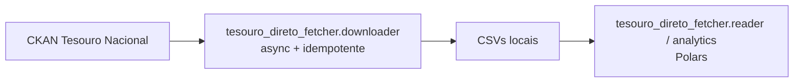
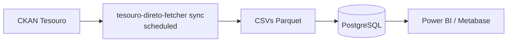

# Tesouro — Finanças

O Tesouro Nacional brasileiro publica dois tipos muito diferentes de dados:

- **Microdados de renda fixa** via Tesouro Direto — preços, yields, operações de compra/venda, estoques, investidores.
- **Agregados fiscais** via *Resultado do Tesouro Nacional* (RTN) — receitas, despesas e resultado primário do Governo Federal.

O ecossistema cobre ambos com pacotes dedicados.

## O desafio

Análise de Tesouro Direto encontra três barreiras críticas:

- **Volume e velocidade** — arquivos diários com milhões de registros; Pandas estoura memória rapidamente.
- **Complexidade FIFO** — calcular retornos para investidores com múltiplas compras e vendas parciais exige controle contábil estrito (matching FIFO de lotes com injeção de cupons).
- **Performance de portfólio** — calcular retornos mensais com depósitos, saques e renda de cupom exige metodologia GIPS-compliant (Modified Dietz).

A planilha RTN apresenta outro desafio: 24 abas mensais/trimestrais/anuais em formato wide, com hierarquia de contas que precisa ser normalizada para análise.

## Dois stacks: Exploração vs. Produção

### Stack 1 — Exploração (`tesouro-direto-fetcher` SDK + Polars)

Para análise ad-hoc, notebooks Jupyter, modelagem de yield curve, análise de portfólio one-off. Use o downloader assíncrono + readers Polars + analytics direto.

### Stack 2 — Produção (Pipeline `tesouro-direto-fetcher` + Parquet/PostgreSQL)

Para análise diária recorrente: scheduler chama `tesouro-direto-fetcher sync` (idempotente via `Last-Modified`), converte CSVs para Parquet, persiste em PostgreSQL para consumo BI.

Para dados fiscais (RTN), o fluxo é mais simples: `rtn-fetcher` baixa a planilha mais recente, normaliza para formato longo e exporta para Excel/SQLite.

## Pacotes

- **[tesouro-direto-fetcher](tesouro-direto-fetcher.md)** — suíte de engenharia financeira: async fetching com idempotência, processamento Polars (10× vs. Pandas), matching FIFO de lotes com injeção de cupom, retornos Modified Dietz GIPS-compliant. Suporta LTN, NTN-B/F/C, LFT.
- **[rtn-fetcher](rtn-fetcher.md)** — downloader e normalizador da planilha RTN: 24 abas mensais/trimestrais/anuais (corrente / constante / % do PIB), normalização em formato longo com expansão de hierarquia de contas, CLI de exportação Excel/SQLite.
Para a teoria por trás dos números — YTM, duration, Modified Dietz, retornos reais para títulos indexados à inflação — consulte **[Cálculo de Retornos de Renda Fixa](../concepts/calculo-retornos-renda-fixa.md)** na seção Conceitos.

Os [Princípios de Design](../concepts/principios.md) do ecossistema se manifestam aqui de forma especialmente visível: idempotência via `last_modified`, FIFO determinístico e Modified Dietz auditável. Receitas táticas em [Padrões Práticos](../concepts/padroes.md): [Idempotência](../concepts/padroes.md#processamento-idempotente), [Concorrência para I/O](../concepts/padroes.md#concorrencia-io), [Lazy evaluation](../concepts/padroes.md#lazy-evaluation).

## Tipos de títulos do Tesouro Direto

| Código | Nome | Características |
|---|---|---|
| **LTN** | Letras do Tesouro Nacional | Prefixados (cupom zero), curto prazo |
| **NTN-B** | Notas do Tesouro Série B | Indexados ao IPCA, cupons semestrais |
| **NTN-F** | Notas do Tesouro Série F | Prefixados com cupons, longo prazo |
| **NTN-C** | Notas do Tesouro Série C | Indexados ao IGP-M (legado) |
| **LFT** | Letras Financeiras do Tesouro | Atrelados à Selic, pós-fixados |

Métricas disponíveis por título e data: yield (YTM), preço (% do par), duration modificada, vencimento, juros acumulados, volume em circulação.

## Próximos passos

- Para análise de portfólio: vá para **[tesouro-direto-fetcher](tesouro-direto-fetcher.md)** e use `calculate_portfolio_monthly_returns`.
- Para a matemática por trás dos cálculos: leia **[Cálculo de Retornos de Renda Fixa](../concepts/calculo-retornos-renda-fixa.md)**.
- Para dados fiscais (RTN): vá para **[rtn-fetcher](rtn-fetcher.md)**.
- Para combinar Tesouro com IPCA/PIB: veja **[Análise Econômica Multi-Fonte](../cookbook/analise-economica-multi-fonte.md)**.

## Recursos externos

- [Tesouro Direto (oficial)](https://www.tesouro.gov.br/tesouro-direto)
- [Resultado do Tesouro Nacional (RTN)](https://www.gov.br/tesouronacional/pt-br/estatisticas-fiscais-e-planejamento/resultado-do-tesouro-nacional-rtn)
