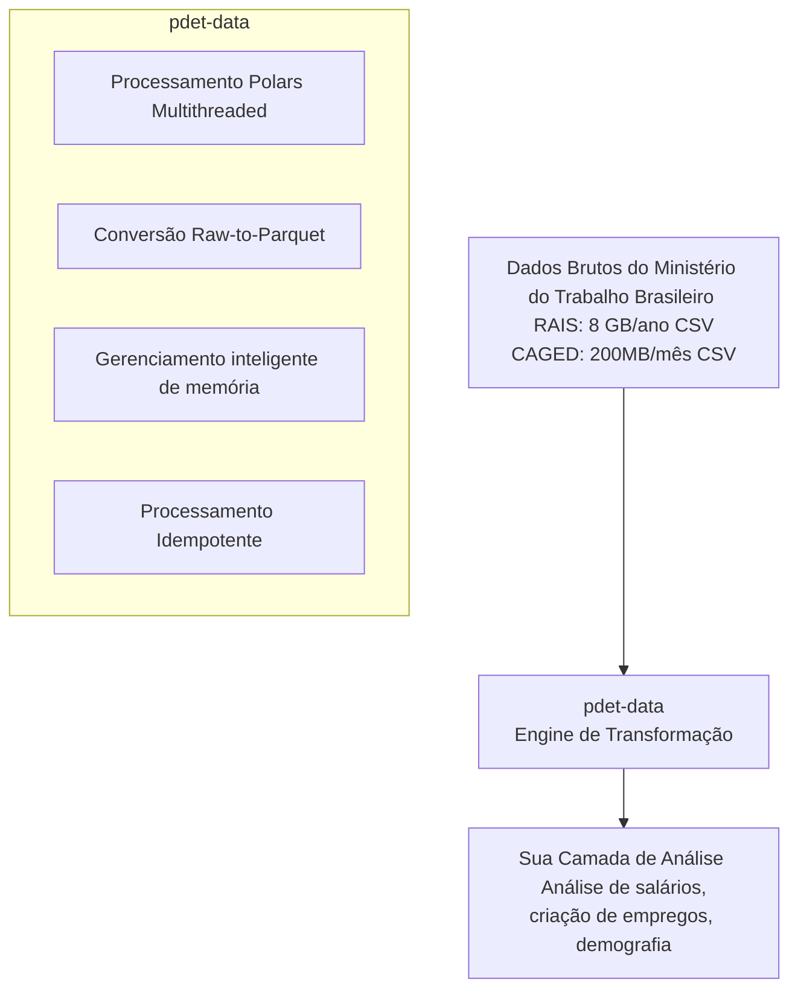

# Dados de Mercado de Trabalho (Trabalho)

Microdados de mercado de trabalho brasileiro de fontes administrativas: RAIS (censo anual de emprego) e CAGED (fluxos mensais de empregos).

**pdet-data** é um engine de processamento Big Data que transforma massivos datasets governamentais de trabalho em infraestrutura de análise production-ready—a primeira etapa de um stack de dados moderno para análise de emprego.

## O Desafio

Microdados de mercado de trabalho brasileiro encontram barreiras severas de infraestrutura:

- **Esgotamento de Memória**: Arquivos RAIS únicos (50M+ linhas) quebram ferramentas tradicionais (Pandas)
- **Ineficiência de Formato**: Formatos legados CSV/TXT são lentos, não-tipados e desperdiçadores de espaço
- **Explosão de Arquivo Temporário**: Descompressão requer espaço em disco indisponível em instâncias cloud

**pdet-data** supera isso através de processamento vetorial Polars, armazenamento colunar Apache Parquet e gerenciamento inteligente de memória.

## Fontes de Dados

### RAIS (Relação Anual de Informações Sociais)

Censo anual de todas as relações de emprego formal:

- **Cobertura**: ~60 milhões de registros de emprego por ano
- **Disponível**: 1985-presente
- **Conteúdo**: Dados demográficos, salários, ocupação, educação, permanência, detalhes da firma
- **Tamanho**: 8-10 GB por ano (descomprimido)

### CAGED (Cadastro Geral de Empregados e Desempregados)

Registro administrativo mensal de fluxos de emprego:

- **Cobertura**: Contratações e desligamentos por setor/região
- **Disponível**: 1992-presente (mensal)
- **Frequência**: Divulgado com 3 semanas de atraso
- **Tamanho**: 200-500 MB por mês (descomprimido)

## Arquitetura: Pipeline pdet-data



## Capacidades

- ✅ **Raw-to-Parquet**: Converter 8 GB CSV → 0.4 GB Parquet (compressão 95%)
- ✅ **Multithreaded**: Processar 100M+ registros em segundos
- ✅ **Eficiente em memória**: Footprint mínimo em disco durante transformação
- ✅ **Idempotente**: Primeira execução 60s → execuções cache <0.1s (speedup 600x)
- ✅ **Schema tipado**: Detecção automática e validação de tipo de dado
- ✅ **Production-ready**: Outputs versionados, pipelines diários

## Casos de Uso

### Monitoramento do Mercado de Trabalho

Rastrear tendências de emprego, fluxos de desemprego e criação de empregos por setor.

### Análise de Salários

Estudar níveis salariais, desigualdade e diferenças setoriais usando RAIS.

### Economia Regional

Analisar especialização do mercado de trabalho e estrutura econômica por estado/município.

### Educação e Habilidades

Examinar relação entre níveis de educação e resultados de emprego.

### Dinâmica de Empresas

Estudar padrões de criação de empregos e crescimento de empresas usando painéis históricos da RAIS.

## Ferramentas

### pdet-data

Buscar dados RAIS e CAGED com agregação automática e export Parquet.

**Use quando**: Você precisa de dados de emprego por estado, setor ou nível de educação.

### guia-parquet

Guia para trabalhar com grandes datasets de trabalho usando Polars e Parquet.

**Use quando**: Você está processando grandes arquivos RAIS/CAGED para análise.

## Estrutura de Dados

### Campos RAIS (Seleção)

| Campo | Tipo | Descrição |
|-------|------|-------------|
| **year** | int | Ano da competência |
| **employee_id** | str | ID anônimo de funcionário |
| **employer_id** | str | CNPJ/ID da firma |
| **state** | str | Estado (UF) |
| **municipality** | str | Código de município |
| **occupation_code** | str | CBO (ocupação) |
| **education** | str | Nível de educação |
| **salary** | float | Salário mensal (R$) |
| **start_date** | date | Data de início do emprego |
| **end_date** | date | Data de término do emprego (se desligado) |
| **sector** | str | CNAE (setor econômico) |

### Campos CAGED (Seleção)

| Campo | Tipo | Descrição |
|-------|------|---------|
| **year_month** | date | Ano-mês da competência |
| **state** | str | Estado (UF) |
| **sector** | str | CNAE (setor econômico) |
| **admissions** | int | Contratações durante o mês |
| **demissions** | int | Desligamentos durante o mês |
| **net_flow** | int | contratações - desligamentos |

## Fluxo de Trabalho: Transformar → Carregar → Analisar

### Etapa 1: Transformar RAIS Bruto em Parquet (Idempotente)

Baixe uma vez com o CLI, depois converta todos os arquivos em bulk. `convert_rais` descomprime cada `.7z`, faz parse do CSV com o schema correto para esse ano, e escreve um Parquet ao lado.

```bash
# Baixar todo arquivo RAIS / CAGED (idempotente: pula arquivos já presentes)
pdet-data fetch ./raw

# Descomprimir + parse + escrever Parquet para todo arquivo em ./raw
pdet-data convert ./raw ./parquet
```

Equivalente em Python:

```python
from pathlib import Path
from pdet_data import connect, fetch_rais, convert_rais

ftp = connect()
try:
    fetch_rais(ftp=ftp, dest_dir=Path("./raw"))
finally:
    ftp.close()

convert_rais(Path("./raw"), Path("./parquet"))
```

### Etapa 2: Análise Multi-Ano com Polars

```python
import polars as pl
from pathlib import Path

# Lazy scan — Polars só lê as colunas/linhas que você realmente usa
all_data = []
for year in range(1994, 2024):
    df = (
        pl.scan_parquet(Path(f"parquet/rais-vinculos/{year}.parquet"))
          .with_columns(pl.lit(year).alias("year"))
          .collect()
    )
    all_data.append(df)

# Concatenar todos os anos (Polars manipula 100M+ linhas)
combined = pl.concat(all_data, how="vertical")

# Analisar crescimento de salários
wage_trends = (
    combined
    .group_by(["year", "cnae_code"])
    .agg([
        pl.col("salary").mean().alias("avg_salary"),
        pl.col("employee_id").count().alias("num_employees")
    ])
)

print(f"✓ Analisados {len(combined):,} registros de emprego")
```

### Etapa 3: Análise de Fluxo de Empregos CAGED

```python
from pdet_data import CAGEDProcessor
import polars as pl

processor = CAGEDProcessor()

# Processar múltiplos anos
monthly_data = []
for year in [2023, 2024]:
    result = processor.process_year(year, force_refresh=False)
    monthly_data.append(pl.read_parquet(result.path))

combined = pl.concat(monthly_data, how="vertical")

# Criação anual de empregos por estado
annual_jobs = (
    combined
    .with_columns([
        pl.col("year_month").dt.year().alias("year")
    ])
    .group_by(["year", "state"])
    .agg([
        pl.col("admissions").sum().alias("total_hires"),
        pl.col("demissions").sum().alias("total_separations"),
        pl.col("net_flow").sum().alias("net_jobs")
    ])
)

print(annual_jobs.filter(pl.col("year") == 2024).sort("net_jobs", descending=True))
```

## Melhores Práticas

### 1. Sempre Use Processamento Idempotente

Pule reprocessamento caro:

```python
# ❌ Nunca: Forçar reprocessamento (60 segundos)
result = processor.process_year(2023, force_refresh=True)

# ✅ Sempre: Use cache se inalterado (0.08 segundos)
result = processor.process_year(2023, force_refresh=False)
```

### 2. Use Avaliação Lazy para Análise Multi-Ano

Adie execução até coleta:

```python
# ❌ Eager: Carrega todos os resultados intermediários
by_sector = df.group_by("cnae_code").agg(...)

# ✅ Lazy: Otimiza consulta inteira antes da execução
by_sector = (
    df
    .lazy()
    .group_by(["year", "cnae_code"])
    .agg(...)
    .collect()
)
```

### 3. Concatenar Primeiro, Agregar Segundo

Processamento multi-ano eficiente:

```python
# ❌ Ineficiente: Agregar por ano, depois combinar
results = []
for year in range(1994, 2024):
    agg = df_year.group_by("cnae_code").agg(...)  # 30 agregações
    results.append(agg)

combined = pl.concat(results)

# ✅ Eficiente: Concatenar uma vez, agregar uma vez
all_data = []
for year in range(1994, 2024):
    df = pl.read_parquet(f"rais_{year}.parquet").with_columns(
        pl.lit(year).alias("year")
    )
    all_data.append(df)

combined = pl.concat(all_data, how="vertical")  # Concatenação única
by_sector = combined.group_by(["year", "cnae_code"]).agg(...)
```

### 4. Armazene Resultados em Parquet

Nunca use CSV para dados processados:

```python
# ❌ Lento, grande, sem tipo
result.write_csv("output.csv")  # 4 GB, 30s para ler

# ✅ Rápido, compacto, tipado
result.write_parquet("output.parquet")  # 0.4 GB, 0.5s para ler
```

### 5. Manipule Vínculos de Emprego Corretamente

RAIS reporta status de emprego em 31 de dezembro de cada ano:

```python
import polars as pl

# Rastrear transições de trabalhadores
rais_2022 = pl.read_parquet("rais_2022.parquet")
rais_2023 = pl.read_parquet("rais_2023.parquet")

# Trabalhadores que mudaram de setor
transitions = (
    rais_2022
    .join(
        rais_2023.select(["employee_id", "cnae_code"]),
        on="employee_id",
        how="inner",
        suffix="_2023"
    )
    .filter(pl.col("cnae_code") != pl.col("cnae_code_2023"))
)

print(f"Transições de setor: {len(transitions):,}")
```

## Benchmarks de Performance

| Operação | Tempo | Throughput |
|-----------|------|-----------|
| Processar RAIS 2023 (primeira execução) | 62s | 800k linhas/seg |
| Processar RAIS 2023 (cache) | 0.08s | — |
| Concatenar 30 anos (100M linhas) | 0.5s | 200M linhas/seg |
| Agregar todas as 100M linhas | 4.2s | 23.8M linhas/seg |
| CSV (10 GB) vs Parquet (0.4 GB) | — | compressão 96% |

## Ferramentas nesta Seção

### [pdet-data](pdet-data.md)

Engine industrial de transformação Big Data para RAIS e CAGED:

- **Conversão Raw-to-Parquet** (compressão 95%+, schema tipado)
- **Processamento Polars multithreaded** (10x mais rápido que Pandas)
- **Gerenciamento inteligente de memória** (footprint mínimo em disco)
- **Processamento idempotente** (cache de arquivos inalterados)
- **Production-ready**: Pipelines diários, outputs versionados

### [Guia Parquet + Polars](guia-parquet.md)

Melhores práticas para trabalhar com grandes datasets de trabalho.

## Saiba Mais

- **[Documentação pdet-data](pdet-data.md)** — Referência completa de recursos
- **[Estatísticas de Emprego IBGE](../ibge/index.md)** — Taxas de desemprego
- **[Visão Geral da Arquitetura](../architecture/overview.md)** — Design do sistema
- **[RAIS Oficial (Português)](https://www.gov.br/trabalho/pt-br/acesso-a-informacao/dados-abertos/rais)** — Fonte governamental
- **[CAGED Oficial (Português)](https://www.gov.br/trabalho/pt-br/acesso-a-informacao/dados-abertos/caged)** — Fonte governamental
