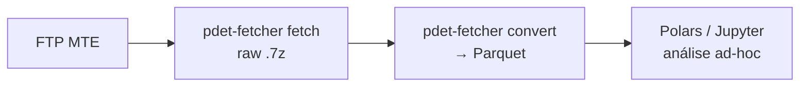
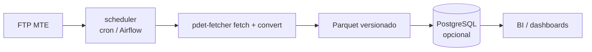

# Mercado de Trabalho

Microdados administrativos do mercado de trabalho brasileiro, vindos de duas fontes do Ministério do Trabalho:

- **RAIS** (Relação Anual de Informações Sociais) — censo anual de todas as relações de emprego formal. ~60M registros/ano, 1985–presente, ~8 GB CSV/ano.
- **CAGED** (Cadastro Geral de Empregados e Desempregados) — registro mensal de fluxos (admissões e desligamentos) por setor/região. 1992–presente, 200-500 MB/mês.

## O desafio

- **Esgotamento de memória** — arquivos RAIS (50M+ linhas) quebram Pandas em máquinas típicas.
- **Ineficiência de formato** — CSV/TXT legados são lentos, não-tipados e desperdiçam espaço (CSV: 8 GB; Parquet equivalente: 0.4 GB).
- **Explosão de arquivos temporários** — descompressão `.7z` exige espaço em disco frequentemente indisponível em VMs cloud.
- **Esquema variável** — colunas e tipos mudam ao longo dos anos (década de 1990 vs. 2020 são quase incompatíveis).

## Dois stacks: Exploração vs. Produção

### Stack 1 — Exploração (Parquet ad-hoc + Polars)

Para análise pontual de um ou poucos anos. Após uma conversão inicial dos brutos para Parquet, todo o trabalho subsequente acontece direto em Polars/Jupyter.

### Stack 2 — Produção (Pipeline `pdet-fetcher` agendado)

Para pipelines diários/mensais que produzem artefatos versionados. RAIS é anual (release dezembro do ano seguinte); CAGED é mensal com 3 semanas de atraso. Agende `pdet-fetcher fetch` + `convert` para rodar quando novos arquivos saem; resultados são idempotentes (re-rodar não custa nada).

## Pacotes

- **[pdet-fetcher](pdet-fetcher.md)** — engine de transformação Big Data. Fetch FTP idempotente, descompressão `.7z`, parser CSV com schema por-ano, escrita Parquet via Polars. Throughput: 50M linhas → Parquet em ~60s; cache de re-runs em ~0.08s.

Para o tutorial de Parquet + Polars (não específico de RAIS, aplicável a qualquer dataset grande), veja **[Parquet + Polars](../concepts/parquet-polars.md)** em Conceitos.

Os [Princípios de Design](../concepts/principios.md) do ecossistema — especialmente Performance e Sem Mágica — são centrais aqui: Polars 10× Pandas, conversão determinística, sem caching escondido. Receitas táticas em [Padrões Práticos](../concepts/padroes.md): [Parquet vs. CSV](../concepts/padroes.md#parquet-vs-csv), [Lazy evaluation](../concepts/padroes.md#lazy-evaluation), [Memória para arquivos grandes](../concepts/padroes.md#memoria-arquivos-grandes).

## Estrutura de dados

### Campos RAIS (seleção)

| Campo | Tipo | Descrição |
|---|---|---|
| `year` | int | Ano de competência |
| `employee_id` | str | ID anônimo de funcionário |
| `employer_id` | str | CNPJ/ID da firma |
| `state` | str | UF |
| `cnae_code` | str | Setor econômico |
| `occupation_code` | str | CBO |
| `salary` | float | Salário mensal (R$) |
| `tenure_days` | int | Permanência no emprego |

### Campos CAGED (seleção)

| Campo | Tipo | Descrição |
|---|---|---|
| `year_month` | date | Ano-mês de competência |
| `state` | str | UF |
| `cnae_code` | str | Setor econômico |
| `admissions` | int | Contratações no mês |
| `demissions` | int | Desligamentos no mês |
| `net_flow` | int | Saldo (admissions − demissions) |

## Próximos passos

- Para começar a converter RAIS/CAGED: vá para **[pdet-fetcher](pdet-fetcher.md)**.
- Para o tutorial de Parquet+Polars: veja **[Parquet + Polars](../concepts/parquet-polars.md)**.
- Para combinar emprego com PIB e yields do Tesouro: veja **[Análise Econômica Multi-Fonte](../cookbook/analise-economica-multi-fonte.md)**.

## Recursos externos

- [RAIS (oficial)](https://www.gov.br/trabalho/pt-br/acesso-a-informacao/dados-abertos/rais)
- [CAGED (oficial)](https://www.gov.br/trabalho/pt-br/acesso-a-informacao/dados-abertos/caged)
